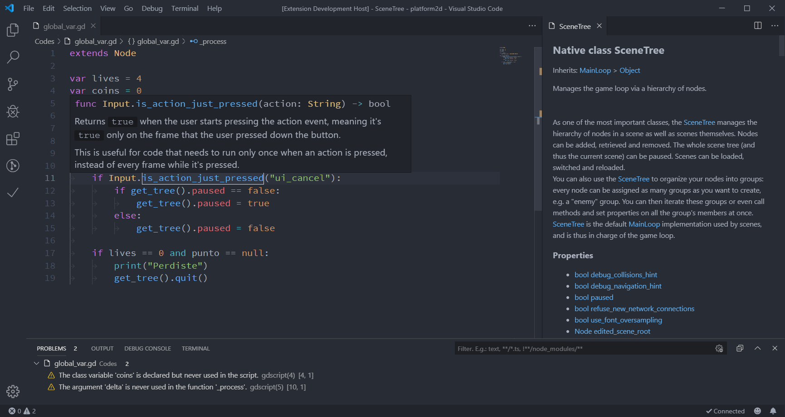

# Introduction to Pandemonium

This article is here to help you figure out whether Pandemonium might be a good fit
for you. We will introduce some broad features of the engine to give you a feel
for what you can achieve with it and answer questions such as "what do I need to
know to get started?".

This is by no means an exhaustive overview. We will introduce many more features
in this getting started series.

## What is Pandemonium?

Pandemonium is a general-purpose 2D and 3D game engine designed to support all sorts
of projects. You can use it to create games or applications you can then release
on desktop or mobile, as well as on the web.

You can also create console games with it, although you either need strong
programming skills or a developer to port the game for you.

Note:

- Pandemonium can't provide an open-source console export due to the licensing
  terms imposed by console manufacturers. Regardless of the
  engine you use, though, releasing games on consoles is always a lot of
  work. You can read more on that [here](../../03_usage/13_platform/01_consoles.md).

## How does it work and look?

Pandemonium comes with a fully-fledged game editor with integrated tools to answer the
most common needs. It includes a code editor, an animation editor, a tilemap
editor, a shader editor, a debugger, a profiler, and more.

Of course, if you prefer, you can work with external programs.

## Programming languages

Let's talk about the available programming languages.

You can code your games using [GDScript](toc-learn-scripting-gdscript), a
Pandemonium-specific and tightly integrated language with a lightweight syntax.

With the [GDNative](../../04_modules/gdnative) technology, you can also write
gameplay or high-performance algorithms in C or C++ without recompiling the
engine. You can use this technology to integrate third-party libraries and other
Software Development Kits (SDK) in the engine.

Of course, you can also directly add modules and features to the engine, as it's
completely free and open-source.

## What do I need to know to use Pandemonium?

Pandemonium is a feature-packed game engine. With its thousands of features, there is
a lot to learn. To make the most of it, you need good programming foundations.
While we try to make the engine accessible, you will benefit a lot from knowing
how to think like a programmer first.

Pandemonium relies on the object-oriented programming paradigm. Being comfortable with
concepts such as classes and objects will help you code efficiently in it.

If you are entirely new to programming, we recommend following the
[CS50 open courseware](https://cs50.harvard.edu/x)
from Harvard University. It's a great free course that will teach
you everything you need to know to be off to a good start. It will save you
countless hours and hurdles learning any game engine afterward.

Note: In CS50, you will learn multiple programming languages. Don't be
afraid of that: programming languages have many similarities. The
skills you learn with one language transfer well to others.

We will provide you with more Pandemonium-specific learning resources
[here](05_learning_new_features.md).

In the next part, you will get an overview of the engine's essential concepts.

