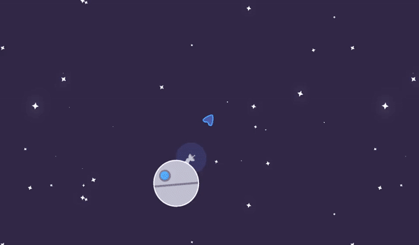
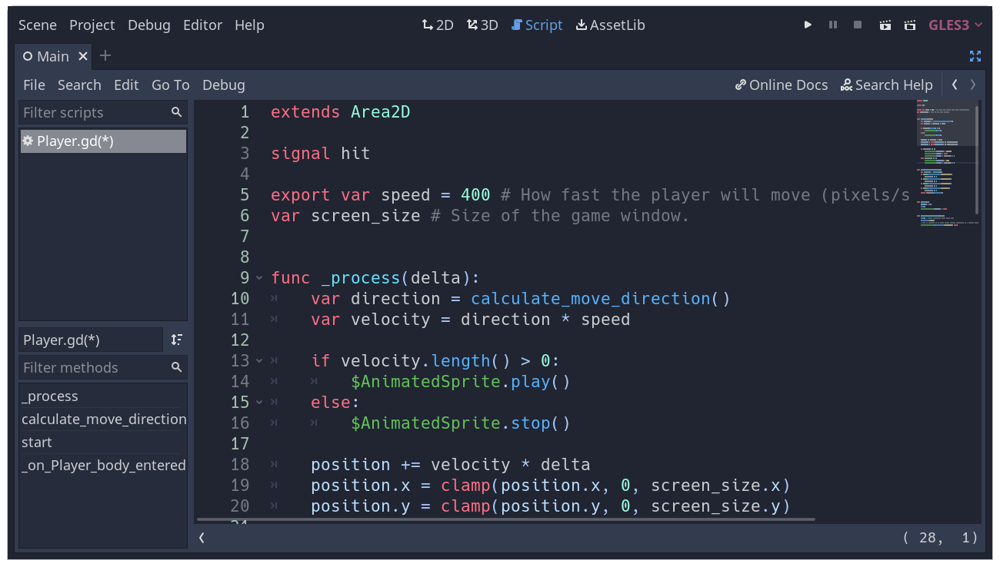
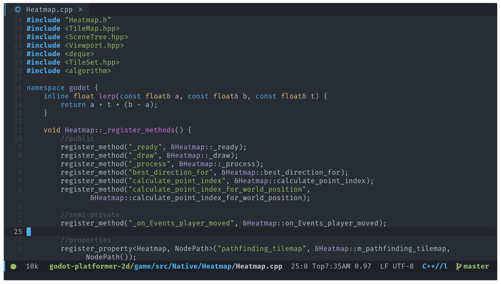

# Scripting languages

This lesson will give you an overview of the available scripting languages in
Pandemonium. You will learn the pros and cons of each option. In the next part, you
will write your first script using GDScript.

**Scripts attach to a node and extend its behavior**. This means that scripts
inherit all functions and properties of the node they attach to.

For example, take a game where a Camera2D node follows a ship. The Camera2D node
follows its parent by default. Imagine you want the camera to shake when the player
takes damage. As this feature is not built into Pandemonium, you would attach a script
to the Camera2D node and code the shake.

## Available scripting languages

Pandemonium offers: GDScript, and via its GDNative technology, C and C++, and python.
C# is also available via a separate module, but it have to be compiled separately.

You can use multiple languages in a single project.

We provide this flexibility to answer the needs of different game projects and
developers.

## Which language should I use?

If you're a beginner, we recommend to **start with GDScript**. We made this
language specifically for Pandemonium and the needs of game developers. It has a
lightweight and straightforward syntax and provides the tightest integration
with Pandemonium.

Let's look at each language's features, as well as its pros and cons.

### GDScript

GDScript is an
[object-oriented](https://en.wikipedia.org/wiki/Object-oriented_programming) and
[imperative](https://en.wikipedia.org/wiki/Imperative_programming)
programming language built for Pandemonium. It's made by and for game developers
to save you time coding games. Its features include:

- A simple syntax that leads to short files.
- Blazing fast compilation and loading times.
- Tight editor integration, with code completion for nodes, signals, and more
  information from the scene it's attached to.
- Built-in vector and transform types, making it efficient for heavy use of
  linear algebra, a must for games.
- Supports multiple threads as efficiently as statically typed languages.
- No [garbage collection](https://en.wikipedia.org/wiki/Garbage_collection_(computer_science)), as
  this feature eventually gets in the way when creating games. The engine counts
  references and manages the memory for you in most cases by default, but you
  can also control memory if you need to.
- [Gradual typing](https://en.wikipedia.org/wiki/Gradual_typing). Variables
  have dynamic types by default, but you also can use type hints for strong type
  checks.

GDScript looks like Python as you structure your code blocks using indentations,
but it doesn't work the same way in practice. It's inspired by multiple
languages, including Squirrel, Lua, and Python.

Note:

Why don't we use Python or Lua directly?

Years ago, Pandemonium (godot) used Python, then Lua. Both languages' integration took a
lot of work and had severe limitations. For example, threading support was a
big challenge with Python.

Developing a dedicated language doesn't take us more work and we can tailor
it to game developers' needs. We're now working on performance optimizations
and features that would've been difficult to offer with third-party
languages.

### C and C++ via GDNative

GDNative allows you to write game code in C or C++ without needing to recompile
or even restart Pandemonium.

You can use any version of the language or mix compiler brands and versions for
the generated shared libraries, thanks to our use of an internal C API Bridge.

GDNative is the best choice for performance. You don't need to use it
throughout an entire game, as you can write other parts in GDScript, C#, or
VisualScript.

When working with GDNative, the available types, functions, and properties
closely resemble Pandemonium's actual C++ API.

## Summary

Scripts are files containing code that you attach to a node to extend its
functionality.

Pandemonium supports five official scripting languages, offering you flexibility
between performance and ease of use.

You can mix languages, for instance, to implement demanding algorithms with C or
C++ and write most of the game logic with GDScript.

