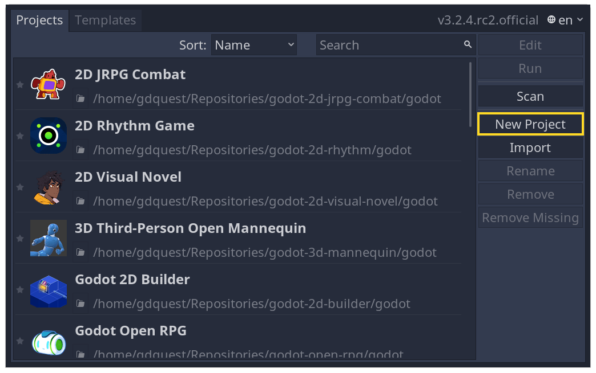
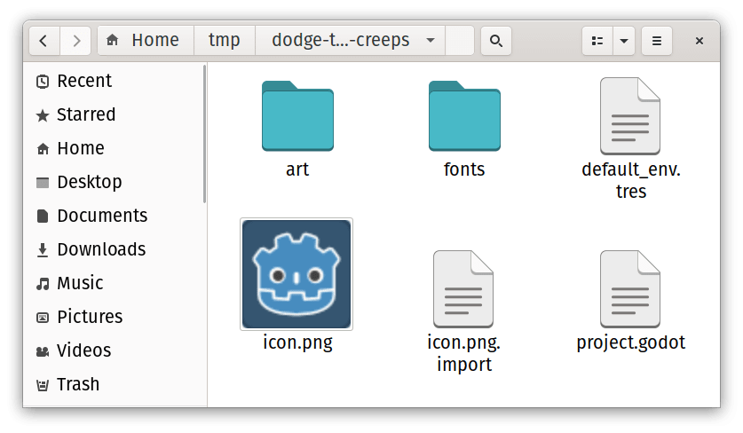
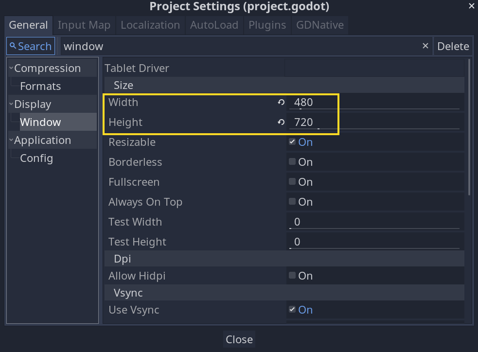
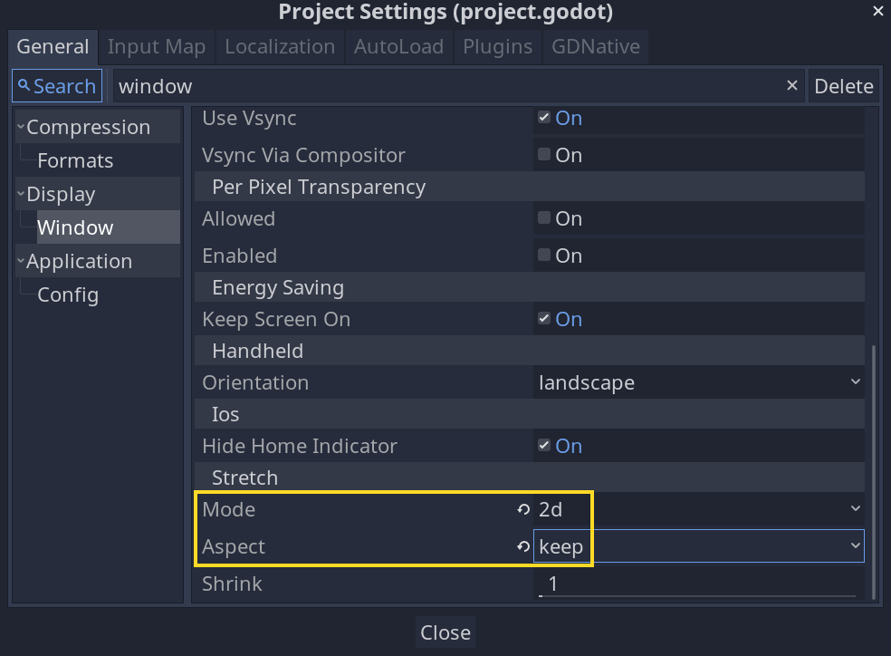
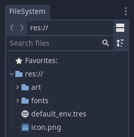

# Setting up the project

In this short first part, we'll set up and organize the project.

Launch Pandemonium and create a new project.

Download [dodge_assets.zip](files/dodge_assets.zip).

The archive contains the images and sounds you'll be using
to make the game. Extract the archive and move the `art/`
and `fonts/` directories to your project's directory.

Your project folder should look like this.

This game is designed for portrait mode, so we need to adjust the size of the
game window. Click on *Project -&gt; Project Settings* to open the project settings
window and in the left column, open the *Display -&gt; Window* tab. There, set
"Width" to `480` and "Height" to `720`.

Also, scroll down to the bottom of the section and, under the "Stretch" options,
set `Mode` to "2d" and `Aspect` to "keep". This ensures that the game scales
consistently on different sized screens.

### Organizing the project

In this project, we will make 3 independent scenes: `Player`, `Mob`, and
`HUD`, which we will combine into the game's `Main` scene.

In a larger project, it might be useful to create folders to hold the various
scenes and their scripts, but for this relatively small game, you can save your
scenes and scripts in the project's root folder, identified by `res://`. You
can see your project folders in the FileSystem dock in the lower left corner:

With the project in place, we're ready to design the player scene in the next lesson.

