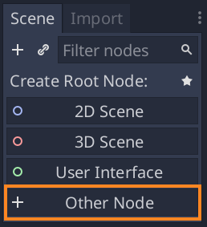
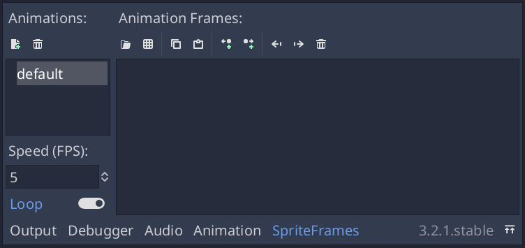
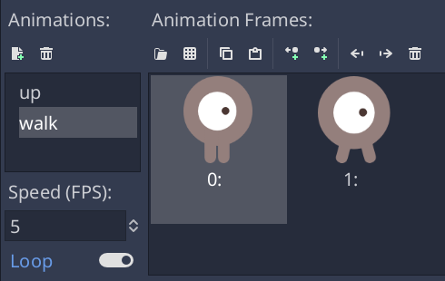
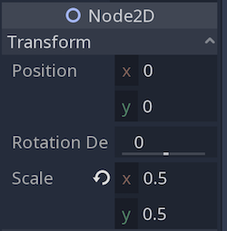
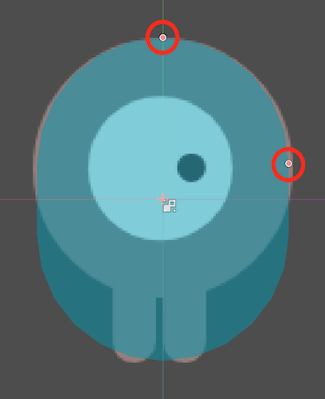
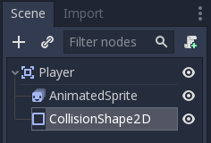

# Creating the player scene

With the project settings in place, we can start working on the
player-controlled character.

The first scene will define the `Player` object. One of the benefits of
creating a separate Player scene is that we can test it separately, even before
we've created other parts of the game.

## Node structure

To begin, we need to choose a root node for the player object. As a general
rule, a scene's root node should reflect the object's desired functionality -
what the object *is*. Click the "Other Node" button and add an `Area2D`
node to the scene.

Pandemonium will display a warning icon next to the node in the scene tree. You can
ignore it for now. We will address it later.

With `Area2D` we can detect objects that overlap or run into the player.
Change the node's name to `Player` by double-clicking on it. Now that we've
set the scene's root node, we can add additional nodes to give it more
functionality.

Before we add any children to the `Player` node, we want to make sure we don't
accidentally move or resize them by clicking on them. Select the node and click
the icon to the right of the lock; its tooltip says "Makes sure the object's
children are not selectable."

Save the scene. Click Scene -&gt; Save, or press `Ctrl + S` on Windows/Linux
or `Cmd + S` on macOS.

Note:

For this project, we will be following the Pandemonium naming conventions.

**GDScript**: Classes (nodes) use PascalCase, variables and
functions use snake_case, and constants use ALL_CAPS ([See](../../03_usage/15_scripting/gdscript/04_gdscript_styleguide.md)).

## Sprite animation

Click on the `Player` node and add an `AnimatedSprite`
node as a child. The `AnimatedSprite` will handle the
appearance and animations for our player. Notice that there is a warning symbol
next to the node. An `AnimatedSprite` requires a `SpriteFrames`
resource, which is a list of the animations it can
display. To create one, find the `Frames` property in the Inspector and click
"[empty]" -&gt; "New SpriteFrames". Click again to open the "SpriteFrames" panel:

On the left is a list of animations. Click the "default" one and rename it to
"walk". Then click the "New Animation" button to create a second animation named
"up". Find the player images in the "FileSystem" tab - they're in the `art`
folder you unzipped earlier. Drag the two images for each animation, named
`playerGrey_up[1/2]` and `playerGrey_walk[1/2]`, into the "Animation Frames"
side of the panel for the corresponding animation:

The player images are a bit too large for the game window, so we need to scale
them down. Click on the `AnimatedSprite` node and set the `Scale` property
to `(0.5, 0.5)`. You can find it in the Inspector under the `Node2D`
heading.

Finally, add a `CollisionShape2D` as a child of
`Player`. This will determine the player's "hitbox", or the bounds of its
collision area. For this character, a `CapsuleShape2D` node gives the best
fit, so next to "Shape" in the Inspector, click "[empty]"" -> "New
CapsuleShape2D". Using the two size handles, resize the shape to cover the
sprite:

When you're finished, your `Player` scene should look like this:

Make sure to save the scene again after these changes.

In the next part, we'll add a script to the player node to move and animate it.
Then, we'll set up collision detection to know when the player got hit by
something.

