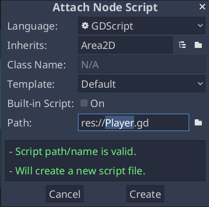

# Coding the player

In this lesson, we'll add player movement, animation, and set it up to detect
collisions.

To do so, we need to add some functionality that we can't get from a built-in
node, so we'll add a script. Click the `Player` node and click the "Attach
Script" button:


In the script settings window, you can leave the default settings alone. Just
click "Create":



Note:

  - If this is your first time encountering GDScript, please read
    `doc_scripting` before continuing.

Start by declaring the member variables this object will need:

gdscript GDScript

```
extends Area2D

    export var speed = 400 # How fast the player will move (pixels/sec).
    var screen_size # Size of the game window.
```

Using the `export` keyword on the first variable `speed` allows us to set
its value in the Inspector. This can be handy for values that you want to be
able to adjust just like a node's built-in properties. Click on the `Player`
node and you'll see the property now appears in the "Script Variables" section
of the Inspector. Remember, if you change the value here, it will override the
value written in the script.


The `ready()` function is called when a node enters the scene tree, which is
a good time to find the size of the game window:

```
func _ready():
    screen_size = get_viewport_rect().size
```

Now we can use the `process()` function to define what the player will do.
`process()` is called every frame, so we'll use it to update elements of our
game, which we expect will change often. For the player, we need to do the
following:

- Check for input.
- Move in the given direction.
- Play the appropriate animation.

First, we need to check for input - is the player pressing a key? For this game,
we have 4 direction inputs to check. Input actions are defined in the Project
Settings under "Input Map". Here, you can define custom events and assign
different keys, mouse events, or other inputs to them. For this game, we will
map the arrow keys to the four directions.

Click on *Project -> Project Settings* to open the project settings window and
click on the *Input Map* tab at the top. Type "move_right" in the top bar and
click the "Add" button to add the `move_right` action.


We need to assign a key to this action. Click the "+" icon on the right, then
click the "Key" option in the drop-down menu. A dialog asks you to type in the
desired key. Press the right arrow on your keyboard and click "Ok".


Repeat these steps to add three more mappings:

1. `move_left` mapped to the left arrow key.
2. `move_up` mapped to the up arrow key.
3. And `move_down` mapped to the down arrow key.

Your input map tab should look like this:


Click the "Close" button to close the project settings.

Note:

  - We only mapped one key to each input action, but you can map multiple keys,
    joystick buttons, or mouse buttons to the same input action.

You can detect whether a key is pressed using `Input.is_action_pressed()`,
which returns `true` if it's pressed or `false` if it isn't.

gdscript GDScript
```
func _process(delta):
    var velocity = Vector2.ZERO # The player's movement vector.
    if Input.is_action_pressed("move_right"):
        velocity.x += 1
    if Input.is_action_pressed("move_left"):
        velocity.x -= 1
    if Input.is_action_pressed("move_down"):
        velocity.y += 1
    if Input.is_action_pressed("move_up"):
        velocity.y -= 1

    if velocity.length() > 0:
        velocity = velocity.normalized() * speed
        $AnimatedSprite.play()
    else:
        $AnimatedSprite.stop()
```

We start by setting the `velocity` to `(0, 0)` - by default, the player
should not be moving. Then we check each input and add/subtract from the
`velocity` to obtain a total direction. For example, if you hold `right` and
`down` at the same time, the resulting `velocity` vector will be `(1, 1)`.
In this case, since we're adding a horizontal and a vertical movement, the
player would move *faster* diagonally than if it just moved horizontally.

We can prevent that if we *normalize* the velocity, which means we set its
*length* to `1`, then multiply by the desired speed. This means no more fast
diagonal movement.

Tip:

  - If you've never used vector math before, or need a refresher, you can
    see an explanation of vector usage in Pandemonium at `doc_vector_math`.
    It's good to know but won't be necessary for the rest of this tutorial.

We also check whether the player is moving so we can call `play()` or
`stop()` on the AnimatedSprite.

Tip:

  - `$` is shorthand for `get_node()`. So in the code above, `$AnimatedSprite.play()` is the same as
    `get_node("AnimatedSprite").play()`.

  - In GDScript, `$` returns the node at the relative path from the current node, or returns `null` if the node is not found. Since
    AnimatedSprite is a child of the current node, we can use`$AnimatedSprite`.

Now that we have a movement direction, we can update the player's position. We
can also use `clamp()` to prevent it from leaving the screen. *Clamping* a
value means restricting it to a given range. Add the following to the bottom of
the `process` function (make sure it's not indented under the `else`):

gdscript GDScript

```
position += velocity * delta
position.x = clamp(position.x, 0, screen_size.x)
position.y = clamp(position.y, 0, screen_size.y)
```

Tip:

  - The `delta` parameter in the `process()` function refers to the *frame length* - the amount of time that the previous frame took to complete.
    Using this value ensures that your movement will remain consistent evenif the frame rate changes.

Click "Play Scene" (:kbd:`F6`, :kbd:`Cmd + R` on macOS) and confirm you can move
the player around the screen in all directions.

Warning:

If you get an error in the "Debugger" panel that says

  - `Attempt to call function 'play' in base 'null instance' on a null instance`

  - this likely means you spelled the name of the AnimatedSprite node wrong. Node names are case-sensitive and `$NodeName` must match
    the name you see in the scene tree.

## Choosing animations

Now that the player can move, we need to change which animation the
AnimatedSprite is playing based on its direction. We have the "walk" animation,
which shows the player walking to the right. This animation should be flipped
horizontally using the `flip_h` property for left movement. We also have the
"up" animation, which should be flipped vertically with `flip_v` for downward
movement. Let's place this code at the end of the `process()` function:

gdscript GDScript

```
if velocity.x != 0:
    $AnimatedSprite.animation = "walk"
    $AnimatedSprite.flip_v = false
    # See the note below about boolean assignment.
    $AnimatedSprite.flip_h = velocity.x < 0
elif velocity.y != 0:
    $AnimatedSprite.animation = "up"
    $AnimatedSprite.flip_v = velocity.y > 0
```

Note:

  - The boolean assignments in the code above are a common shorthand for programmers. Since we're doing a comparison test (boolean) and also
    *assigning* a boolean value, we can do both at the same time. Consider this code versus the one-line boolean assignment above:

```
if velocity.x < 0:
    $AnimatedSprite.flip_h = true
else:
    $AnimatedSprite.flip_h = false
```

Play the scene again and check that the animations are correct in each of the
directions.

Tip:
 A common mistake here is to type the names of the animations wrong. The
        animation names in the SpriteFrames panel must match what you type in
        the code. If you named the animation `"Walk"`, you must also use a
        capital "W" in the code.

When you're sure the movement is working correctly, add this line to
`ready()`, so the player will be hidden when the game starts:

gdscript GDScript

```
hide()
```

## Preparing for collisions

We want `Player` to detect when it's hit by an enemy, but we haven't made any
enemies yet! That's OK, because we're going to use Pandemonium's *signal*
functionality to make it work.

Add the following at the top of the script, after `extends Area2D`:

gdscript GDScript

```
signal hit
```

This defines a custom signal called "hit" that we will have our player emit
(send out) when it collides with an enemy. We will use `Area2D` to detect the
collision. Select the `Player` node and click the "Node" tab next to the
Inspector tab to see the list of signals the player can emit:


Notice our custom "hit" signal is there as well! Since our enemies are going to
be `RigidBody2D` nodes, we want the `body_entered(body: Node)` signal. This
signal will be emitted when a body contacts the player. Click "Connect.." and
the "Connect a Signal" window appears. We don't need to change any of these
settings so click "Connect" again. Pandemonium will automatically create a function in
your player's script.


Note the green icon indicating that a signal is connected to this function. Add
this code to the function:

gdscript GDScript

```
func _on_Player_body_entered(body):
    hide() # Player disappears after being hit.
    emit_signal("hit")
    # Must be deferred as we can't change physics properties on a physics callback.
    $CollisionShape2D.set_deferred("disabled", true)
```

Each time an enemy hits the player, the signal is going to be emitted. We need
to disable the player's collision so that we don't trigger the `hit` signal
more than once.

Note:
 Disabling the area's collision shape can cause an error if it happens
          in the middle of the engine's collision processing. Using
          `set_deferred()` tells Pandemonium to wait to disable the shape until it's
          safe to do so.

The last piece is to add a function we can call to reset the player when
starting a new game.

gdscript GDScript

```
func start(pos):
    position = pos
    show()
    $CollisionShape2D.disabled = false
```

With the player working, we'll work on the enemy in the next lesson.
