# Player scene and input actions

In the next two lessons, we will design the player scene, register custom input
actions, and code player movement. By the end, you'll have a playable character
that moves in eight directions.

Create a new scene by going to the Scene menu in the top-left and clicking *New
Scene*. Create a *KinematicBody* node as the root and name it *Player*.

Kinematic bodies are complementary to the area and rigid bodies used in the 2D
game tutorial. Like rigid bodies, they can move and collide with the
environment, but instead of being controlled by the physics engine, you dictate
their movement. You will see how we use the node's unique features when we code
the jump and squash mechanics.

For now, we're going to create a basic rig for our character's 3D model. This
will allow us to rotate the model later via code while it plays an animation.

Add a *Spatial* node as a child of *Player* and name it *Pivot*. Then, in the
FileSystem dock, expand the `art/` folder by double-clicking it and drag and
drop `player.glb` onto the *Pivot* node.

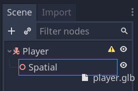

This should instantiate the model as a child of *Pivot*. You can rename it to
*Character*.

Note: The `.glb` files contain 3D scene data based on the open-source GLTF 2.0
specification. They're a modern and powerful alternative to a proprietary format
like FBX. To produce these files, we designed the
model in [Blender 3D](https://www.blender.org/) and exported it to GLTF.

As with all kinds of physics nodes, we need a collision shape for our character
to collide with the environment. Select the *Player* node again and add a
*CollisionShape*. In the *Inspector*, assign a *SphereShape* to the *Shape*
property. The sphere's wireframe appears below the character.

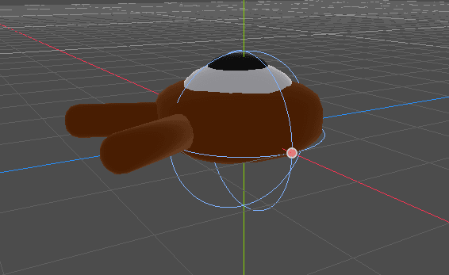

It will be the shape the physics engine uses to collide with the environment, so
we want it to better fit the 3D model. Shrink it a bit by dragging the orange
dot in the viewport. My sphere has a radius of about `0.8` meters.

Then, move the shape up so its bottom roughly aligns with the grid's plane.

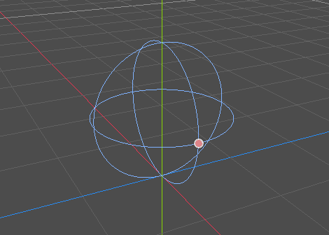

You can toggle the model's visibility by clicking the eye icon next to the
*Character* or the *Pivot* nodes.

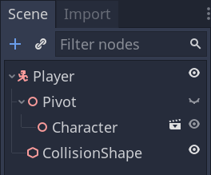

Save the scene as `Player.tscn`.

With the nodes ready, we can almost get coding. But first, we need to define
some input actions.

## Creating input actions

To move the character, we will listen to the player's input, like pressing the
arrow keys. In Pandemonium, while we could write all the key bindings in code, there's
a powerful system that allows you to assign a label to a set of keys and
buttons. This simplifies our scripts and makes them more readable.

This system is the Input Map. To access its editor, head to the *Project* menu
and select *Project Settings…*.

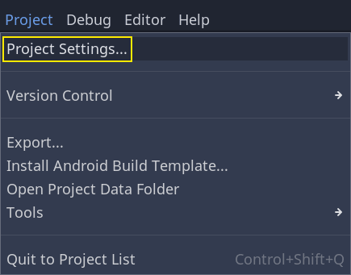

At the top, there are multiple tabs. Click on *Input Map*. This window allows
you to add new actions at the top; they are your labels. In the bottom part, you
can bind keys to these actions.

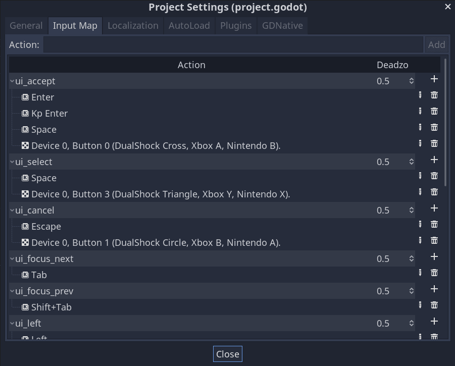

Pandemonium projects come with some predefined actions designed for user interface
design, which we could use here. But we're defining our own to support gamepads.

We're going to name our actions `move_left`, `move_right`, `move_forward`,
`move_back`, and `jump`.

To add an action, write its name in the bar at the top and press Enter.

Create the five actions. Your window should have them all listed at the bottom.

To bind a key or button to an action, click the "+" button to its right. Do this
for `move_left` and in the drop-down menu, click *Key*.

This option allows you to add a keyboard input. A popup appears and waits for
you to press a key. Press the left arrow key and click *OK*.

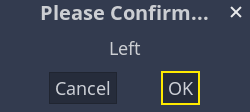

Do the same for the A key.

Let's now add support for a gamepad's left joystick. Click the "+" button again
but this time, select *Joy Axis*.

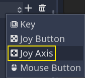

The popup gives you two drop-down menus. On the left, you can select a gamepad
by index. *Device 0* corresponds to the first plugged gamepad, *Device 1*
corresponds to the second, and so on. You can select the joystick and direction
you want to bind to the input action on the right. Leave the default values and
press the *Add* button.

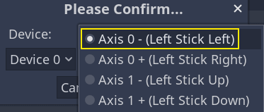

Do the same for the other input actions. For example, bind the right arrow, D,
and the left joystick's right axis to `move_right`. After binding all keys,
your interface should look like this.

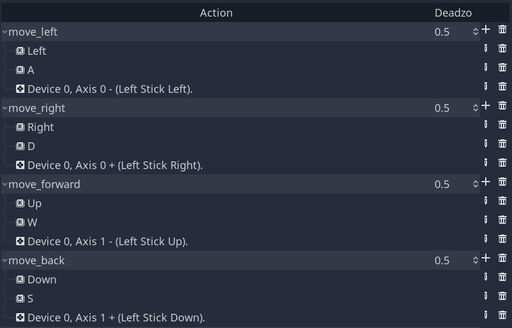

We have the `jump` action left to set up. Bind the Space key and the gamepad's
A button. To bind a gamepad's button, select the *Joy Button* option in the menu.

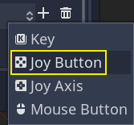

Leave the default values and click the *Add* button.

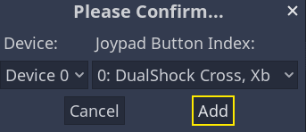

Your jump input action should look like this.

That's all the actions we need for this game. You can use this menu to label any
groups of keys and buttons in your projects.

In the next part, we'll code and test the player's movement.

