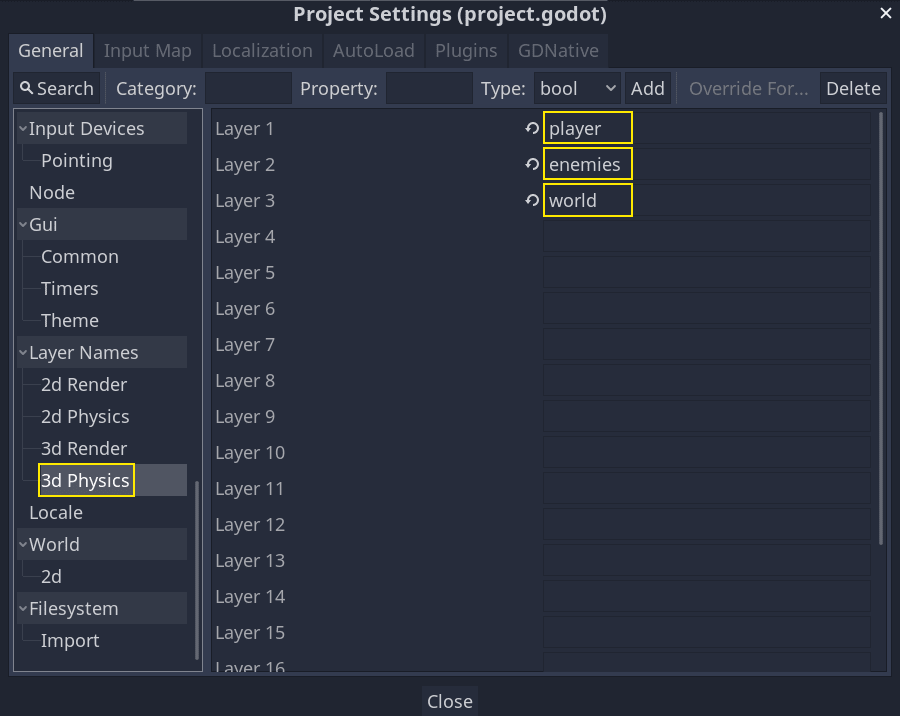
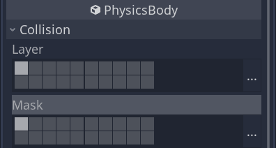
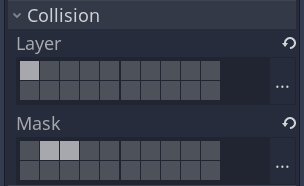
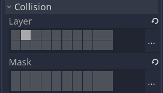
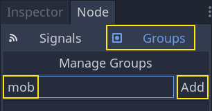
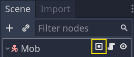

# Jumping and squashing monsters

In this part, we'll add the ability to jump, to squash the monsters. In the next
lesson, we'll make the player die when a monster hits them on the ground.

First, we have to change a few settings related to physics interactions. Enter
the world of `physics layers
( doc_physics_introduction_collision_layers_and_masks )`.

## Controlling physics interactions

Physics bodies have access to two complementary properties: layers and masks.
Layers define on which physics layer(s) an object is.

Masks control the layers that a body will listen to and detect. This affects
collision detection. When you want two bodies to interact, you need at least one
to have a mask corresponding to the other.

If that's confusing, don't worry, we'll see three examples in a second.

The important point is that you can use layers and masks to filter physics
interactions, control performance, and remove the need for extra conditions in
your code.

By default, all physics bodies and areas are set to both layer and mask `0`.
This means they all collide with each other.

Physics layers are represented by numbers, but we can give them names to keep
track of what's what.

### Setting layer names

Let's give our physics layers a name. Go to *Project -> Project Settings*.


In the left menu, navigate down to *Layer Names -> 3D Physics*. You can see a
list of layers with a field next to each of them on the right. You can set their
names there. Name the first three layers *player*, *enemies*, and *world*,
respectively.



Now, we can assign them to our physics nodes.

### Assigning layers and masks

In the *Main* scene, select the *Ground* node. In the *Inspector*, expand the
*Collision* section. There, you can see the node's layers and masks as a grid of
buttons.



The ground is part of the world, so we want it to be part of the third layer.
Click the lit button to toggle off the first *Layer* and toggle on the third
one. Then, toggle off the *Mask* by clicking on it.


As I mentioned above, the *Mask* property allows a node to listen to interaction
with other physics objects, but we don't need it to have collisions. The
*Ground* doesn't need to listen to anything; it's just there to prevent
creatures from falling.

Note that you can click the "..." button on the right side of the properties to
see a list of named checkboxes.


Next up are the *Player* and the *Mob*. Open `Player.tscn` by double-clicking
the file in the *FileSystem* dock.

Select the *Player* node and set its *Collision -> Mask* to both "enemies" and
"world". You can leave the default *Layer* property as the first layer is the
"player" one.



Then, open the *Mob* scene by double-clicking on `Mob.tscn` and select the
*Mob* node.

Set its *Collision -> Layer* to "enemies" and unset its *Collision -> Mask*,
leaving the mask empty.



These settings mean the monsters will move through one another. If you want the
monsters to collide with and slide against each other, turn on the "enemies"
mask.

Note:

    The mobs don't need to mask the "world" layer because they only move
    on the XZ plane. We don't apply any gravity to them by design.

## Jumping

The jumping mechanic itself requires only two lines of code. Open the *Player*
script. We need a value to control the jump's strength and update
`physics_process()` to code the jump.

After the line that defines `fall_acceleration`, at the top of the script, add
the `jump_impulse`.

gdscript GDScript

```
   #...
   # Vertical impulse applied to the character upon jumping in meters per second.
   export var jump_impulse = 20
```

Inside `physics_process()`, add the following code before the line where we
called `move_and_slide()`.

gdscript GDScript

```
   func _physics_process(delta):
       #...

       # Jumping.
       if is_on_floor() and Input.is_action_just_pressed("jump"):
           velocity.y += jump_impulse

       #...
```

That's all you need to jump!

The `is_on_floor()` method is a tool from the `KinematicBody` class. It
returns `true` if the body collided with the floor in this frame. That's why
we apply gravity to the *Player*: so we collide with the floor instead of
floating over it like the monsters.

If the character is on the floor and the player presses "jump", we instantly
give them a lot of vertical speed. In games, you really want controls to be
responsive and giving instant speed boosts like these, while unrealistic, feel
great.

Notice that the Y axis is positive upwards. That's unlike 2D, where the Y axis
is positive downward.

## Squashing monsters

Let's add the squash mechanic next. We're going to make the character bounce
over monsters and kill them at the same time.

We need to detect collisions with a monster and to differentiate them from
collisions with the floor. To do so, we can use Pandemonium's `group
( doc_groups )` tagging feature.

Open the scene `Mob.tscn` again and select the *Mob* node. Go to the *Node*
dock on the right to see a list of signals. The *Node* dock has two tabs:
*Signals*, which you've already used, and *Groups*, which allows you to assign
tags to nodes.

Click on it to reveal a field where you can write a tag name. Enter "mob" in the
field and click the *Add* button.



An icon appears in the *Scene* dock to indicate the node is part of at least one
group.



We can now use the group from the code to distinguish collisions with monsters
from collisions with the floor.

### Coding the squash mechanic

Head back to the *Player* script to code the squash and bounce.

At the top of the script, we need another property, `bounce_impulse`. When
squashing an enemy, we don't necessarily want the character to go as high up as
when jumping.

gdscript GDScript

```
   # Vertical impulse applied to the character upon bouncing over a mob in
   # meters per second.
   export var bounce_impulse = 16
```

Then, at the bottom of `physics_process()`, add the following loop. With
`move_and_slide()`, Pandemonium makes the body move sometimes multiple times in a
row to smooth out the character's motion. So we have to loop over all collisions
that may have happened.

In every iteration of the loop, we check if we landed on a mob. If so, we kill
it and bounce.

With this code, if no collisions occurred on a given frame, the loop won't run.

gdscript GDScript

```
   func _physics_process(delta):
       #...
       for index in range(get_slide_count()):
           # We check every collision that occurred this frame.
           var collision = get_slide_collision(index)
           # If we collide with a monster...
           if collision.collider.is_in_group("mob"):
               var mob = collision.collider
               # ...we check that we are hitting it from above.
               if Vector3.UP.dot(collision.normal) > 0.1:
                   # If so, we squash it and bounce.
                   mob.squash()
                   velocity.y = bounce_impulse
```

 That's a lot of new functions. Here's some more information about them.

The functions `get_slide_count()` and `get_slide_collision()` both come from
the `KinematicBody( KinematicBody )` class and are related to
`move_and_slide()`.

`get_slide_collision()` returns a
`KinematicCollision( KinematicCollision )` object that holds
information about where and how the collision occurred. For example, we use its
`collider` property to check if we collided with a "mob" by calling
`is_in_group()` on it: `collision.collider.is_in_group("mob")`.

Note:


    The method `is_in_group()` is available on every `Node( Node )`.

To check that we are landing on the monster, we use the vector dot product:
`Vector3.UP.dot(collision.normal) > 0.1`. The collision normal is a 3D vector
that is perpendicular to the plane where the collision occurred. The dot product
allows us to compare it to the up direction.

With dot products, when the result is greater than `0`, the two vectors are at
an angle of fewer than 90 degrees. A value higher than `0.1` tells us that we
are roughly above the monster.

We are calling one undefined function, `mob.squash()`. We have to add it to
the Mob class.

Open the script `Mob.gd` by double-clicking on it in the *FileSystem* dock. At
the top of the script, we want to define a new signal named `squashed`. And at
the bottom, you can add the squash function, where we emit the signal and
destroy the mob.

gdscript GDScript

```
   # Emitted when the player jumped on the mob.
   signal squashed

   # ...


   func squash():
       emit_signal("squashed")
       queue_free()
```

We will use the signal to add points to the score in the next lesson.

With that, you should be able to kill monsters by jumping on them. You can press
:kbd:`F5` to try the game and set `Main.tscn` as your project's main scene.

However, the player won't die yet. We'll work on that in the next part.

