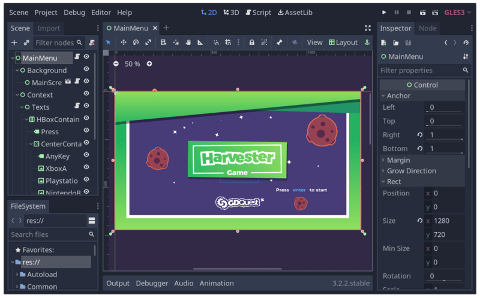
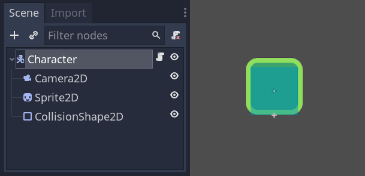
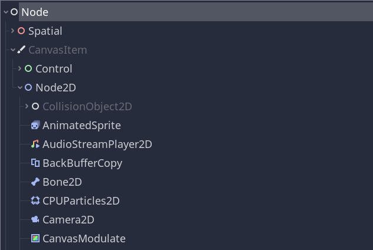
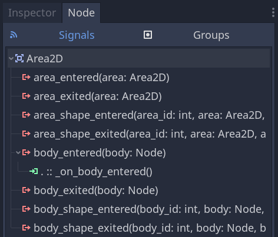

.. Intention: introduce only a handful of key concepts and avoid a big cognitive
   load. Readers will then be reminded of the concepts further in the getting
   started series, reinforcing their learning.

Overview of Pandemonium's key concepts
================================

Every game engine revolves around abstractions you use to build your
applications. In Pandemonium, a game is a **tree** of **nodes** that you group
together into **scenes**. You can then wire these nodes so they can communicate
using **signals**.

These are the four concepts you will learn here. We're going to look at them
briefly to give you a sense of how the engine works. In the getting started
series, you will get to use them in practice.

Scenes
------

In Pandemonium, you break down your game in reusable scenes. A scene can be a character,
a weapon, a menu in the user interface, a single house, an entire level, or
anything you can think of. Pandemonium's scenes are flexible; they fill the role of
both prefabs and scenes in some other game engines.

You can also nest scenes. For example, you can put your character in a level,
and drag and drop a scene as a child of it.

Nodes
-----

A scene is composed of one or more **nodes**. Nodes are your game's smallest
building blocks that you arrange into trees. Here's an example of a character's
nodes.

It is made of a `KinematicBody2D` node named "Character", a `Sprite`, a
`Camera2D`, and a `CollisionShape2D`.

Note:
 The node names end with "2D" because this is a 2D scene. Their 3D
          counterpart have names that end with "3D".

Notice how nodes and scenes look the same in the editor. When you save a tree of
nodes as a scene, it then shows as a single node, with its internal structure
hidden in the editor.

Pandemonium provides an extensive library of base node types you can combine and
extend to build more powerful ones. 2D, 3D, or user interface, you will do most
things with these nodes.

The scene tree
--------------

All your game's scenes come together in the **scene tree**, literally a tree of
scenes. And as scenes are trees of nodes, the scene tree also is a tree of
nodes. But it's easier to think of your game in terms of scenes as they can
represent characters, weapons, doors, or your user interface.

Signals
-------

Nodes emit signals when some event occurs. This feature allows you to make
nodes communicate without hard-wiring them in code. It gives you a lot of
flexibility in how you structure your scenes.

Note:
 Signals are Pandemonium's version of the *observer* pattern. You can read
          more about it here:
          https://gameprogrammingpatterns.com/observer.html

For example, buttons emit a signal when pressed. You can connect to this signal
to run code in reaction to this event, like starting the game or opening a menu.

Other built-in signals can tell you when two objects collided, when a character
or monster entered a given area, and much more. You can also define new signals
tailored to your game.

Summary
-------

Nodes, scenes, the scene tree, and signals are four core concepts in Pandemonium that
you will manipulate all the time.

Nodes are your game's smallest building blocks. You combine them to create scenes
that you then combine and nest into the scene tree. You can then use signals to
make nodes react to events in other nodes or different scene tree branches.

After this short breakdown, you probably have many questions. Bear with us as
you will get many answers throughout the getting started series.
