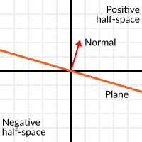
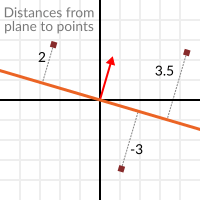
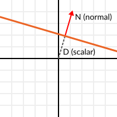
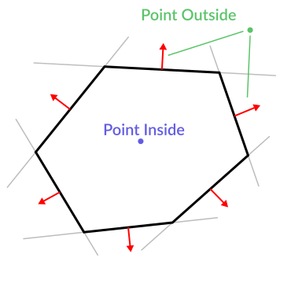
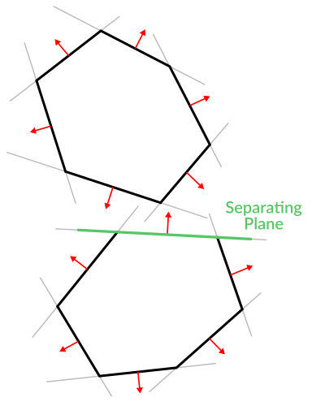
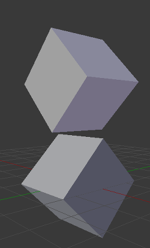
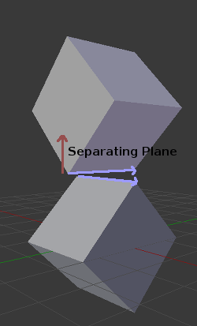

# Advanced vector math

### Planes

The dot product has another interesting property with unit vectors.
Imagine that perpendicular to that vector (and through the origin)
passes a plane. Planes divide the entire space into positive
(over the plane) and negative (under the plane), and (contrary to
popular belief) you can also use their math in 2D:



Unit vectors that are perpendicular to a surface (so, they describe the
orientation of the surface) are called **unit normal vectors**. Though,
usually they are just abbreviated as *normals*. Normals appear in
planes, 3D geometry (to determine where each face or vertex is siding),
etc. A **normal** *is* a **unit vector**, but it's called *normal*
because of its usage. (Just like we call (0,0) the Origin!).

It's as simple as it looks. The plane passes by the origin and the
surface of it is perpendicular to the unit vector (or *normal*). The
side towards the vector points to is the positive half-space, while the
other side is the negative half-space. In 3D this is exactly the same,
except that the plane is an infinite surface (imagine an infinite, flat
sheet of paper that you can orient and is pinned to the origin) instead
of a line.

## Distance to plane

Now that it's clear what a plane is, let's go back to the dot product.
The dot product between a **unit vector** and any **point in space**
(yes, this time we do dot product between vector and position), returns
the **distance from the point to the plane**:

gdscript GDScript

```
    var distance = normal.dot(point)
```

But not just the absolute distance, if the point is in the negative half
space the distance will be negative, too:



This allows us to tell which side of the plane a point is.

## Away from the origin

I know what you are thinking! So far this is nice, but *real* planes are
everywhere in space, not only passing through the origin. You want real
*plane* action and you want it *now*.

Remember that planes not only split space in two, but they also have
*polarity*. This means that it is possible to have perfectly overlapping
planes, but their negative and positive half-spaces are swapped.

With this in mind, let's describe a full plane as a **normal** *N* and a
**distance from the origin** scalar *D*. Thus, our plane is represented
by N and D. For example:



For 3D math, Pandemonium provides a `Plane`
built-in type that handles this.

Basically, N and D can represent any plane in space, be it for 2D or 3D
(depending on the amount of dimensions of N) and the math is the same
for both. It's the same as before, but D is the distance from the origin
to the plane, travelling in N direction. As an example, imagine you want
to reach a point in the plane, you will just do:

gdscript GDScript

```
    var point_in_plane = N*D
```

This will stretch (resize) the normal vector and make it touch the
plane. This math might seem confusing, but it's actually much simpler
than it seems. If we want to tell, again, the distance from the point to
the plane, we do the same but adjusting for distance:

gdscript GDScript

```
    var distance = N.dot(point) - D
```

The same thing, using a built-in function:

gdscript GDScript

```
    var distance = plane.distance_to(point)
```

This will, again, return either a positive or negative distance.

Flipping the polarity of the plane can be done by negating both
N and D. This will result in a plane in the same position, but with
inverted negative and positive half spaces:

gdscript GDScript

```
    N = -N
    D = -D
```

Of course, Pandemonium also implements this operator in `Plane`,
so doing:

gdscript GDScript

```
    var inverted_plane = -plane
```

Will work as expected.

So, remember, a plane is just that and its main practical use is
calculating the distance to it. So, why is it useful to calculate the
distance from a point to a plane? It's extremely useful! Let's see some
simple examples..

## Constructing a plane in 2D

Planes clearly don't come out of nowhere, so they must be built.
Constructing them in 2D is easy, this can be done from either a normal
(unit vector) and a point, or from two points in space.

In the case of a normal and a point, most of the work is done, as the
normal is already computed, so just calculate D from the dot product of
the normal and the point.

gdscript GDScript

```
    var N = normal
    var D = normal.dot(point)
```

For two points in space, there are actually two planes that pass through
them, sharing the same space but with normal pointing to the opposite
directions. To compute the normal from the two points, the direction
vector must be obtained first, and then it needs to be rotated 90°
degrees to either side:

gdscript GDScript

```
    # Calculate vector from `a` to `b`.
    var dvec = (point_b - point_a).normalized()
    # Rotate 90 degrees.
    var normal = Vector2(dvec.y, -dvec.x)
    # Alternatively (depending the desired side of the normal):
    # var normal = Vector2(-dvec.y, dvec.x)
```

The rest is the same as the previous example, either point_a or
point_b will work since they are in the same plane:

gdscript GDScript

```
    var N = normal
    var D = normal.dot(point_a)
    # this works the same
    # var D = normal.dot(point_b)
```

Doing the same in 3D is a little more complex and will be explained
further down.

## Some examples of planes

Here is a simple example of what planes are useful for. Imagine you have
a `convex ( https://www.mathsisfun.com/definitions/convex.html )`
polygon. For example, a rectangle, a trapezoid, a triangle, or just any
polygon where no faces bend inwards.

For every segment of the polygon, we compute the plane that passes by
that segment. Once we have the list of planes, we can do neat things,
for example checking if a point is inside the polygon.

We go through all planes, if we can find a plane where the distance to
the point is positive, then the point is outside the polygon. If we
can't, then the point is inside.



Code should be something like this:

gdscript GDScript

```
    var inside = true
    for p in planes:
        # check if distance to plane is positive
        if (p.distance_to(point) > 0):
            inside = false
            break # with one that fails, it's enough
```

Pretty cool, huh? But this gets much better! With a little more effort,
similar logic will let us know when two convex polygons are overlapping
too. This is called the Separating Axis Theorem (or SAT) and most
physics engines use this to detect collision.

With a point, just checking if a plane
returns a positive distance is enough to tell if the point is outside.
With another polygon, we must find a plane where *all* *the* *other*
*polygon* *points* return a positive distance to it. This check is
performed with the planes of A against the points of B, and then with
the planes of B against the points of A:



Code should be something like this:

gdscript GDScript

```
    var overlapping = true

    for p in planes_of_A:
        var all_out = true
        for v in points_of_B:
            if (p.distance_to(v) < 0):
                all_out = false
                break

        if (all_out):
            # a separating plane was found
            # do not continue testing
            overlapping = false
            break

    if (overlapping):
        # only do this check if no separating plane
        # was found in planes of A
        for p in planes_of_B:
            var all_out = true
            for v in points_of_A:
                if (p.distance_to(v) < 0):
                    all_out = false
                    break

            if (all_out):
                overlapping = false
                break

    if (overlapping):
        print("Polygons Collided!")
```

As you can see, planes are quite useful, and this is the tip of the
iceberg. You might be wondering what happens with non convex polygons.
This is usually just handled by splitting the concave polygon into
smaller convex polygons, or using a technique such as BSP (which is not
used much nowadays).

### Collision detection in 3D

This is another bonus bit, a reward for being patient and keeping up
with this long tutorial. Here is another piece of wisdom. This might
not be something with a direct use case (Pandemonium already does collision
detection pretty well) but it's used by almost all physics engines and collision
detection libraries :)

Remember that converting a convex shape in 2D to an array of 2D planes
was useful for collision detection? You could detect if a point was
inside any convex shape, or if two 2D convex shapes were overlapping.

Well, this works in 3D too, if two 3D polyhedral shapes are colliding,
you won't be able to find a separating plane. If a separating plane is
found, then the shapes are definitely not colliding.

To refresh a bit a separating plane means that all vertices of polygon A
are in one side of the plane, and all vertices of polygon B are in the
other side. This plane is always one of the face-planes of either
polygon A or polygon B.

In 3D though, there is a problem to this approach, because it is
possible that, in some cases a separating plane can't be found. This is
an example of such situation:



To avoid it, some extra planes need to be tested as separators, these
planes are the cross product between the edges of polygon A and the
edges of polygon B



So the final algorithm is something like:

gdscript GDScript

```
    var overlapping = true

    for p in planes_of_A:
        var all_out = true
        for v in points_of_B:
            if (p.distance_to(v) < 0):
                all_out = false
                break

        if (all_out):
            # a separating plane was found
            # do not continue testing
            overlapping = false
            break

    if (overlapping):
        # only do this check if no separating plane
        # was found in planes of A
        for p in planes_of_B:
            var all_out = true
            for v in points_of_A:
                if (p.distance_to(v) < 0):
                    all_out = false
                    break

            if (all_out):
                overlapping = false
                break

    if (overlapping):
        for ea in edges_of_A:
            for eb in edges_of_B:
                var n = ea.cross(eb)
                if (n.length() == 0):
                    continue

                var max_A = -1e20 # tiny number
                var min_A = 1e20 # huge number

                # we are using the dot product directly
                # so we can map a maximum and minimum range
                # for each polygon, then check if they
                # overlap.

                for v in points_of_A:
                    var d = n.dot(v)
                    max_A = max(max_A, d)
                    min_A = min(min_A, d)

                var max_B = -1e20 # tiny number
                var min_B = 1e20 # huge number

                for v in points_of_B:
                    var d = n.dot(v)
                    max_B = max(max_B, d)
                    min_B = min(min_B, d)

                if (min_A > max_B or min_B > max_A):
                    # not overlapping!
                    overlapping = false
                    break

            if (not overlapping):
                break

    if (overlapping):
       print("Polygons collided!")
```

### More information

For more information on using vector math in Pandemonium, see the following article:

- `doc_matrices_and_transforms`

If you would like additional explanation, you should check out
3Blue1Brown's excellent video series "Essence of Linear Algebra":
https://www.youtube.com/watch?v=fNk_zzaMoSs&list=PLZHQObOWTQDPD3MizzM2xVFitgF8hE_ab
