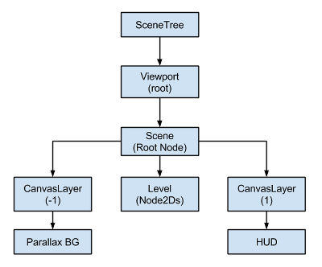

Canvas layers
=============

Viewport and Canvas items
-------------------------

`CanvasItem` is the base for all 2D nodes, be it regular
2D nodes, such as `Node2D`.
Both inherit from `CanvasItem`.
You can arrange canvas items in trees. Each item will inherit its parent's
transform: when the parent moves, its children move too.

CanvasItem nodes, and nodes inheriting from them, are direct or indirect children of a
`Viewport`, that display them.

A Viewport has the property
`Viewport.canvas_transform`,
allows to apply a custom `Transform2D`
transform to the CanvasItem hierarchy it contains. Nodes such as
`Camera2D` work by changing that transform.

To achieve effects like scrolling, manipulating the canvas transform property is
more efficient than moving the root canvas item and the entire scene with it.

Usually though, we don't want *everything* in the game or app to be subject to the canvas
transform. For example:

-  **Parallax Backgrounds**: Backgrounds that move slower than the rest
   of the stage.
-  **UI**: Think of a user interface (UI) or head-up display (HUD) superimposed on our view of the game world. We want a life counter, score display and other elements to retain their screen positions even when our view of the game world changes.
-  **Transitions**: We may want visual effects used for transitions (fades, blends) to remain at a fixed screen location.

How can these problems be solved in a single scene tree?

CanvasLayers
------------

The answer is `CanvasLayer`,
which is a node that adds a separate 2D rendering layer for all its
children and grand-children. Viewport children will draw by default at
layer "0", while a CanvasLayer will draw at any numeric layer. Layers
with a greater number will be drawn above those with a smaller number.
CanvasLayers also have their own transform and do not depend on the
transform of other layers. This allows the UI to be fixed in screen-space
while our view on the game world changes.

An example of this is creating a parallax background. This can be done
with a CanvasLayer at layer "-1". The screen with the points, life
counter and pause button can also be created at layer "1".

Here's a diagram of how it looks:

CanvasLayers are independent of tree order, and they only depend on
their layer number, so they can be instantiated when needed.

Note:
   CanvasLayers aren't necessary to control the drawing order of nodes.
            The standard way to ensuring that a node is  correctly drawn 'in front' or 'behind' others is to manipulate the
            order of the nodes in the scene panel. Perhaps counterintuitively, the topmost nodes in the scene panel are drawn
            on *behind* lower ones in the viewport. 2d nodes also have a property for controlling their drawing order
            (see `Node2D.z_index`).
