Particle systems (2D)
=====================

Intro
-----

A simple (but flexible enough for most uses) particle system is
provided. Particle systems are used to simulate complex physical effects,
such as sparks, fire, magic particles, smoke, mist, etc.

The idea is that a "particle" is emitted at a fixed interval and with a
fixed lifetime. During its lifetime, every particle will have the same
base behavior. What makes each particle different from the rest and provides a more
organic look is the "randomness" associated with each parameter. In
essence, creating a particle system means setting base physics
parameters and then adding randomness to them.

Particle nodes
~~~~~~~~~~~~~~

Pandemonium provides two different nodes for 2D particles, `Particles2D` and
`CPUParticles2D`.
Particles2D is more advanced and uses the GPU to process particle effects, but that limits
it to higher end graphics API, and in our case to the GLES3 renderer. For projects using
the GLES2 backend, CPUParticles2D is a CPU-driven option with near feature parity with
Particles2D, but lesser performance. While Particles2D is configured via a
`ParticlesMaterial` (and optionally with a custom shader), the matching options
are provided via node properties in CPUParticles2D (with the exception of the trail settings).
You can convert a Particles2D node into a CPUParticles2D node by clicking on the node in the
inspector, and selecting "Convert to CPUParticles2D" in the "Particles" menu of the toolbar.

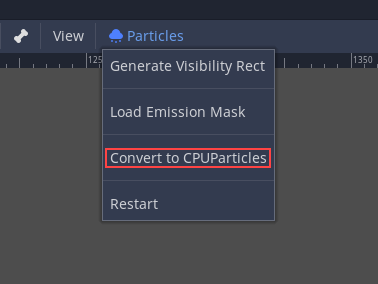

The rest of this tutorial is going to use the Particles2D node. First, add a Particles2D
node to your scene. After creating that node you will notice that only a white dot was created,
and that there is a warning icon next to your Particles2D node in the scene dock. This
is because the node needs a ParticlesMaterial to function.

ParticlesMaterial
~~~~~~~~~~~~~~~~~

To add a process material to your particles node, go to `Process Material` in
your inspector panel. Click on the box next to `Material`, and from the dropdown
menu select `New ParticlesMaterial`.

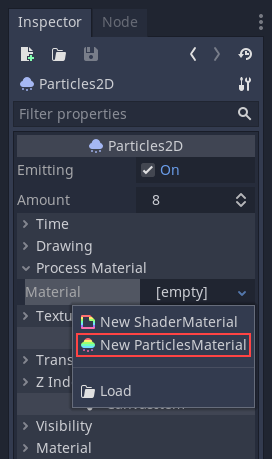

Your Particles2D node should now be emitting
white points downward.

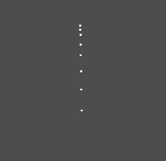

Texture
~~~~~~~

A particle system uses a single texture (in the future this might be
extended to animated textures via spritesheet). The texture is set via
the relevant texture property:


Time parameters
---------------

Lifetime
~~~~~~~~

The time in seconds that every particle will stay alive. When lifetime
ends, a new particle is created to replace it.

Lifetime: 0.5

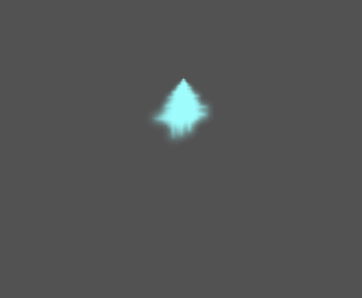

Lifetime: 4.0

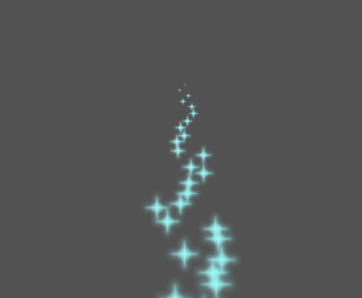

One Shot
~~~~~~~~

When enabled, a Particles2D node will emit all of its particles once
and then never again.

Preprocess
~~~~~~~~~~

Particle systems begin with zero particles emitted, then start emitting.
This can be an inconvenience when loading a scene and systems like
a torch, mist, etc. begin emitting the moment you enter. Preprocess is
used to let the system process a given number of seconds before it is
actually drawn the first time.

Speed Scale
~~~~~~~~~~~

The speed scale has a default value of `1` and is used to adjust the
speed of a particle system. Lowering the value will make the particles
slower while increasing the value will make the particles much faster.

Explosiveness
~~~~~~~~~~~~~

If lifetime is `1` and there are 10 particles, it means a particle
will be emitted every 0.1 seconds. The explosiveness parameter changes
this, and forces particles to be emitted all together. Ranges are:

-  0: Emit particles at regular intervals (default value).
-  1: Emit all particles simultaneously.

Values in the middle are also allowed. This feature is useful for
creating explosions or sudden bursts of particles:


Randomness
~~~~~~~~~~

All physics parameters can be randomized. Random values range from `0` to
`1`. The formula to randomize a parameter is:

```
    initial_value = param_value + param_value * randomness
```

Fixed FPS
~~~~~~~~~

This setting can be used to set the particle system to render at a fixed
FPS. For instance, changing the value to `2` will make the particles render
at 2 frames per second. Note this does not slow down the particle system itself.

Fract Delta
~~~~~~~~~~~

This can be used to turn Fract Delta on or off.

Drawing parameters
------------------

Visibility Rect
~~~~~~~~~~~~~~~


The visibility rectangle controls the visibility of the particles on screen. If this rectangle is outside of the viewport, the engine will not render the particles on screen.

The rectangle's `W` and `H` properties respectively control its Width and its Height.
The `X` and `Y` properties control the position of the upper-left
corner of the rectangle, relative to the particle emitter.

You can have Pandemonium generate a Visibility Rect automatically using the toolbar above the 2d view. To do so, select the Particles2D node and Click `Particles > Generate Visibility Rect`. Pandemonium will simulate the Particles2D node emitting particles for a few seconds and set the rectangle to fit the surface the particles take.

You can control the emit duration with the `Generation Time (sec)` option. The maximum value is 25 seconds. If you need more time for your particles to move around, you can temporarily change the `preprocess` duration on the Particles2D node.

Local Coords
~~~~~~~~~~~~

By default this option is on, and it means that the space that particles
are emitted to is relative to the node. If the node is moved, all
particles are moved with it:

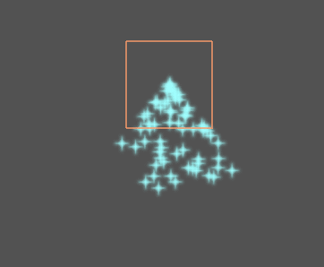

If disabled, particles will emit to global space, meaning that if the
node is moved, already emitted particles are not affected:


Draw Order
~~~~~~~~~~

This controls the order in which individual particles are drawn. `Index`
means particles are drawn according to their emission order (default).
`Lifetime` means they are drawn in order of remaining lifetime.

ParticlesMaterial settings
--------------------------

Direction
~~~~~~~~~

This is the base direction at which particles emit. The default is
`Vector3(1, 0, 0)` which makes particles emit to the right. However,
with the default gravity settings, particles will go straight down.

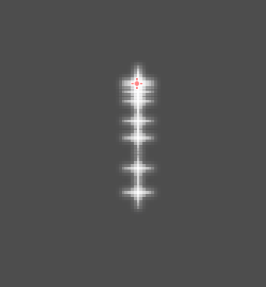

For this property to be noticeable, you need an *initial velocity* greater
than 0. Here, we set the initial velocity to 40. You'll notice that
particles emit toward the right, then go down because of gravity.

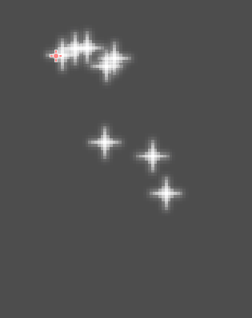

Spread
~~~~~~

This parameter is the angle in degrees which will be randomly added in
either direction to the base `Direction`. A spread of `180` will emit
in all directions (+/- 180). For spread to do anything the "Initial Velocity"
parameter must be greater than 0.


Flatness
~~~~~~~~

This property is only useful for 3D particles.

Gravity
~~~~~~~

The gravity applied to every particle.


Initial Velocity
~~~~~~~~~~~~~~~~

Initial velocity is the speed at which particles will be emitted (in
pixels/sec). Speed might later be modified by gravity or other
accelerations (as described further below).

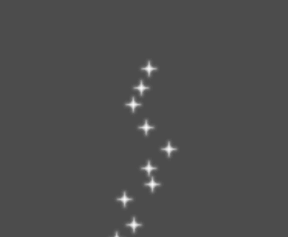

Angular Velocity
~~~~~~~~~~~~~~~~

Angular velocity is the initial angular velocity applied to particles.

Spin Velocity
~~~~~~~~~~~~~

Spin velocity is the speed at which particles turn around their center
(in degrees/sec).


Orbit Velocity
~~~~~~~~~~~~~~

Orbit velocity is used to make particles turn around their center.

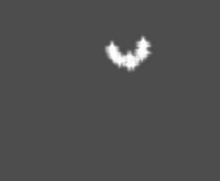

Linear Acceleration
~~~~~~~~~~~~~~~~~~~

The linear acceleration applied to each particle.

Radial Acceleration
~~~~~~~~~~~~~~~~~~~

If this acceleration is positive, particles are accelerated away from
the center. If negative, they are absorbed towards it.


Tangential Acceleration
~~~~~~~~~~~~~~~~~~~~~~~

This acceleration will use the tangent vector to the center. Combining
with radial acceleration can do nice effects.


Damping
~~~~~~~

Damping applies friction to the particles, forcing them to stop. It is
especially useful for sparks or explosions, which usually begin with a
high linear velocity and then stop as they fade.

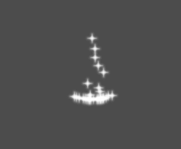

Angle
~~~~~

Determines the initial angle of the particle (in degrees). This parameter
is mostly useful randomized.

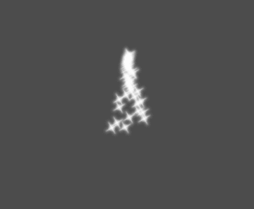

Scale
~~~~~

Determines the initial scale of the particles.


Color
~~~~~

Used to change the color of the particles being emitted.

Hue variation
~~~~~~~~~~~~~

The `Variation` value sets the initial hue variation applied to each
particle. The `Variation Random` value controls the hue variation
randomness ratio.

Emission Shapes
---------------

ParticlesMaterials allow you to set an Emission Mask, which dictates
the area and direction in which particles are emitted.
These can be generated from textures in your project.

Ensure that a ParticlesMaterial is set, and the Particles2D node is selected.
A "Particles" menu should appear in the Toolbar:


Open it and select "Load Emission Mask":

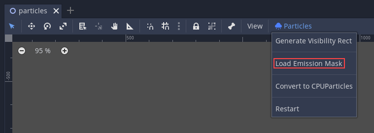

Then select which texture you want to use as your mask:

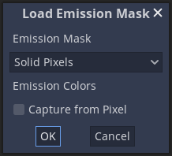

A dialog box with several settings will appear.

Emission Mask
~~~~~~~~~~~~~

Three types of emission masks can be generated from a texture:

-  Solid Pixels: Particles will spawn from any area of the texture,
   excluding transparent areas.


-  Border Pixels: Particles will spawn from the outer edges of the texture.

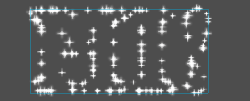

-  Directed Border Pixels: Similar to Border Pixels, but adds extra
   information to the mask to give particles the ability to emit away
   from the borders. Note that an `Initial Velocity` will need to
   be set in order to utilize this.


Emission Colors
~~~~~~~~~~~~~~~

`Capture from Pixel` will cause the particles to inherit the color of the mask at their spawn points.

Once you click "OK", the mask will be generated and set to the ParticlesMaterial, under the `Emission Shape` section:

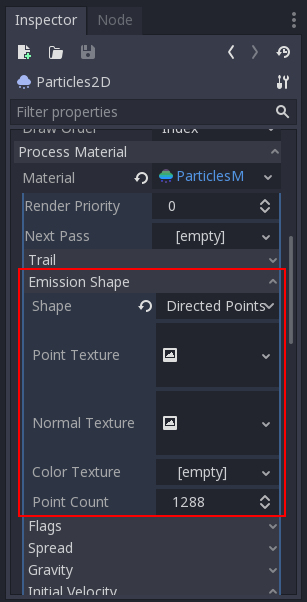

All of the values within this section have been automatically generated by the
"Load Emission Mask" menu, so they should generally be left alone.

Note:
 An image should not be added to `Point Texture` or `Color Texture` directly.
          The "Load Emission Mask" menu should always be used instead.
