# 3D lights and shadows

## Introduction

Light sources emit light that mixes with the materials and produces a visible
result. Light can come from several types of sources in a scene:

-  From the Material itself in the form of the emission color (though
   it does not affect nearby objects unless baked).
-  Light Nodes: Directional, Omni and Spot.
-  Ambient Light in the
   `Environment`.
-  Baked Light (read `doc_baked_lightmaps`).

The emission color is a material property. You can read more about it
in the `doc_spatial_material` tutorial.

## Light nodes

There are three types of light nodes: `Directional light`,
`Omni light` and `Spot light`. Let's take a look at the common
parameters for lights:

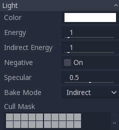

Each one has a specific function:

-  **Color**: Base color for emitted light.
-  **Energy**: Energy multiplier. This is useful for saturating lights or working with `doc_high_dynamic_range`.
-  **Indirect Energy**: Secondary multiplier used with indirect light (light bounces). This works in baked light or GIProbe.
-  **Negative**: Light becomes subtractive instead of additive. It's sometimes useful to manually compensate some dark corners.
-  **Specular**: Affects the intensity of the specular blob in objects affected by this light. At zero, this light becomes a pure diffuse light.
-  **Bake Mode**: Sets the bake mode for the light. For more information see `doc_baked_lightmaps`
-  **Cull Mask**: Objects that are in the selected layers below will be affected by this light.
   Note that objects disabled via this cull mask will still cast shadows.
   If you don't want disabled objects to cast shadows, adjust the `cast_shadow` property on the
   GeometryInstance to the desired value.

#### Shadow mapping

Lights can optionally cast shadows. This gives them greater realism (light does
not reach occluded areas), but it can incur a bigger performance cost.
There is a list of generic shadow parameters, each also has a specific function:

-  **Enabled**: Check to enable shadow mapping in this light.
-  **Color**: Areas occluded are multiplied by this color. It is black by default, but it can be changed to tint shadows.
-  **Bias**: When this parameter is too small, self shadowing occurs. When too large, shadows separate from the casters. Tweak to what works best for you.
-  **Contact**: Performs a short screen-space raycast to reduce the gap generated by the bias. Contact shadows are only available when using the GLES3 backend.
-  **Reverse Cull Face**: Some scenes work better when shadow mapping is rendered with face-culling inverted.

Below is an image of what tweaking bias looks like. Default values work for most
cases, but in general it depends on the size and complexity of geometry.

Finally, if gaps can't be solved, the **Contact** option can help (at a performance cost):

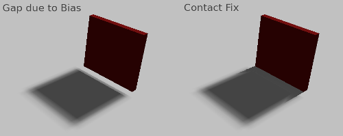

Any sort of bias issues can always be fixed by increasing the shadow map resolution,
although that may lead to decreased performance.

Tip:

    If shadow biasing is a problem in your scene, the following settings are a good starting point:

    - Enable **Reverse Cull Face**. This reduces shadow peter-panning significantly
      and prevents lights from exhibiting shadow acne at grazing angles.
      The main downside is that it may cause lighting to leak in some corners.
      The other downside is that materials that have their cull mode set to
      **Disabled** or MeshInstances with Cast Shadow set to **Double-Sided**
      may exhibit shadow acne.
    - Set **Bias** to `-0.01`. The bias should be a negative value when
      **Reverse Cull Face** is enabled, but it should be a positive value when it's disabled.
    - For DirectionalLight, set the directional shadow **Normal Bias** to `0.0`
      and **Bias Split Scale** to `0.0`. Depending on your scene, you may also
      want to further decrease **Bias** to a value between `-0.05` and `-0.1`.

    Following the above tips should make it possible to avoid gaps in shadows without
    resorting to contact shadows (which have many issues of their own).
    If shadow acne is still visible after performing the above tweaks,
    try subdividing your meshes further in your 3D modeling software.

### Directional light

This is the most common type of light and represents a light source
very far away (such as the sun). It is also the cheapest light to compute and should be used whenever possible
(although it's not the cheapest shadow-map to compute, but more on that later).

Directional light models an infinite number of parallel light rays
covering the whole scene. The directional light node is represented by a big arrow which
indicates the direction of the light rays. However, the position of the node
does not affect the lighting at all and can be anywhere.

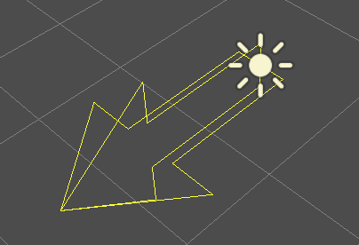

Every face whose front-side is hit by the light rays is lit, while the others stay dark. Most light types
have specific parameters, but directional lights are pretty simple in nature, so they don't.

#### Directional shadow mapping

To compute shadow maps, the scene is rendered (only depth) from an orthogonal point of view that covers
the whole scene (or up to the max distance). There is, however, a problem with this approach because objects
closer to the camera receive blocky shadows.

To fix this, a technique named "Parallel Split Shadow Maps" (or PSSM) is used. This splits the view frustum in 2 or 4 areas. Each
area gets its own shadow map. This allows small areas close to the viewer to have the same shadow resolution as a huge, far-away area.

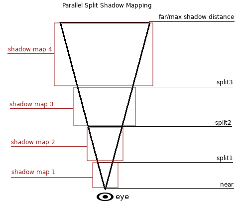

With this, shadows become more detailed:

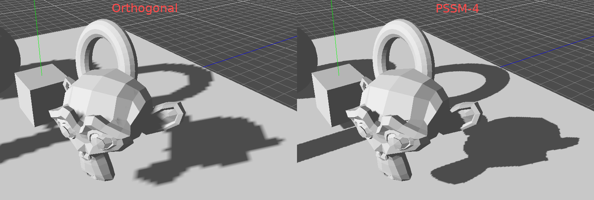

To control PSSM, a number of parameters are exposed:

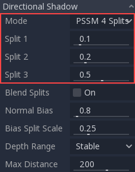

Each split distance is controlled relative to the camera far (or shadow
**Max Distance** if greater than zero), so *0.0* is the eye position and *1.0*
is where the shadow ends at a distance. Splits are in-between. Default values
generally work well, but tweaking the first split a bit is common to give more
detail to close objects (like a character in a third person game).

Always make sure to set a shadow *Max Distance* according to what the scene needs.
A lower maximum distance will result in better-looking shadows.

Sometimes, the transition between a split and the next can look bad. To fix this,
the **"Blend Splits"** option can be turned on, which sacrifices detail in exchange
for smoother transitions:

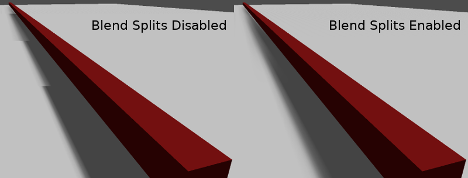

The **"Normal Bias"** parameter can be used to fix special cases of self shadowing
when objects are perpendicular to the light. The only downside is that it makes
the shadow a bit thinner.

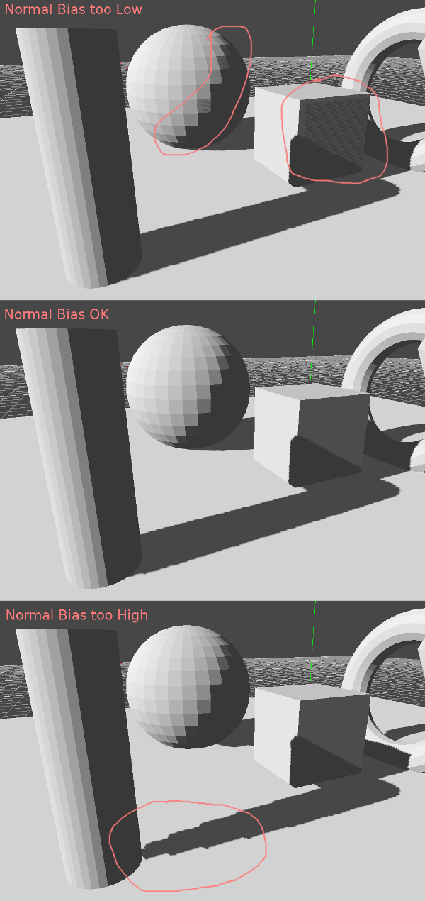

The **"Bias Split Scale"** parameter can control extra bias for the splits that
are far away. If self shadowing occurs only on the splits far away, this value can fix them.

Finally, the **"Depth Range"** has two settings:

- **Stable**: Keeps the shadow stable while the camera moves, and the blocks that appear in the outline when close to the shadow edges remain in-place. This is the default and generally desired, but it reduces the effective shadow resolution.
- **Optimized**: Tries to achieve the maximum resolution available at any given time. This may result in a "moving saw" effect on shadow edges, but at the same time the shadow looks more detailed (so this effect may be subtle enough to be forgiven).

Just experiment which setting works better for your scene.

Shadowmap size for directional lights can be changed in Project Settings -> Rendering -> Quality:

Increasing it can solve bias problems, but decrease performance. Shadow mapping is an art of tweaking.

### Omni light

Omni light is a point source that emits light spherically in all directions up to a given
radius.

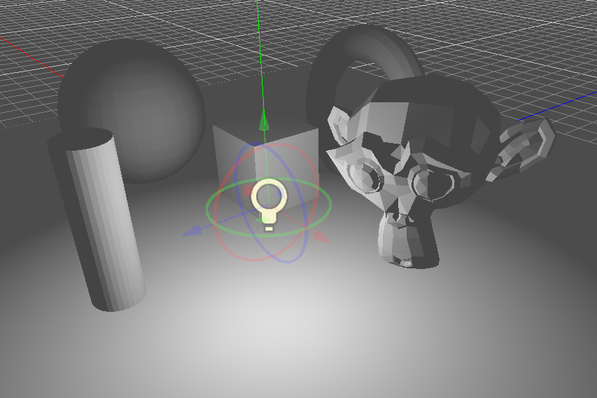

In real life, light attenuation is an inverse function, which means omni lights don't have a radius.
This is a problem because it means computing several omni lights would become demanding.

To solve this, a *Range* is introduced together with an attenuation function.

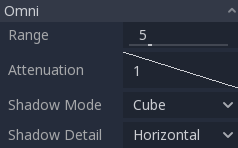

These two parameters allow tweaking how this works visually in order to find aesthetically pleasing results.

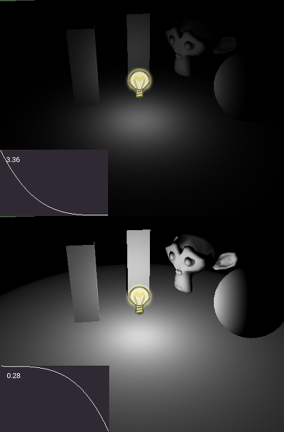

#### Omni shadow mapping

Omni light shadow mapping is relatively straightforward. The main issue that needs to be
considered is the algorithm used to render it.

Omni Shadows can be rendered as either **"Dual Paraboloid" or "Cube Mapped"**.
The former renders quickly, but can cause deformations,
while the later is more correct, but costlier.

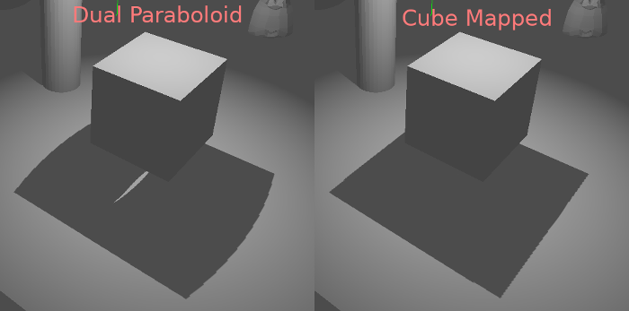

If the objects being rendered are mostly irregular, Dual Paraboloid is usually
enough. In any case, as these shadows are cached in a shadow atlas (more on that at the end), it
may not make a difference in performance for most scenes.

### Spot light

Spot lights are similar to omni lights, except they emit light only into a cone
(or "cutoff"). They are useful to simulate flashlights,
car lights, reflectors, spots, etc. This type of light is also attenuated towards the
opposite direction it points to.

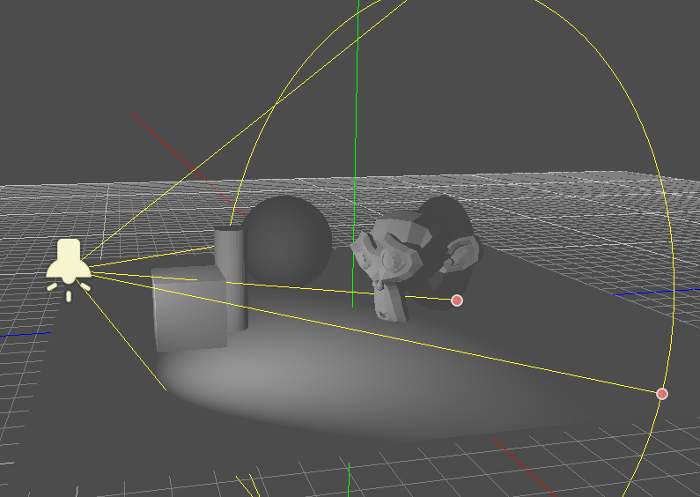

Spot lights share the same **Range** and **Attenuation** as **OmniLight**, and add two extra parameters:

- **Angle**: The aperture angle of the light
- **Angle Attenuation**: The cone attenuation, which helps soften the cone borders.

#### Spot shadow mapping

Spots don't need any parameters for shadow mapping. Keep in mind that, at more than 89 degrees of aperture, shadows
stop functioning for spots, and you should consider using an Omni light instead.

### Shadow atlas

Unlike Directional lights, which have their own shadow texture, Omni and Spot lights are assigned to slots of a shadow atlas.
This atlas can be configured in Project Settings -> Rendering -> Quality -> Shadow Atlas.

The resolution applies to the whole Shadow Atlas. This atlas is divided into four quadrants:

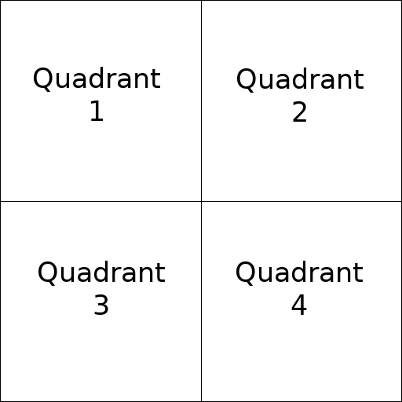

Each quadrant can be subdivided to allocate any number of shadow maps; the following is the default subdivision:

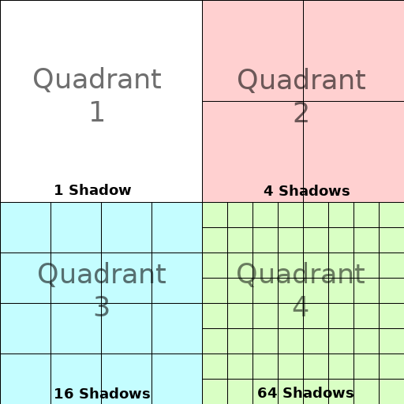

The allocation logic is simple. The biggest shadow map size (when no subdivision is used)
represents a light the size of the screen (or bigger).
Subdivisions (smaller maps) represent shadows for lights that are further away
from view and proportionally smaller.

Every frame, the following procedure is performed for all lights:

1. Check if the light is on a slot of the right size. If not, re-render it and move it to a larger/smaller slot.
2. Check if any object affecting the shadow map has changed. If it did, re-render the light.
3. If neither of the above has happened, nothing is done, and the shadow is left untouched.

If the slots in a quadrant are full, lights are pushed back to smaller slots, depending on size and distance.

This allocation strategy works for most games, but you may want to use a separate one in some cases (for example, a top-down game where
all lights are around the same size and quadrants may all have the same subdivision).

### Shadow filter quality

The filter quality of shadows can be tweaked. This can be found in
Project Settings -> Rendering -> Quality -> Shadows.
Pandemonium supports no filter, PCF5 and PCF13.

It affects the blockyness of the shadow outline:

