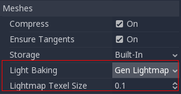
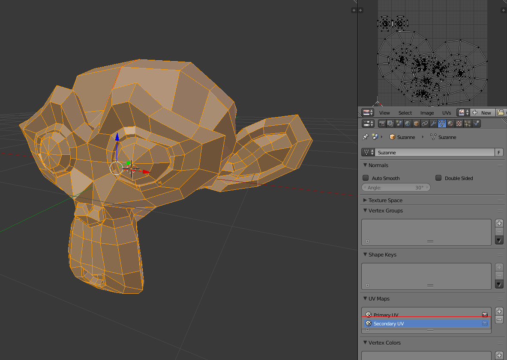
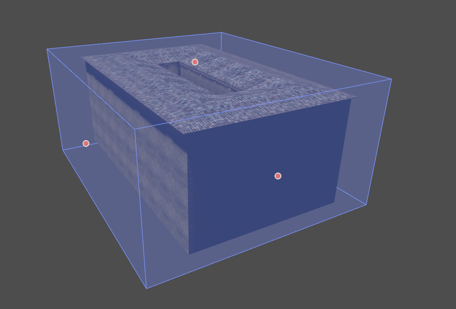
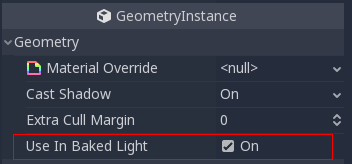
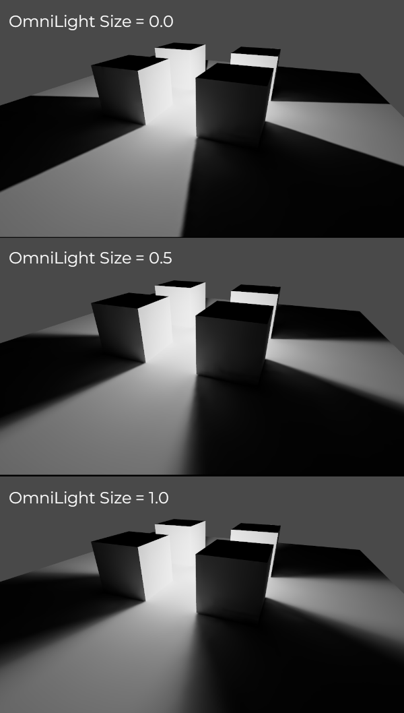
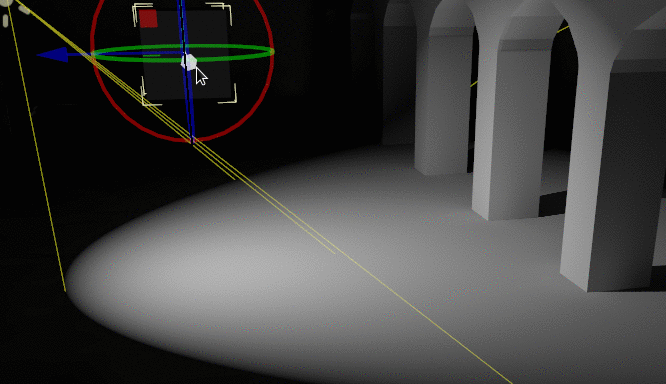

# Baked lightmaps

## Introduction

Baked lightmaps are an alternative workflow for adding indirect (or fully baked)
lighting to a scene. Unlike the `doc_gi_probes` approach, baked lightmaps
work fine on low-end PCs and mobile devices, as they consume almost no resources
at run-time. Also unlike GIProbe, baked lightmaps can optionally be used to
store direct lighting, which provides even further performance gains.

Unlike GIProbes, Baked Lightmaps are completely static. Once baked, they
can't be modified at all. They also don't provide the scene with reflections, so
using `doc_reflection_probes` together with it on interiors (or using a Sky
on exteriors) is a requirement to get good quality.

As they are baked, they have fewer problems than `GIProbe` regarding light
bleeding, and indirect light will often look better. The downside is that baking
lightmaps takes much longer than baking a GIProbe. While baking a GIProbe can be
done in a matter of seconds, baking lightmaps will take several minutes if not
more. This can slow down iteration speed significantly, so it is recommended to
bake lightmaps only when you actually need to see changes in lighting.

Baking lightmaps will also reserve baked materials' UV2 slot, which means you can
no longer use it for other purposes in materials (either in the built-in
`doc_spatial_material` or in custom shaders).

In the end, deciding which indirect lighting approach is better depends on your
use case. In general, GIProbe is easier to set up and works better with dynamic
objects. For mobile or low-end compatibility, though, baked lightmaps are your
only choice.

## Visual comparison

Here are some comparisons of how BakedLightmap vs. GIProbe look. Notice that
lightmaps are more accurate, but also suffer from the fact
that lighting is on an unwrapped texture, so transitions and resolution may not
be that good. GIProbe looks less accurate (as it's an approximation), but
smoother overall.

## Setting up

First of all, before the lightmapper can do anything, the objects to be baked need
an UV2 layer and a texture size. An UV2 layer is a set of secondary texture coordinates
that ensures any face in the object has its own place in the UV map. Faces must
not share pixels in the texture.

There are a few ways to ensure your object has a unique UV2 layer and texture size:

### Unwrap on scene import

This is probably the best approach overall. The only downside is that, on large
models, unwrapping can take a while on import. Nonetheless, Pandemonium will cache the UV2
across reimports, so it will only be regenerated when needed.

Select the imported scene in the filesystem dock, then go to the **Import** dock.
There, the following option can be modified:

The **Light Baking** mode needs to be set to **Gen Lightmaps**. A texel size
in world units must also be provided, as this will determine the
final size of the lightmap texture (and, in consequence, the UV padding in the map).

The effect of setting this option is that all meshes within the scene will have
their UV2 maps properly generated.

Warning:

    When reusing a mesh within a scene, keep in mind that UVs will be generated
    for the first instance found. If the mesh is re-used with different scales
    (and the scales are wildly different, more than half or twice), this will
    result in inefficient lightmaps. Don't reuse a source mesh at significantly
    different scales if you are planning to use lightmapping.

    Also, the `*.unwrap_cache` files should *not* be ignored in version control
    as these files guarantee that UV2 reimports are consistent across platforms
    and engine versions.

### Unwrap from within Pandemonium

Pandemonium has an option to unwrap meshes and visualize the UV channels.
It can be found in the Mesh menu:

This will generate a second set of UV2 coordinates which can be used for baking,
and it will also set the texture size automatically.

### Unwrap from your 3D DCC

The last option is to do it from your favorite 3D app. This approach is generally
not recommended, but it's explained first so that you know it exists.
The main advantage is that, on complex objects that you may want to re-import a
lot, the texture generation process can be quite costly within Pandemonium,
so having it unwrapped before import can be faster.

Simply do an unwrap on the second UV2 layer.

Then import the 3D scene normally. Remember you will need to set the texture
size on the mesh after import.

If you use external meshes on import, the size will be kept.
Be wary that most unwrappers in 3D DCCs are not quality oriented, as they are
meant to work quickly. You will mostly need to use seams or other techniques to
create better unwrapping.

### Checking UV2

In the mesh menu mentioned before, the UV2 texture coordinates can be visualized.
Make sure, if something is failing, to check that the meshes have these UV2 coordinates:

## Setting up the scene

Before anything is done, a **BakedLightmap** node needs to be added to a scene.
This will enable light baking on all nodes (and sub-nodes) in that scene, even
on instanced scenes.

A sub-scene can be instanced several times, as this is supported by the baker, and
each will be assigned a lightmap of its own (just make sure to respect the rule
about scaling mentioned before):

### Configure bounds

Lightmap needs an approximate volume of the area affected because it uses it to
transfer light to dynamic objects inside it (more on that later). Just
cover the scene with the volume as you do with `GIProbe`:

### Setting up meshes

For a **MeshInstance** node to take part in the baking process, it needs to have
the **Use in Baked Light** property enabled.

When auto-generating lightmaps on scene import, this is enabled automatically.

### Setting up lights

Lights are baked with indirect light by default. This means that shadowmapping
and lighting are still dynamic and affect moving objects, but light bounces from
that light will be baked.

Lights can be disabled (no bake) or be fully baked (direct and indirect). This
can be controlled from the **Bake Mode** menu in lights:

The modes are:

#### Disabled

The light is ignored when baking lightmaps. Keep in mind hiding a light will have
no effect for baking, so this must be used instead of hiding the Light node.

This is the mode to use for dynamic lighting effects such as explosions and weapon effects.

#### Indirect

This is the default mode, and is a compromise between performance and real-time
friendliness. Only indirect lighting will be baked. Direct light and shadows are
still real-time, as they would be without BakedLightmap.

This mode allows performing *subtle* changes to a light's color, energy and
position while still looking fairly correct. For example, you can use this
to create flickering static torches that have their indirect light baked.

#### All

Both indirect and direct lighting will be baked. Since static surfaces can skip
lighting and shadow computations entirely, this mode provides the best
performance along with smooth shadows that never fade based on distance. The
real-time light will not affect baked surfaces anymore, but it will still affect
dynamic objects. When using the **All** bake mode on a light, dynamic objects
will not cast real-time shadows onto baked surfaces, so you need to use a
different approach such as blob shadows instead. Blob shadows can be implemented
with a Sprite3D + RayCast setup, or a negative SpotLight pointing down with its
bake mode set to **Disabled**.

The light will not be adjustable at all during gameplay. Moving
the light and changing its color or energy will not have any effect on static surfaces.

Since bake modes can be adjusted on a per-light basis, it is possible to create
hybrid baked light setups. One popular option is to use a real-time
DirectionalLight with its bake mode set to **Indirect**, and use the **All**
bake mode for OmniLights and SpotLights. This provides good performance while
still allowing dynamic objects to cast real-time shadows in outdoor areas.

After selecting the **All** bake mode on a light, you can optionally
specify a **Size** greater than 0 for the light in the inspector.
This size is used to provide softer shadows depending on the distance between
the shadow caster and the object receiving the shadow. This mimics real life
shadow appearance:

The light's **Size** property is ignored for real-time shadows; it will only affect baked
shadows. When the **Size** property is changed, lightmaps must be baked again to
make changes visible.

## Baking

To begin the bake process, just push the **Bake Lightmaps** button on top
when selecting the BakedLightmap node:

This can take from seconds to minutes (or hours) depending on scene size, bake
method and quality selected.

### Balancing bake times with quality

Since high-quality bakes can take very long (up to several hours for large complex scenes),
it is recommended to use lower quality settings at first. Then, once you are confident
with your scene's lighting setup, raise the quality settings and perform a "final"
bake before exporting your project.

Note:

    By default, the lightmap baker will use all the system's logical CPU cores
    to speed up baking. This can reduce system responsiveness. To preserve system
    responsiveness while lightmaps are baking, you can reduce the number of CPU threads
    used to bake lightmaps. Keeping 1 or 2 CPU threads free will help improve
    system responsiveness, which is useful when multi-tasking while lightmaps are
    baking at the cost of slowing down lightmap baking slightly.

    To do so, open **Editor > Editor Settings** and adjust
    **Editors > 3d > Lightmap Baking Number Of Cpu Threads**.
    The default value (`0`) uses all of the system's logical CPU cores.
    Positive values will specify a number of threads to use, while negative
    values will subtract from the total number of logical CPU cores in the system.
    For example, on a system with 8 logical CPU cores, adjusting the setting to
    `-1` will use 7 CPU threads for lightmap baking.

### Configuring bake

Several more options are present for baking:

- **Bake Extents**: The size of the area affected. This can be edited in the 3D
  editor viewport using the handles. Any object that can have lightmaps baked and
  is *touching* the bake extents will have lightmaps baked for it, but dynamic
  object capture will only work within the extents.

#### Tweaks

- **Quality:** Four bake quality modes are provided: Low, Medium, High, and Ultra.
  Higher quality takes more time, but result in a better-looking lightmap with
  less noise. The difference is especially noticeable with emissive materials or
  areas that get little to no direct lighting.
- **Bounces:** The number of bounces to use for indirect lighting. The default value (3)
  is a good compromise between bake times and quality. Higher values will make
  light bounce around more times before it stops, which makes indirect lighting
  look smoother (but also brighter). During the initial lighting iteration work,
  it is recommended to decrease the number of bounces to 1 to speed up baking.
  Remember that your scene will be darker when decreasing the number of bounces.
- **Use Denoiser:** If enabled, uses OpenImageDenoise to make the lightmap
  significantly less noisy. This increases bake times and can occasionally
  introduce artifacts, but the result is often worth it.
- **Use Hdr:** If disabled, lightmaps are smaller on disk, but they won't be
  able to capture any light over white (1.0). This will result in visible clipping
  if you have bright lights in your scene. When HDR is disabled, banding may also
  be visible in the lightmap.
- **Use Color:** If disabled, lightmaps are smaller on disk, but the lightmap
  won't be able to store colored lighting. When baking indirect light only, the
  difference may be barely visible since indirect light is generally not highly
  saturated. However, when baking both direct and indirect lighting using the
  **All** bake mode on a light, this will turn colored lighting into grayscale
  lighting. This can be disabled together with HDR to get the smallest possible
  lightmap file at a given resolution.
- **Bias:** The offset value to use for shadows in 3D units. You generally don't
  need to change this value, except if you run into issues with light bleeding or
  dark spots in your lightmap after baking. This setting does not affect real-time
  shadows casted on baked surfaces.
- **Default Texels Per Unit:** For meshes that do not specify their own lightmap
  texel density, this will be used as the value. Higher values result in
  *lower-resolution* lightmaps, which result in faster bake times and lower file
  sizes at the cost of blurrier indirect lighting and shadows.

#### Atlas

- **Generate:** If enabled, a texture atlas will be generated for the lightmap.
  This results in more efficient rendering, but is only compatible with the
  GLES3 rendering backend. Disable this setting if your project is allowed to
  fall back to GLES2. (This is not the case by default and must be enabled in
  the Project Settings.) *This setting is ignored when the project is configured
  to use GLES2 by default.*
- **Max Size:** The maximum size of the atlas in pixels. Higher values result
  in a more efficient atlas, but are less compatible with old/low-end hardware.
  If in doubt, leave this setting on its default value (4096).

#### Capture

- **Enabled:** This enables probe capture so that dynamic objects can *receive* indirect lighting.
  Regardless of this setting's value, dynamic objects will not be able to
  *contribute* indirect lighting to the scene. This is a limitation of lightmaps.
- **Cell Size:** The distance between lightmap probes in 3D units. Higher values
  result in more sparse probe placement, which decreases bake times and file
  size at the cost of lower lighting accuracy for dynamic objects.
- **Quality:** The lightmap probe generation quality. Higher values result in
  more accurate lighting, but take longer to bake. This setting does not affect
  the *density* of the lightmap probes, only their quality.
- **Propagation:** Similar to `GIProbe ( doc_gi_probes )`'s Propagation property.
  Higher values result in brighter and more diffuse indirect lighting for
  dynamic objects. Adjust this value depending on your scene to make dynamic
  objects better fit with static baked lighting.

#### Data

- **Light Data**: Contains the light baked data after baking. Textures are saved
  to disk, but this also contains the capture data for dynamic objects, which can
  be heavy. If you are using a scene in `.tscn` format, you should save this
  resource to an external binary `.lmbake` file to avoid bloating the `.tscn`
  scene with binary data encoded in Base64.

The Light Data resource can be edited to adjust two additional properties:

- **Energy:** Adjusts the lightmap's brightness. Higher values result in brighter lightmaps.
  This can be adjusted at run-time for short-lived dynamic effects such as thunderstorms.
  However, keep in mind that it will affect *all* baked lights.
- **Interior:** If enabled, dynamic objects will not make use of environment lighting
  and will use light probes for ambient lighting exclusively. If disabled, both
  environment lighting and light probes are used to light up dynamic objects.

Tip:

    The generated EXR file can be viewed and even edited using an image editor
    to perform post-processing if needed. However, keep in mind that changes to
    the EXR file will be lost when baking lightmaps again.

## Dynamic objects

In other engines or lightmapper implementations, you are generally required to
manually place small objects called "lightprobes" all around the level to
generate *capture* data. This is then used to transfer the light to dynamic
objects that move around the scene.

However, this implementation of lightmapping uses a different method. The process is
automatic, so you don't have to do anything. Just move your objects around, and
they will be lit accordingly. Of course, you have to make sure you set up your
scene bounds accordingly or it won't work.

