# Environment and post-processing

Pandemonium provides a redesigned Environment resource, as well as a new
post-processing system with many available effects right out of the box.

## Environment

The Environment resource stores all the information required for controlling
rendering environment. This includes sky, ambient lighting, tone mapping,
effects, and adjustments. By itself it does nothing, but it becomes enabled once
used in one of the following locations in order of priority:

#### Camera node

An Environment can be set to a camera. It will have priority over any other setting.

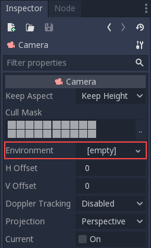

This is mostly useful when wanting to override an existing environment,
but in general it's a better idea to use the option below.

#### WorldEnvironment3D node

The WorldEnvironment3D node can be added to any scene, but only one can exist per
active scene tree. Adding more than one will result in a warning.

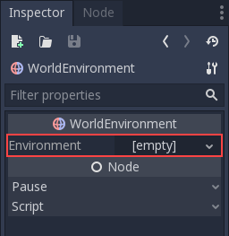

Any Environment added has higher priority than the default Environment
(explained below). This means it can be overridden on a per-scene basis,
which makes it quite useful.

#### Default environment

A default environment can be set, which acts as a fallback when no Environment
was set to a Camera or WorldEnvironment.
Just head to Project Settings -&gt; Rendering -&gt; Environment:

New projects created from the Project Manager come with a default environment
(`default_env.tres`). If one needs to be created, save it to disk before
referencing it here.

## Environment options

Following is a detailed description of all environment options and how they
are intended to be used.

#### Background

The Background section contains settings on how to fill the background (parts of
the screen where objects were not drawn). In Pandemonium 3.0, the background not only
serves the purpose of displaying an image or color, it can also change how objects
are affected by ambient and reflected light.

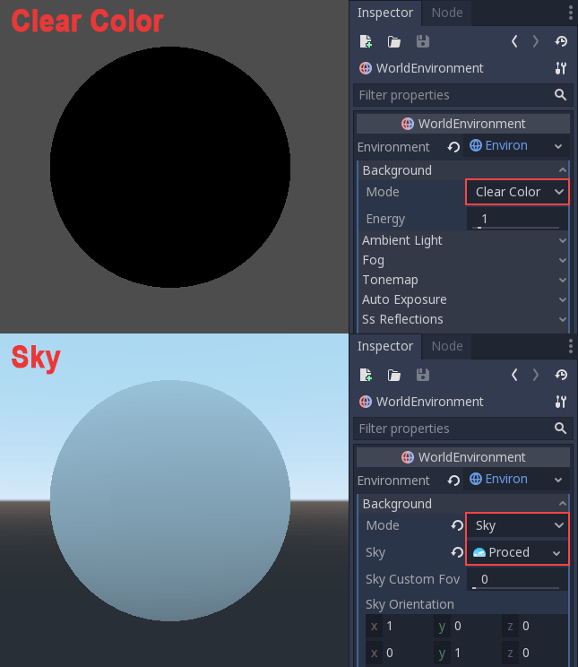

There are many ways to set the background:

- **Clear Color** uses the default clear color defined by the project. The background will be a constant color.
- **Custom Color** is like Clear Color, but with a custom color value.
- **Sky** lets you define a panorama sky (a 360 degree sphere texture) or a procedural sky (a simple sky featuring a gradient and an optional sun). Objects will reflect it and absorb ambient light from it.
- **Color+Sky** lets you define a sky (as above), but uses a constant color value for drawing the background. The sky will only be used for reflection and ambient light.

#### Ambient Light

Ambient (as defined here) is a type of light that affects every piece of geometry
with the same intensity. It is global and independent of lights that might be
added to the scene.

There are two types of ambient light: the *Ambient Color* (which is a constant
color multiplied by the material albedo) and then one obtained from the *Sky*
(as described before, but a sky needs to be set as background for this to be
enabled).

When a *Sky* is set as background, it's possible to blend between ambient color
and sky using the **Sky Contribution** setting (this value is 1.0 by default for
convenience, so only the sky affects objects).

Here is a comparison of how different ambient light affects a scene:

Finally, there is an **Energy** setting, which is a multiplier. It's useful when
working with HDR.

In general, ambient light should only be used for simple scenes, large exteriors,
or for performance reasons (ambient light is cheap), as it does not provide the
best lighting quality. It's better to generate
ambient light from ReflectionProbe or GIProbe, which will more faithfully simulate
how indirect light propagates. Below is a comparison, in terms of quality, between using a
flat ambient color and a GIProbe:

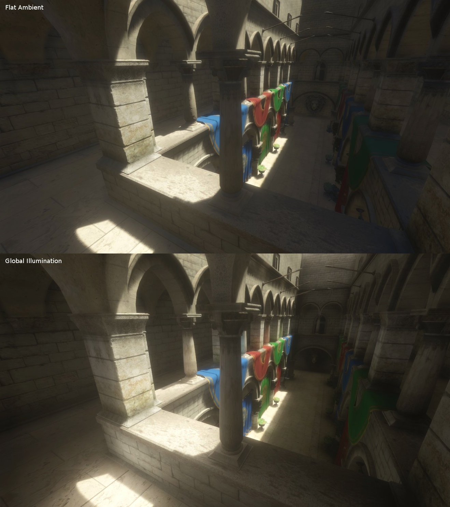

Using one of the methods described above, objects get constant ambient lighting
replaced by ambient light from the probes.

#### Fog

Fog, as in real life, makes distant objects fade away into an uniform color. The
physical effect is actually pretty complex, but Pandemonium provides a good approximation.
There are two kinds of fog in Pandemonium:

- **Depth Fog:** This one is applied based on the distance from the camera.
- **Height Fog:** This one is applied to any objects below (or above) a certain height, regardless of the distance from the camera.

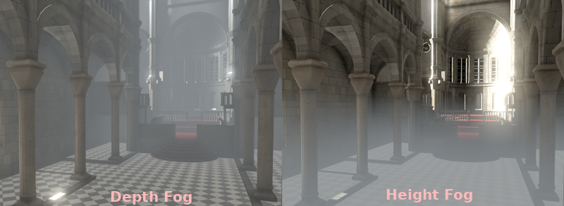

Both of these fog types can have their curve tweaked, making their transition more or less sharp.

Two properties can be tweaked to make the fog effect more interesting:

The first is **Sun Amount**, which makes use of the Sun Color property of the fog.
When looking towards a directional light (usually a sun), the color of the fog
will be changed, simulating the sunlight passing through the fog.

The second is **Transmit Enabled** which simulates more realistic light transmittance.
In practice, it makes light stand out more across the fog.

#### Tonemap

*This feature is only available when using the GLES3 backend.*

Selects the tonemapping curve that will be applied to the scene, from a
list of standard curves used in the film and game industry. Tonemapping operators
other than Linear are used to make light and dark areas more homogeneous,
while also avoiding clipping of bright highlights.

The tone mapping options are:

- **Mode:** The tone mapping mode to use.
  - **Linear:** The default tonemapping mode. This is the fastest and simplest
    tonemapping operator, but it causes bright lighting to look blown out, with
    noticeable clipping in the output colors.
  - **Reinhardt:** Performs a variation on rendered pixels' colors by this
    formula: `color = color / (1 + color)`. This avoids clipping bright
    highlights, but the resulting image can look a bit dull.
  - **Filmic:** This avoids clipping bright highlights, with a resulting image
    that usually looks more vivid than Reinhardt.
  - **ACES Fitted:** Academy Color Encoding System tonemapper.
    ACES Fitted is slightly more expensive than other options, but it handles
    bright lighting in a more realistic fashion by desaturating it as it becomes brighter.
    ACES typically has a more contrasted output compared to Reinhardt and Filmic.
    ACES is the recommended option when aiming for photorealistic visuals.
  - **ACES:** *Deprecated (will be removed in Pandemonium 4.0).* Behaves like ACES,
    but doesn't desaturate lighting as it becomes brighter (which is less realistic).
    It's recommended to use ACES Fitted instead of ACES.
- **Exposure:** Tone mapping exposure which simulates amount of light received
  over time (default: `1.0`). Higher values result in an overall brighter appearance.
  If the scene appears too dark as a result of a tonemapping operator or whitepoint
  change, try increasing this value slightly.
- **White:** Tone mapping whitepoint, which simulates where in the scale white is
  located (default: `1.0`). For photorealistic lighting, recommended values are
  between `6.0` and `8.0`. Higher values result in less blown out highlights,
  but make the scene appear slightly darker as a whole.

#### Auto Exposure (HDR)

*This feature is only available when using the GLES3 backend.*

Even though, in most cases, lighting and texturing are heavily artist controlled,
Pandemonium supports a simple high dynamic range implementation with the auto exposure
mechanism. This is generally used for the sake of realism when combining
interior areas with low light and outdoors. Auto exposure simulates the camera
(or eye) in an effort to adapt between light and dark locations and their
different amounts of light.

The simplest way to use auto exposure is to make sure outdoor lights (or other
strong lights) have energy beyond 1.0. This is done by tweaking their **Energy**
multiplier (on the Light itself). To make it consistent, the **Sky** usually
needs to use the energy multiplier too, to match with the directional light.
Normally, values between 3.0 and 6.0 are enough to simulate indoor-outdoor conditions.

By combining Auto Exposure with *Glow* post processing (more on that below),
pixels that go over the tonemap **White** will bleed to the glow buffer,
creating the typical bloom effect in photography.

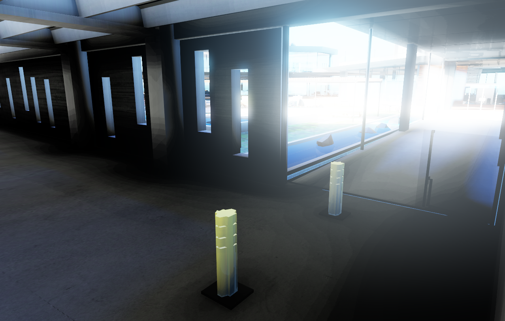

The user-controllable values in the Auto Exposure section come with sensible
defaults, but you can still tweak them:

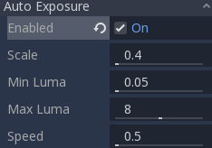

- **Scale:** Value to scale the lighting. Brighter values produce brighter images, smaller ones produce darker ones.
- **Min Luma:** Minimum luminance that auto exposure will aim to adjust for. Luminance is the average of the light in all the pixels of the screen.
- **Max Luma:** Maximum luminance that auto exposure will aim to adjust for.
- **Speed:** Speed at which luminance corrects itself. The higher the value, the faster correction happens.

## Mid- and post-processing effects

A large amount of widely-used mid- and post-processing effects are supported
in the Environment.

#### Screen-Space Reflections (SSR)

*This feature is only available when using the GLES3 backend.*

While Pandemonium supports three sources of reflection data (Sky, ReflectionProbe, and
GIProbe), they may not provide enough detail for all situations. Scenarios
where Screen Space Reflections make the most sense are when objects are in
contact with each other (object over floor, over a table, floating on water, etc).

The other advantage (even if only enabled to a minimum), is that it works in real-time
(while the other types of reflections are pre-computed). This can be used to
make characters, cars, etc. reflect on surrounding surfaces when moving around.

A few user-controlled parameters are available to better tweak the technique:

- **Max Steps** determines the length of the reflection. The bigger this number, the more costly it is to compute.
- **Fade In** allows adjusting the fade-in curve, which is useful to make the contact area softer.
- **Fade Out** allows adjusting the fade-out curve, so the step limit fades out softly.
- **Depth Tolerance** can be used for screen-space-ray hit tolerance to gaps. The bigger the value, the more gaps will be ignored.
- **Roughness** will apply a screen-space blur to approximate roughness in objects with this material characteristic.

Keep in mind that screen-space-reflections only work for reflecting opaque geometry. Transparent objects can't be reflected.

#### Screen-Space Ambient Occlusion (SSAO)

*This feature is only available when using the GLES3 backend.*

As mentioned in the **Ambient** section, areas where light from light nodes
does not reach (either because it's outside the radius or shadowed) are lit
with ambient light. Pandemonium can simulate this using GIProbe, ReflectionProbe,
the Sky, or a constant ambient color. The problem, however, is that all the
methods proposed previously act more on a larger scale (large regions) than at the
smaller geometry level.

Constant ambient color and Sky are the same everywhere, while GI and
Reflection probes have more local detail, but not enough to simulate situations
where light is not able to fill inside hollow or concave features.

This can be simulated with Screen Space Ambient Occlusion. As you can see in the
image below, its purpose is to make sure concave areas are darker, simulating
a narrower path for the light to enter:

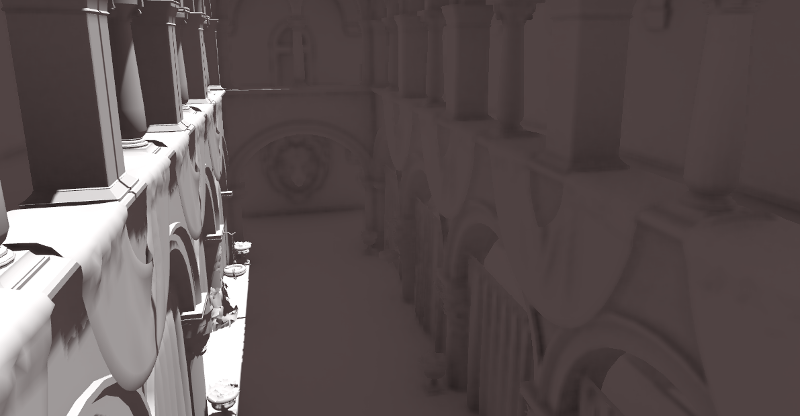

It is a common mistake to enable this effect, turn on a light, and not be able to
appreciate it. This is because SSAO only acts on *ambient* light, not direct light.

This is why, in the image above, the effect is less noticeable under the direct
light (on the left). If you want to force SSAO to work with direct light too, use
the **Light Affect** parameter (even though this is not correct, some artists like how it looks).

SSAO looks best when combined with a real source of indirect light, like GIProbe:

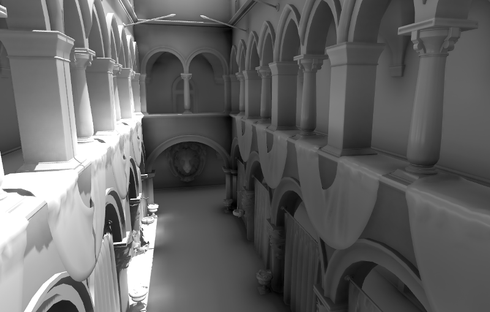

Tweaking SSAO is possible with several parameters:

- **Radius/Intensity:** To control the radius or intensity of the occlusion, these two parameters are available. Radius is in world (Metric) units.
- **Radius2/Intensity2:** A Secondary radius/intensity can be used. Combining a large and a small radius AO generally works well.
- **Bias:** This can be tweaked to solve self occlusion, though the default generally works well enough.
- **Light Affect:** SSAO only affects ambient light, but increasing this slider can make it also affect direct light. Some artists prefer this effect.
- **Ao Channel Affect:** If a value of zero is used, only the material's AO texture will be used for ambient occlusion; SSAO will not be applied. Values greater than 0 multiply the AO texture by the SSAO effect to varying degrees. This does not affect materials without an AO texture.
- **Quality:** Depending on quality, SSAO will take more samples over a sphere for every pixel. High quality only works well on modern GPUs.
- **Blur:** Type of blur kernel used. The 1x1 kernel is a simple blur that preserves local detail better, but is not as efficient (generally works better with the high quality setting above), while 3x3 will soften the image better (with a bit of dithering-like effect), but does not preserve local detail as well.
- **Edge Sharpness**: This can be used to preserve the sharpness of edges (avoids areas without AO on creases).

#### Depth of Field / Far Blur

This effect simulates focal distance on high end cameras. It blurs objects behind
a given range. It has an initial **Distance** with a **Transition** region
(in world units):

The **Amount** parameter controls the amount of blur. For larger blurs, tweaking
the **Quality** may be needed in order to avoid artifacts.

#### Depth of Field / Near Blur

This effect simulates focal distance on high end cameras. It blurs objects close
to the camera (acts in the opposite direction as far blur).
It has an initial **Distance** with a **Transition** region (in world units):

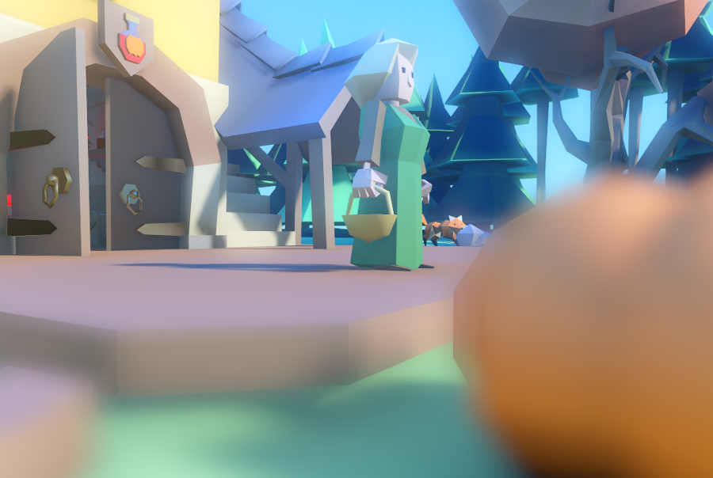

The **Amount** parameter controls the amount of blur. For larger blurs, tweaking
the **Quality** may be needed in order to avoid artifacts.

It is common to use both blurs together to focus the viewer's attention on a
given object:

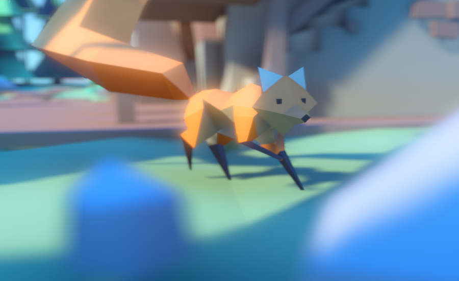

#### Glow

In photography and film, when light amount exceeds the maximum supported by the
media (be it analog or digital), it generally bleeds outwards to darker regions
of the image. This is simulated in Pandemonium with the **Glow** effect.

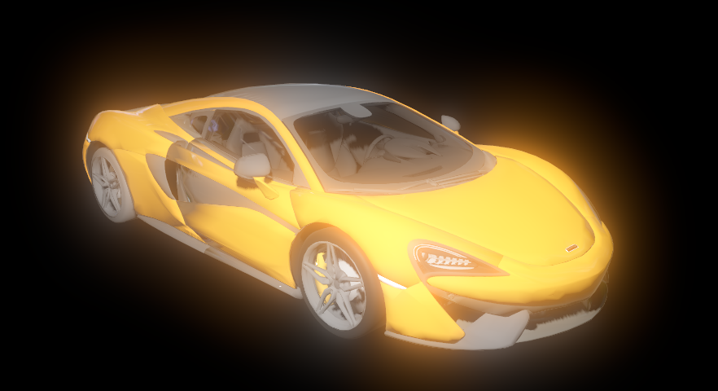

By default, even if the effect is enabled, it will be weak or invisible. One of
two conditions need to happen for it to actually show:

- 1) The light in a pixel surpasses the **HDR Threshold** (where 0 is all light surpasses it, and 1.0 is light over the tonemapper **White** value). Normally, this value is expected to be at 1.0, but it can be lowered to allow more light to bleed. There is also an extra parameter, **HDR Scale**, that allows scaling (making brighter or darker) the light surpassing the threshold.

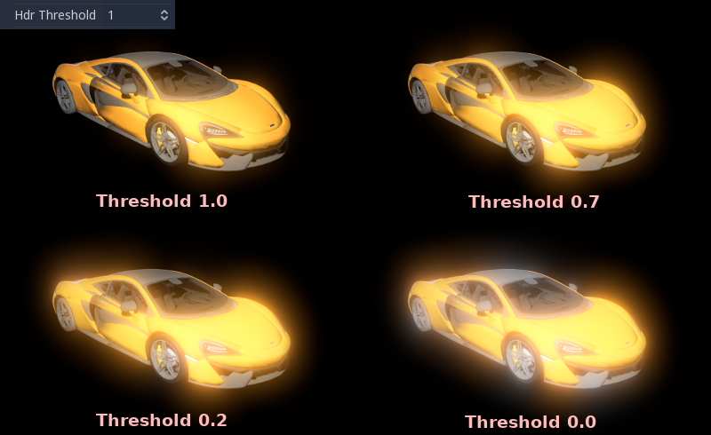

- 2) The Bloom effect has a value set greater than 0. As it increases, it sends the whole screen to the glow processor at higher amounts.

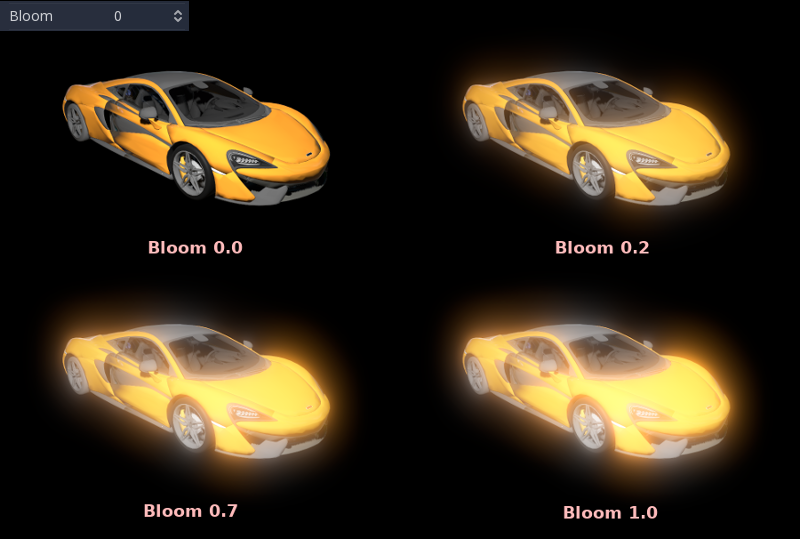

Both will cause the light to start bleeding out of the brighter areas.

Once glow is visible, it can be controlled with a few extra parameters:

- **Intensity** is an overall scale for the effect, it can be made stronger or weaker (0.0 removes it).
- **Strength** is how strong the gaussian filter kernel is processed. Greater values make the filter saturate and expand outwards. In general, changing this is not needed, as the size can be more efficiently adjusted with the **Levels**.

The **Blend Mode** of the effect can also be changed:

- **Additive** is the strongest one, as it only adds the glow effect over the image with no blending involved. In general, it's too strong to be used, but can look good with low intensity Bloom (produces a dream-like effect).
- **Screen** ensures glow never brightens more than itself and it works great as an all around.
- **Softlight** is the default and weakest one, producing only a subtle color disturbance around the objects. This mode works best on dark scenes.
- **Replace** can be used to blur the whole screen or debug the effect. It only shows the glow effect without the image below.

To change the glow effect size and shape, Pandemonium provides **Levels**. Smaller
levels are strong glows that appear around objects, while large levels are hazy
glows covering the whole screen:

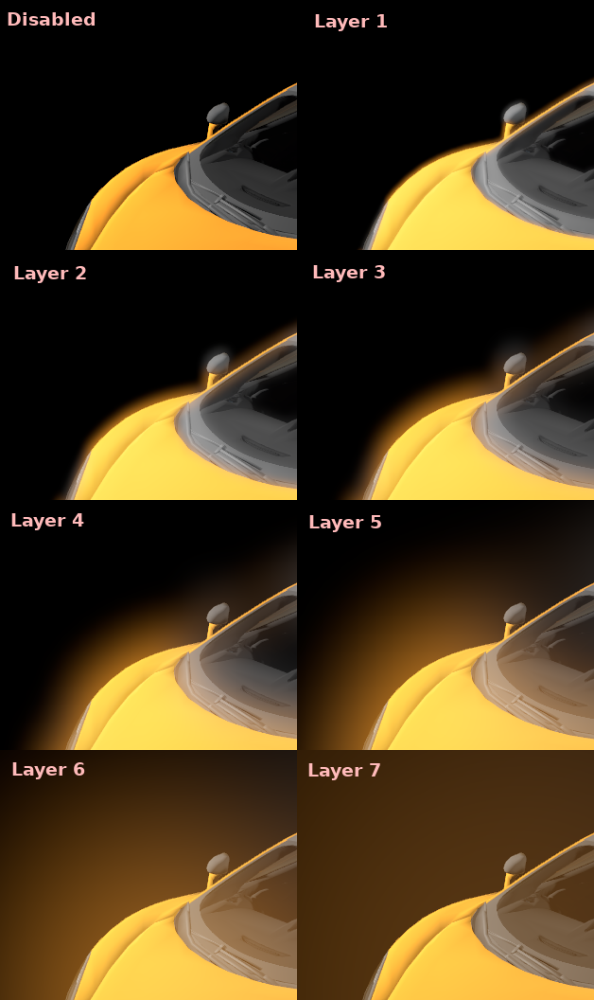

The real strength of this system, though, is to combine levels to create more
interesting glow patterns:

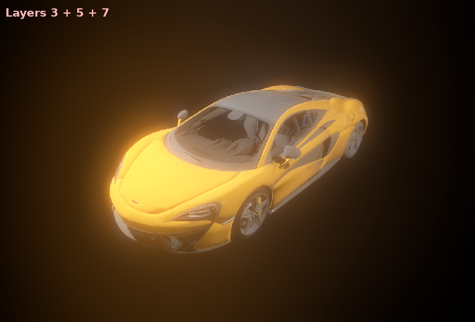

Finally, as the highest layers are created by stretching small blurred images,
it is possible that some blockiness may be visible. Enabling **Bicubic Upscaling**
gets rids of it, at a minimal performance cost.
*Note that this is effective only when using the GLES3 backend.*

#### Adjustments

At the end of processing, Pandemonium offers the possibility to do some standard
image adjustments.

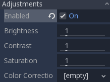

The first one is being able to change the typical Brightness, Contrast,
and Saturation:

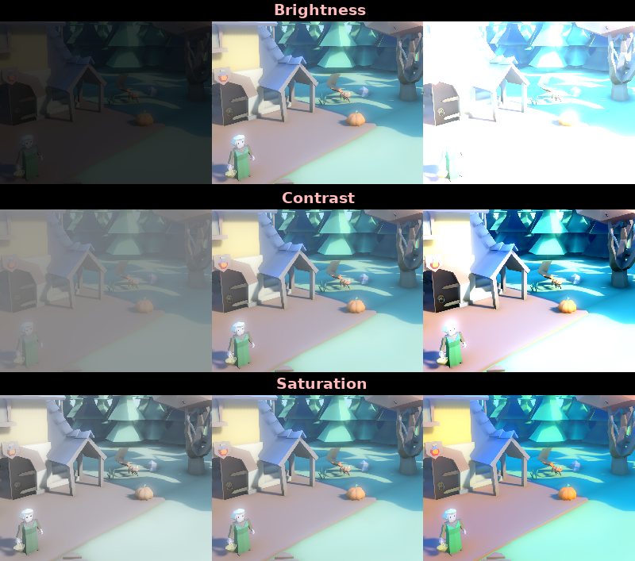

The second is by supplying a color correction gradient. A regular black to
white gradient like the following one will produce no effect:

But creating custom ones will allow to map each channel to a different color:

