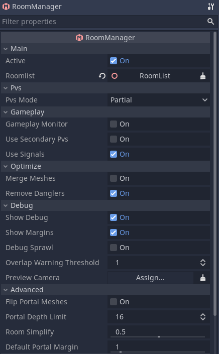
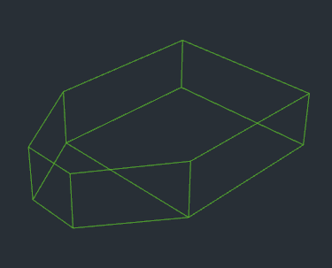
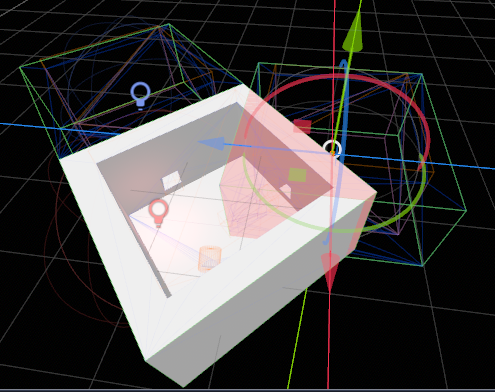
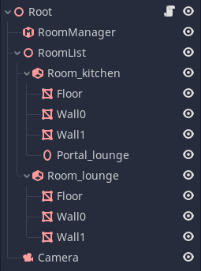

First steps with Rooms and Portals
==================================

The RoomManager
~~~~~~~~~~~~~~~

Anytime you want to use the portal system, you need to include a special node in your scene tree, called the `RoomManager( RoomManager )`. The RoomManager is responsible for the runtime maintenance of the system, especially converting the objects in your rooms into a *room graph* which is used at runtime to perform occlusion culling and other tasks.

Room Conversion
^^^^^^^^^^^^^^^

This conversion must take place every time you want to activate the system. It does not store the *room graph* in your project (for flexibility and to save memory). You can either trigger it by pressing the **Convert Rooms** button in the editor toolbar (which also has a keyboard shortcut) or by calling the `rooms_convert()` method in the RoomManager. The latter method will be what you use in-game. Note that for safety, best practice is to call `rooms_clear()` before unloading or changing levels.

If you convert the level while the editor is running, the portal culling system will take over from the normal Pandemonium frustum culling, potentially interfering with editor features. To get around this, you can turn portal culling on and off using either the **View Portal Culling** toggle in the **View** menu on the editor toolbar (which also has a keyboard shortcut) or the **Active** setting in the RoomManager node.

Note:
 To use the RoomManager, you have to tell it where the rooms are in your scene tree, or, more specifically, where the RoomList node is. This RoomList is the parent of your rooms - see below. If the RoomList is not set, conversion will fail, and you will see a warning dialog box.

The RoomList
^^^^^^^^^^^^

Before we create any rooms, we must first create a node to be the parent of all the static objects, rooms, roomgroups, and so on in our level. This node is referred to as the the `RoomList`.

Note:
 The roomlist is **not** a special node type – it can just be a regular Spatial.

You will need to assign the roomlist node in the RoomManager so that it knows where to find the rooms.

Why do we use a specific branch of the scene tree and not the scene root? The answer is that there are many internal details of the system which are easier to manage if the rooms are placed on their own branch.

Often you will end up completely replacing the roomlist branch at runtime in your game as you load and unload levels.

Rooms
~~~~~

What is a room?
^^^^^^^^^^^^^^^

`Room( Room )`\ s are a way of spatially partitioning your level into areas that make sense in terms of level design. Rooms often quite literally *are* rooms (like in a building). Ultimately though, as far as the engine is concerned, a room represents a **non-overlapping** convex volume in which you typically place most of your objects that fall within that area.

A room doesn't need to correspond to a literal room. It could, for example, also be a canyon in an outdoor area or a smaller part of a concave room. With a little imagination, you can use the system in almost any scenario.

Why convex?
^^^^^^^^^^^

Rooms are defined as convex volumes (or *convex hulls*) because it's trivial to mathematically determine whether a point is within a convex hull. A simple plane check will tell you the distance of a point from a plane. If a point is behind all the planes bounding the convex hull, then by definition it is inside the room. This makes all kinds of things easier in the internals of the system, such as checking which room a camera is within.

*A convex hull. The hull is defined as a series of planes facing outward. If a point is behind all the planes, it is within the hull.*

Why non-overlapping?
^^^^^^^^^^^^^^^^^^^^

If two rooms overlap, and a camera or player is in this overlapping zone, then there is no way to tell which room the object should be in (and hence render from), or be rendered in. This requirement for non-overlapping rooms does have implications for level design.

If you accidentally create overlapping rooms, the editor will warn you when you convert the rooms, indicating any overlapping zones in red.

The system does attempt to cope with overlapping rooms as best as possible by making the current room *"sticky"*. Each object remembers which room it was in during the previous frame and stays within it as long as it does not move outside the convex hull room bound. This can result in some hysteresis in these overlapping zones.

There is one exception, however, for `internal rooms( doc_rooms_and_portals_internal_rooms )`. You do not have to worry about these to start with.

How do I create a room?
^^^^^^^^^^^^^^^^^^^^^^^

A `Room( Room )` is a node type that can be added to the scene tree like any other. You can place objects within the room by making them children and grand-children of the Room node.

How do I define the shape and position of my room convex hull?
^^^^^^^^^^^^^^^^^^^^^^^^^^^^^^^^^^^^^^^^^^^^^^^^^^^^^^^^^^^^^^

Because defining the room bound is the most important aspect of the system, there are THREE methods available to define the shape of a room in Pandemonium:

1. Use the geometry of the objects contained within the room to automatically create an approximate bound.
2. Manually edit the points that define the convex hull in the room inspector or drag the points around using the editor gizmo (see `doc_room_point_editing`).
3. Provide a manual bound. This is a MeshInstance in the room that has geometry in the shape of the desired bound, with a name with the postfix `-bound`. This is something you might choose to do if you create your levels in Blender or similar (see `doc_rooms_and_portals_blender`).

While the first option can be all that is required, particularly with simple rooms or for pre-production, using manual bounds gives you ultimate control at the expense of a small amount of editing. You can also combine the two approaches, perhaps using automatic bounds for most rooms but manually editing problem areas.

The automatic method is used whenever a manual bound is not supplied.

*A simple pair of rooms. The portal margin is shown with translucent red, and the room hulls are shown with green wireframe.*

Portals
~~~~~~~

If you create some rooms, place objects within them, then convert the level in the editor, you will see the objects in the rooms appearing and showing as you move between rooms. There is one problem, however! Although you can see the objects within the room that the camera is in, you can't see to any neighbouring rooms! For that we need portals.

`Portal( Portal )`\ s are special convex polygons that you position over the openings between rooms in order to allow the system to see between them. You can create a portal node directly in the editor. The default portal has 4 points and behaves much like a `plane` `MeshInstance( MeshInstance )`. You can add or remove points using the inspector. A portal requires at least 3 points to work - this is because it needs to form a polygon rather than a point or line.

To save editing effort, **only one Portal is required between each pair of Rooms**. You *do not need* to (and indeed should not) create two Portals that overlap in opposite directions. Portals default to being two-way, but you can make them one-way in the Portal inspector.

You should therefore place a portal in only one of each pair of neighbouring rooms - this is the portal's *"source room"*. Generally it doesn't matter which you choose as the source room. The portal normal (the arrow in the gizmo) should face *outward* from the source room.

Do not be confused by the arrow. Although the arrow shows which direction the portal faces, most portals will be *two-way*, and can be seen through from both directions. The arrow is more important for ensuring that the portal links to the correct neighbouring room.

Portal linking
^^^^^^^^^^^^^^

There are two ways to specify which room the portal should link to:

- Leave the **Linked Room** in the inspector blank. The system will attempt to *autolink* the portal to the nearest neighbour room during conversion. This works fine in most cases.
- Explicitly specify the room by setting the **Linked Room** in the inspector.

Note:
 Portals are defined as a set of 2D points. This ensures that the polygon formed is in a single plane. The transform determines the portal orientation. The points must also form a *convex* polygon. This is enforced by validating the points you specify, ignoring any that do not form a convex shape. This makes editing easier while making it difficult to break the system.

Trying it out
~~~~~~~~~~~~~

By now you should be able to create a couple of rooms, add some nodes such as MeshInstances within the rooms, and add a portal between the rooms. Try converting the rooms in the editor and see if you can now view the objects in neighbouring rooms through the portal.

You have now mastered the basic principles of the system.

The next step is to look at the different types of objects that can be managed by the system.
