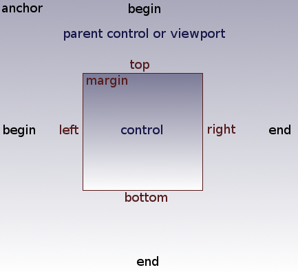
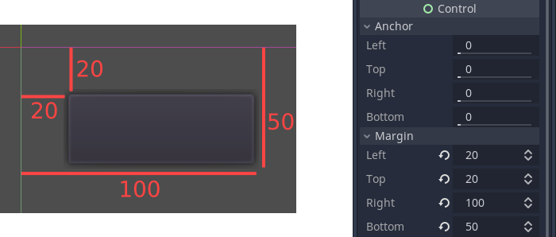
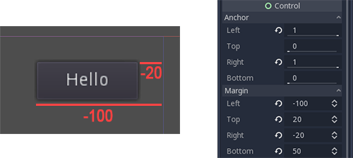
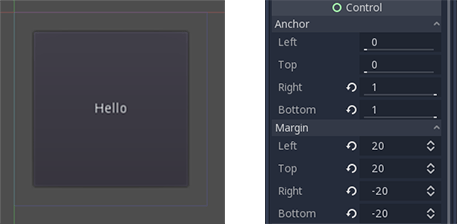

# Size and anchors

If a game was always going to be run on the same device and at the same
resolution, positioning controls would be a simple matter of setting the
position and size of each one of them. Unfortunately, that is rarely the
case.

Only TVs nowadays have a standard resolution and aspect ratio.
Everything else, from computer monitors to tablets, portable consoles
and mobile phones have different resolutions and aspect ratios.

There are several ways to handle this, but for now, let's just imagine
that the screen resolution has changed and the controls need to be
re-positioned. Some will need to follow the bottom of the screen, others
the top of the screen, or maybe the right or left margins.



This is done by editing the *margin* properties of controls. Each
control has four margins: left, right, bottom and top. By default, all of
them represent a distance in pixels relative to the top-left corner of
the parent control or (in case there is no parent control) the viewport.



When horizontal (left, right) and/or vertical (top, bottom) anchors are
changed to 1, the margin values become relative to the bottom-right
corner of the parent control or viewport.



Here, the control is set to expand its bottom-right corner with that of
the parent, so when re-sizing the parent, the control will always cover
it, leaving a 20 pixel margin:



## Centering a control

To center a control in its parent, set its anchors to 0.5 and each margin
to half of its relevant dimension. For example, the code below shows how
a TextureRect can be centered in its parent:

```
    var rect = TextureRect.new()
    rect.texture = load("res://icon.png)")
    rect.anchor_left = 0.5
    rect.anchor_right = 0.5
    rect.anchor_top = 0.5
    rect.anchor_bottom = 0.5
    var texture_size = rect.texture.get_size()
    rect.margin_left = -texture_size.x / 2
    rect.margin_right = -texture_size.x / 2
    rect.margin_top = -texture_size.y / 2
    rect.margin_bottom = -texture_size.y / 2
    add_child(rect)
```

Setting each anchor to 0.5 moves the reference point for the margins to
the center of its parent. From there, we set negative margins so that
the control gets its natural size.

## Layout Presets

Instead of manually adjusting the margin and anchor values, you can use the
toolbar's Layout menu, above the viewport. Besides centering, it gives you many
options to align and resize control nodes.


