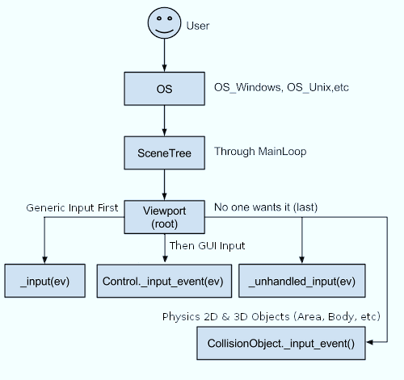
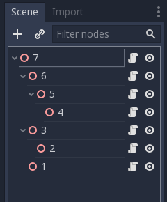

# Using InputEvent

## What is it?

Managing input is usually complex, no matter the OS or platform. To ease
this a little, a special built-in type is provided, `InputEvent`.
This datatype can be configured to contain several types of input
events. Input events travel through the engine and can be received in
multiple locations, depending on the purpose.

Here is a quick example, closing your game if the escape key is hit:

```
func _unhandled_input(event):
    if event is InputEventKey:
        if event.pressed and event.scancode == KEY_ESCAPE:
            get_tree().quit()
```

However, it is cleaner and more flexible to use the provided `InputMap` feature,
which allows you to define input actions and assign them different keys. This way,
you can define multiple keys for the same action (e.g. the keyboard escape key and the start button on a gamepad).
You can then more easily change this mapping in the project settings without updating your code,
and even build a key mapping feature on top of it to allow your game to change the key mapping at runtime!

You can set up your InputMap under **Project &gt; Project Settings &gt; Input Map** and then use those actions like this:

```
func _process(delta):
    if Input.is_action_pressed("ui_right"):
        # Move right.
```

## How does it work?

Every input event is originated from the user/player (though it's
possible to generate an InputEvent and feed them back to the engine,
which is useful for gestures). The OS object for each platform will read
events from the device, then feed them to MainLoop. As `SceneTree`
is the default MainLoop implementation, events are fed to it. Pandemonium
provides a function to get the current SceneTree object: **get_tree()**.

But SceneTree does not know what to do with the event, so it will give
it to the viewports, starting by the "root" `Viewport` (the first
node of the scene tree). Viewport does quite a lot of stuff with the
received input, in order:



1. First of all, the standard `Node._input()` function
   will be called in any node that overrides it (and hasn't disabled input processing with `Node.set_process_input()`).
   If any function consumes the event, it can call `SceneTree.set_input_as_handled()`, and the event will
   not spread any more. This ensures that you can filter all events of interest, even before the GUI.
   For gameplay input, `Node._unhandled_input()` is generally a better fit, because it allows the GUI to intercept the events.
2. Second, it will try to feed the input to the GUI, and see if any
   control can receive it. If so, the `Control` will be called via the
   virtual function `Control._gui_input()` and the signal
   "gui_input" will be emitted (this function is re-implementable by
   script by inheriting from it). If the control wants to "consume" the
   event, it will call `Control.accept_event()` and the event will
   not spread any more. Use the `Control.mouse_filter`
   property to control whether a `Control` is notified
   of mouse events via `Control._gui_input()`
   callback, and whether these events are propagated further.
3. If so far no one consumed the event, the unhandled input callback
   will be called if overridden (and not disabled with
   `Node.set_process_unhandled_input()`).
   If any function consumes the event, it can call `SceneTree.set_input_as_handled()`, and the
   event will not spread any more. The unhandled input callback is ideal for full-screen gameplay events, so they are not received when a GUI is active.
4. If no one wanted the event so far, and a `Camera` is assigned
   to the Viewport with `Object Picking` turned on, a ray to the physics world (in the ray direction from
   the click) will be cast. (For the root viewport, this can also be enabled in `Project Settings`) If this ray hits an object, it will call the
   `CollisionObject._input_event()` function in the relevant
   physics object (bodies receive this callback by default, but areas do
   not. This can be configured through `Area` properties).
5. Finally, if the event was unhandled, it will be passed to the next
   Viewport in the tree, otherwise it will be ignored.

When sending events to all listening nodes within a scene, the viewport
will do so in a reverse depth-first order: Starting with the node at
the bottom of the scene tree, and ending at the root node:



GUI events also travel up the scene tree but, since these events target
specific Controls, only direct ancestors of the targeted Control node receive the event.

In accordance with Pandemonium's node-based design, this enables
specialized child nodes to handle and consume particular events, while
their ancestors, and ultimately the scene root, can provide more
generalized behavior if needed.

## Anatomy of an InputEvent

`InputEvent` is just a base built-in type, it does not represent
anything and only contains some basic information, such as event ID
(which is increased for each event), device index, etc.

There are several specialized types of InputEvent, described in the table below:


| Event                       | Type Index         | Description                             |
|-----------------------------|--------------------|-----------------------------------------|
| `InputEvent`                | NONE               | Empty Input Event.                      |
| `InputEventKey`             | KEY                | Contains a scancode and Unicode value,  |
|                             |                    | as well as modifiers.                   |
| `InputEventMouseButton`     | MOUSE_BUTTON       | Contains click information, such as     |
|                             |                    | button, modifiers, etc.                 |
| `InputEventMouseMotion`     | MOUSE_MOTION       | Contains motion information, such as    |
|                             |                    | relative, absolute positions and speed. |
| `InputEventJoypadMotion`    | JOYSTICK_MOTION    | Contains Joystick/Joypad analog axis    |
|                             |                    | information.                            |
| `InputEventJoypadButton`    | JOYSTICK_BUTTON    | Contains Joystick/Joypad button         |
|                             |                    | information.                            |
| `InputEventScreenTouch`     | SCREEN_TOUCH       | Contains multi-touch press/release      |
|                             |                    | information. (only available on mobile  |
|                             |                    | devices)                                |
| `InputEventScreenDrag`      | SCREEN_DRAG        | Contains multi-touch drag information.  |
|                             |                    | (only available on mobile devices)      |
| `InputEventAction`          | SCREEN_ACTION      | Contains a generic action. These events |
|                             |                    | are often generated by the programmer   |
|                             |                    | as feedback. (more on this below)       |


## Actions

An InputEvent may or may not represent a pre-defined action. Actions are
useful because they abstract the input device when programming the game
logic. This allows for:

-  The same code to work on different devices with different inputs (e.g.,
   keyboard on PC, Joypad on console).
-  Input to be reconfigured at run-time.

Actions can be created from the Project Settings menu in the Actions
tab.

Any event has the methods `InputEvent.is_action()`,
`InputEvent.is_pressed()`.

Alternatively, it may be desired to supply the game back with an action
from the game code (a good example of this is detecting gestures).
The Input singleton has a method for this:
`Input.parse_input_event()`. You would normally use it like this:

```
var ev = InputEventAction.new()
# Set as move_left, pressed.
ev.action = "move_left"
ev.pressed = true
# Feedback.
Input.parse_input_event(ev)
````

## InputMap

Customizing and re-mapping input from code is often desired. If your
whole workflow depends on actions, the `InputMap` singleton is
ideal for reassigning or creating different actions at run-time. This
singleton is not saved (must be modified manually) and its state is run
from the project settings (project.pandemonium). So any dynamic system of this
type needs to store settings in the way the programmer best sees fit.

