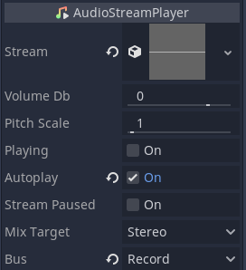

# Recording with microphone

Pandemonium supports in-game audio recording for Windows, macOS, Linux, Android and
iOS.

A simple demo is included in the official demo projects and will be used as
support for this tutorial:
`( https://github.com/Relintai/pandemonium_engine-demo-projects/tree/master/audio/mic_record )`.

You will need to enable audio input in the project settings, or you'll just get empty audio files.

## The structure of the demo

The demo consists of a single scene. This scene includes two major parts: the
GUI and the audio.

We will focus on the audio part. In this demo, a bus named `Record` with the
effect `Record` is created to handle the audio recording.
An `AudioStreamPlayer` named `AudioStreamRecord` is used for recording.




gdscript GDScript

```
    var effect
    var recording


    func _ready():
        # We get the index of the "Record" bus.
        var idx = AudioServer.get_bus_index("Record")
        # And use it to retrieve its first effect, which has been defined
        # as an "AudioEffectRecord" resource.
        effect = AudioServer.get_bus_effect(idx, 0)
```

The audio recording is handled by the `AudioEffectRecord` resource
which has three methods:
`get_recording()`,
`is_recording_active()`,
and `set_recording_active()`.

gdscript GDScript

```
    func _on_RecordButton_pressed():
        if effect.is_recording_active():
            recording = effect.get_recording()
            $PlayButton.disabled = false
            $SaveButton.disabled = false
            effect.set_recording_active(false)
            $RecordButton.text = "Record"
            $Status.text = ""
        else:
            $PlayButton.disabled = true
            $SaveButton.disabled = true
            effect.set_recording_active(true)
            $RecordButton.text = "Stop"
            $Status.text = "Recording..."
```


At the start of the demo, the recording effect is not active. When the user
presses the `RecordButton`, the effect is enabled with
`set_recording_active(true)`.

On the next button press, as `effect.is_recording_active()` is `true`,
the recorded stream can be stored into the `recording` variable by calling
`effect.get_recording()`.

gdscript GDScript

```
    func _on_PlayButton_pressed():
        print(recording)
        print(recording.format)
        print(recording.mix_rate)
        print(recording.stereo)
        var data = recording.get_data()
        print(data)
        print(data.size())
        $AudioStreamPlayer.stream = recording
        $AudioStreamPlayer.play()
```

To playback the recording, you assign the recording as the stream of the
`AudioStreamPlayer` and call `play()`.

gdscript GDScript

```
    func _on_SaveButton_pressed():
        var save_path = $SaveButton/Filename.text
        recording.save_to_wav(save_path)
        $Status.text = "Saved WAV file to: %s\n(%s)" % [save_path, ProjectSettings.globalize_path(save_path)]
```


To save the recording, you call `save_to_wav()` with the path to a file.
In this demo, the path is defined by the user via a `LineEdit` input box.
