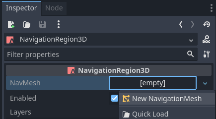
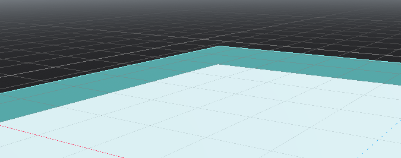
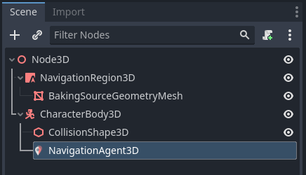

# 3D Navigation Overview

Pandemonium provides multiple objects, classes and servers to facilitate grid-based or mesh-based navigation and pathfinding for 2D and 3D games.
The following section provides a quick overview over all available navigation related objects in Pandemonium for 3D scenes and their primary use.

Pandemonium provides the following objects and classes for 3D navigation:

### `Astar3D`

`Astar3D` objects provide an option to find the shortest path in a graph of weighted **points**.

The AStar3D class is best suited for cellbased 3D gameplay that does not require actors to reach any
possible position within an area but only predefined, distinct positions.

### `NavigationServer3D`

`NavigationServer3D` provides a powerful server API to find the shortest path between two positions
on a area defined by a navigation mesh.

The NavigationServer is best suited for 3D realtime gameplay that does require actors to reach any
possible position within an navmesh defined area. Meshbased navigation scales well with large gameworlds
as a large area can often be defined with a single polygon when it would require many, many grid cells.

The NavigationServer holds different navigation maps that each consist of regions that hold navigation mesh
data. Agents can be placed on a map for avoidance calculation. RIDs are used to reference the internal maps,
regions and agents when communicating with the server.

The following NavigationServer RID types are available.

- NavMap RID: Reference to a specific navigation map that holds regions and agents.
  The map will attempt to join changed navigation meshes of regions by proximity.
  The map will synchronize regions and agents each physics frame.
- NavRegion RID: Reference to a specific navigation region that can hold navigation mesh data.
  The region can be enabled / disabled or the use restricted with a navigationlayer bitmask.
- NavLink RID: Reference to a specific navigation link that connects two navigation mesh positions over arbitrary distances.
- NavAgent RID: Reference to a specific avoidance agent with a radius value use solely in avoidance.

The following SceneTree Nodes are available as helpers to work with the NavigationServer3D API.

### `NavigationRegion3D` Node

A Node that holds a Navigation Mesh resource that defines a navigation mesh for the NavigationServer3D.

- The region can be enabled / disabled.
- The use in pathfinding can be further restricted through the navigationlayers bitmask.
- Regions can join their navigation meshes by proximity for a combined navigation mesh.

### `NavigationLink3D` Node

A Node that connects two positions on navigation mesh over arbitrary distances for pathfinding.

- The link can be enabled / disabled.
- The link can be made one-way or bidirectional.
- The use in pathfinding can be further restricted through the navigationlayers bitmask.

Links tell the pathfinding that a connection exists and at what cost. The actual agent handling and movement needs to happen in custom scripts.

###  `NavigationAgent3D` Node

An optional helper Node to facilitate common NavigationServer3D API calls for pathfinding and avoidance for
a Node3D inheriting parent Node.

###  `NavigationObstacle3D` Node

A Node that acts as an agent with avoidance radius, to work it needs to be added under a Node3D
inheriting parent Node. Obstacles are intended as a last resort option for constantly moving objects
that cannot be re(baked) to a navigation mesh efficiently. This node also only works if RVO processing
is being used.

The 3D navigation meshes are defined with the following resources:

### `NavigationMesh` Resource

A resource that holds 3D navigation mesh data and provides 3D geometry baking options to define navigation
areas inside the Editor as well as at runtime.

- The NavigationRegion3D Node uses this resource to define its navigation area.
- The NavigationServer3D uses this resource to update navmesh of individual regions.
- The GridMap Editor uses this resource when specific navigation meshes are defined for each gridcell.

### See also

You can see how 3D navigation works in action using the
`3D Navigation demo project <https://github.com/Relintai/pandemonium_engine-demo-projects/tree/master/3d/navigation>`__.

## Setup for 3D scene

The following steps show how to setup a minimum viable navigation in 3D that uses the NavigationServer3D and
a NavigationAgent3D for path movement.

1. Add a NavigationRegion3D Node to the scene.
2. Click on the region node and add a new `NavigationMesh` Resource to
   the region node.
   
3. Add a new MeshInstance3D node as a child of the region node.
4. Select the MeshInstance3D node and add a new PlaneMesh and increase the xy size to 10.
5. Select the region node again and press the "Bake Navmesh" button on the top bar.
   
6. Now a transparent navigation mesh appeared that hovers some distance on top the planemesh.
   
7. Add a CharacterBody3D node in the scene with a basic collision shape and some mesh for visuals.
8. Add a NavigationAgent3D node below the character node.
   
9. Add a script to the CharacterBody3D node with the following content. We make sure to set a
   movement target after the scene has fully loaded and the NavigationServer had time to sync.
   Also, add a Camera3D and some light and environment to see something.

```
extends CharacterBody3D

var movement_speed: float = 2.0
var movement_target_position: Vector3 = Vector3(-3.0,0.0,2.0)

onready var navigation_agent: NavigationAgent3D = $NavigationAgent3D

func _ready():
    # These values need to be adjusted for the actor's speed
    # and the navigation layout.
    navigation_agent.path_desired_distance = 0.5
    navigation_agent.target_desired_distance = 0.5

    # Make sure to not await during _ready.
    call_deferred("actor_setup")

func actor_setup():
    # Wait for the first physics frame so the NavigationServer can sync.
    await get_tree().physics_frame

    # Now that the navigation map is no longer empty, set the movement target.
    set_movement_target(movement_target_position)

func set_movement_target(movement_target: Vector3):
    navigation_agent.set_target_position(movement_target)

func _physics_process(delta):
    if navigation_agent.is_navigation_finished():
        return

    var current_agent_position: Vector3 = global_position
    var next_path_position: Vector3 = navigation_agent.get_next_path_position()

    var new_velocity: Vector3 = next_path_position - current_agent_position
    new_velocity = new_velocity.normalized()
    new_velocity = new_velocity * movement_speed

    velocity = new_velocity
    move_and_slide()
```

Note: On the first frame the NavigationServer map has not synchronized region data and any path query
will return empty. Await one frame to pause scripts until the NavigationServer had time to sync.

