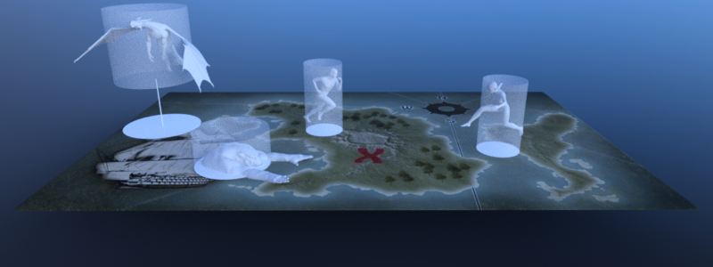

# Using NavigationMaps



A NavigationMap is an abstract navigation world on the NavigationServer identified by a NavigationServer `RID`.

A map can hold and connect a near infinite number of navigation regions with navigation meshes to build the traversable areas of a game world for pathfinding.

A map can be joined by avoidance agents to process collision avoidance between the avoidance agents.

Note:

    Different NavigationMaps are completely isolated from each other but navigation regions
    and avoidance agents can switch between different maps once every server synchronization.

### Default navigation maps

By default Pandemonium creates a navigation map RID for each `World2D` and `World3D` of the root viewport.

The 2D default navigation `map` can be obtained with ``get_world_2d().get_navigation_map()`` from any `Node2D` inheriting Node.

The 3D default navigation `map` can be obtained with ``get_world_3d().get_navigation_map()`` from any `Node3D` inheriting Node.

GDScript

```
    extends Node2D

    var default_2d_navigation_map_rid: RID = get_world_2d().get_navigation_map()
```

### Creating new navigation maps

The NavigationServer can create and support as many navigation maps as are required for specific gameplay.
Additional navigation maps are created and maintained by using the NavigationServer API
directly e.g. to support different avoidance agent or actor locomotion types.

For example uses of different navigation maps see `doc_navigation_different_actor_types` and `doc_navigation_different_actor_locomotion`.

Each navigation map synchronizes queued changes to its navigation regions and avoidance agents individually.
A navigation map that has not received changes will consume little to no processing time.
Navigation regions and avoidance agents can only be part of a single navigations map but they can switch maps at any time.

Note:

    A navigation map switch will take effect only after the next NavigationServer synchronization.

GDScript

```
    extends Node2D

    var new_navigation_map: RID = NavigationServer2D.map_create()
    NavigationServer2D.map_set_active(true)
```

GDScript

```
    extends Node3D

    var new_navigation_map: RID = NavigationServer3D.map_create()
    NavigationServer3D.map_set_active(true)
```

Note:

    There is no difference between navigation maps created with the NavigationServer2D API or the NavigationServer3D API.
