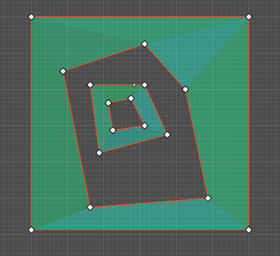
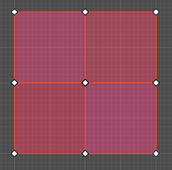
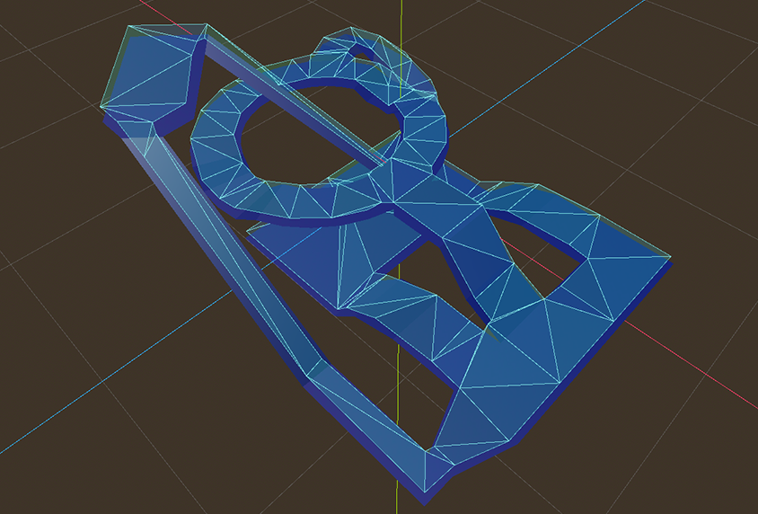

# Using NavigationMeshes

2D and 3D version of the navigation mesh are available as `NavigationPolygon` and
`NavigationMesh` respectively.

Note:

    A navigation mesh describes the traversable safe area for an agent with its center position at zero radius.
    If you want pathfinding to account for an agent's (collision) size you need to shrink the navigation mesh accordingly.

Navigation works independent from other engine parts like rendering and physics. A navigation mesh is the data format to exchange information from those other systems as it describes the traversable safe area for a specific agent. All the necessary information from other engine parts need to be already factored in when creating a navigation mesh. E.g. like visuals that an agent should not clip through or physics collision shapes that an agent should not collide with. This process of factoring in all those wanted navigation restrictions from other engine parts like visuals and collision is commonly called navigation mesh baking.

If you experience clipping or collision problems while following navigation paths always remember that you need to tell the navigation system through an appropriated navigation mesh what your intentions are. By itself the navigation system will never know "this is a tree / rock / wall collision shape or visual mesh" because it only knows "here I was told I can path safely cause it is on navigation mesh".

### Creating 2D NavigationMeshes

Navigation meshes in the 2D editor are created with the help of the NavigationPolygon draw tools
that appear in the top bar of the editor when a NavigationRegion2D is selected.


The NavigationPolygon draw tools can be used to create and edit navigation meshes by defining `outline` polygons.
The outline polygons are later converted to real NavigationMesh resources for the NavigationServer regions.



Multiple outlines can be added to the same NavPolygon resource as long as they **do not intersect or overlap**.
Each additional outline will cut a hole in the polygon created by the larger outline.
If the larger polygon is already a hole it will create a new navigation mesh polygon inside.

Outlines are not a replacement if the intention is to merge aligned polygons e.g. from grid cells.
Outlines, as the name would suggest, cannot intersect each other or have any overlapping vertex positions.



Outline layouts like seen in this picture will fail the convex partitioning required by the navigation mesh generation.
In this layout cases the outline tool cannot be used. Use the `Geometry2D` class for
polygon merge or intersect operations to create a valid merged mesh for navigation.

Note:

    The NavigationServer does not connect navigation mesh islands from the same NavigationMesh resource.
    Do not create multiple disconnected islands in the same NavigationRegion2D and NavPoly resource if they should be later connected.

For 2D no similar navigation mesh baking with geometry parsing exists like in 3D.
The Geometry2D class functions for offset, merge, intersect and clip can be used
to shrink or enlarge existing NavigationPolygons to different actor sizes.

### Creating 3D NavigationMeshes



Navigation meshes in the 3D editor are created with the help of the
`NavigationMeshGenerator` singleton
and the NavigationMesh bake settings that appear in the editor inspector.

NavigationMesh baking is the process of creating a simplified mesh used for pathfinding out of (complex) 3D level geometry.
For this process Pandemonium parses scene geometry and hands the raw mesh or collision data to the
third-party ReCast library for processing and creation of the final navigationmesh.

The resulting NavigationMesh is an approximation of the source geometry surfaces
for both performance and technical reasons. Do not expect the NavigationMesh
to perfectly follow the original surfaces. Especially navigation polygons placed
over ramps will not keep an equal distance to the ground surface. To align an
actor perfectly with the ground use other means like physics.

Warning:

    Meshes need to be triangulated to work as navigation meshes. Other mesh face formats like quad or ngon are not supported.

### NavigationMesh rebaking at runtime

To rebake a `NavigationMesh` at runtime, use the NavigationRegion3D.bake_navigation_mesh() function.
Another option is to use the NavigationMeshGenerator.bake() Singleton function with the NavigationMesh resource directly.
If the navigation mesh resource is already prepared, the region can be updated with the NavigationServer3D API directly as well.

GDScript

```
extends NavigationRegion3D

func update_navigation_mesh():

    # use bake and update function of region
    var on_thread: bool = true
    bake_navigation_mesh(on_thread)

    # or use the NavigationMeshGenerator Singleton
    var _navigationmesh: NavigationMesh = navigation_mesh
    NavigationMeshGenerator.bake(_navigationmesh, self)
    # remove old resource first to trigger a full update
    navigation_mesh = null
    navigation_mesh = _navigationmesh

    # or use NavigationServer API to update region with prepared navigation mesh
    var region_rid: RID = get_region_rid()
    NavigationServer3D.region_set_navigation_mesh(region_rid, navigation_mesh)
```

Note:

    Baking a NavigationMesh at runtime is a costly operation.
    Complex navigation mesh take some time to bake and if done on the main thread can freeze a game.
    (Re)baking a large navigation mesh is preferably done in a separate thread.

Warning:

    Property values on a NavigationMesh resource like ``cell_size`` need
    to match the actual mesh data stored inside in order to merge
    different navigation meshes without issues.

NavigationRegion2D and Navigation3D both use meshes to mark traversable areas, only the tools to create them are different.

For 2D NavigationPolygon resources are used to draw outline points in the editor. From these outline points the NavigationServer2D creates a mesh to upload navigation data to the NavigationServer.

For 3D NavigationMesh resources are used. Instead of providing draw tools the 3D variant
provides an extensive amount of parameters to bake a navigation mesh directly from 3D source geometry.

Note:

    Technically there is no hard distinction between 2D and 3D how to use the given toolsets to create flat navigation meshes. The 2D drawing tool can be used to create a flat 3D navmesh and the 3D baking tool can be used to parse flat 3D geometry into 2D appropriated navigationmeshes.

### 2D Navmesh from CollisionPolygons

The following script parses all child nodes of a NavigationRegion2D for CollisionPolygons
and bakes their shape into the NavigationPolygon. As the NavigationPolygon creates the
navigationmesh from outline data the shapes cannot overlap.

GDScript

```
extends NavigationRegion2D

var new_navigation_polygon: NavigationPolygon = get_navigation_polygon()

func _ready():

    parse_2d_collisionshapes(self)

    new_navigation_polygon.make_polygons_from_outlines()
    set_navigation_polygon(new_navigation_polygon)

func parse_2d_collisionshapes(root_node: Node2D):

    for node in root_node.get_children():

        if node.get_child_count() > 0:
            parse_2d_collisionshapes(node)

        if node is CollisionPolygon2D:

            var collisionpolygon_transform: Transform2D = node.get_global_transform()
            var collisionpolygon: PackedVector2Array = node.polygon

            var new_collision_outline: PackedVector2Array = collisionpolygon_transform * collisionpolygon

            new_navigation_polygon.add_outline(new_collision_outline)
```

### Procedual 2D NavigationMesh

The following script creates a new 2D navigation region and fills it with procedual generated navigation mesh data from a NavigationPolygon resource.

GDScript

```
extends Node2D

var new_2d_region_rid: RID = NavigationServer2D.region_create()

var default_2d_map_rid: RID = get_world_2d().get_navigation_map()
NavigationServer2D.region_set_map(new_2d_region_rid, default_2d_map_rid)

var new_navigation_polygon: NavigationPolygon = NavigationPolygon.new()
var new_outline: PackedVector2Array = PackedVector2Array([
    Vector2(0.0, 0.0),
    Vector2(50.0, 0.0),
    Vector2(50.0, 50.0),
    Vector2(0.0, 50.0),
])
new_navigation_polygon.add_outline(new_outline)
new_navigation_polygon.make_polygons_from_outlines()

NavigationServer2D.region_set_navigation_polygon(new_2d_region_rid, new_navigation_polygon)
```

### Procedual 3D NavigationMesh

The following script creates a new 3D navigation region and fills it with procedual generated navigation mesh data from a NavigationMesh resource.

GDScript

```
extends Node3D

var new_3d_region_rid: RID = NavigationServer3D.region_create()

var default_3d_map_rid: RID = get_world_3d().get_navigation_map()
NavigationServer3D.region_set_map(new_3d_region_rid, default_3d_map_rid)

var new_navigation_mesh: NavigationMesh = NavigationMesh.new()
# Add vertices for a triangle.
new_navigation_mesh.vertices = PackedVector3Array([
    Vector3(-1.0, 0.0, 1.0),
    Vector3(1.0, 0.0, 1.0),
    Vector3(1.0, 0.0, -1.0)
])
# Add indices for the polygon.
new_navigation_mesh.add_polygon(
    PackedInt32Array([0, 1, 2])
)
NavigationServer3D.region_set_navigation_mesh(new_3d_region_rid, new_navigation_mesh)
```

### Navmesh for 3D GridMaps

The following script creates a new 3D navigation mesh for each GridMap items, clears the current grid cells and adds new procedual grid cells with the new navigation mesh.

GDScript

```
extends GridMap

# enable navigation mesh for grid items
set_bake_navigation(true)

# get grid items, create and set a new navigation mesh for each item in the MeshLibrary
var gridmap_item_list: PackedInt32Array = mesh_library.get_item_list()
for item in gridmap_item_list:
    var new_item_navigation_mesh: NavigationMesh = NavigationMesh.new()
    # Add vertices and polygons that describe the traversable ground surface.
    # E.g. for a convex polygon that resembles a flat square.
    new_item_navigation_mesh.vertices = PackedVector3Array([
        Vector3(-1.0, 0.0, 1.0),
        Vector3(1.0, 0.0, 1.0),
        Vector3(1.0, 0.0, -1.0),
        Vector3(-1.0, 0.0, -1.0),
    ])
    new_item_navigation_mesh.add_polygon(
        PackedInt32Array([0, 1, 2, 3])
    )
    mesh_library.set_item_navigation_mesh(item, new_item_navigation_mesh)
    mesh_library.set_item_navigation_mesh_transform(item, Transform3D())

# clear the cells
clear()

# add procedual cells using the first item
var _position: Vector3i = Vector3i(global_transform.origin)
var _item: int = 0
var _orientation: int = 0
for i in range(0,10):
    for j in range(0,10):
        _position.x = i
        _position.z = j
        gridmap.set_cell_item(_position, _item, _orientation)
        _position.x = -i
        _position.z = -j
        gridmap.set_cell_item(_position, _item, _orientation)
```
