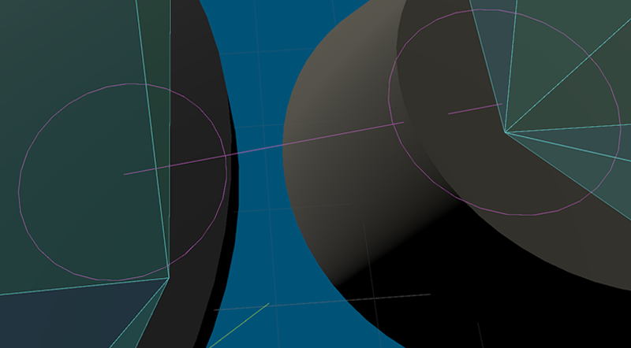

# Using NavigationLinks

NavigationLinks are used to connect navigation mesh polygons from `NavigationRegion2D`
and `NavigationRegion3D` over arbitrary distances for pathfinding.

NavigationLinks are also used to consider movement shortcuts in pathfinding available through
interacting with gameplay objects e.g. ladders, jump pads or teleports.

2D and 3D versions of NavigationJumplinks nodes are available as
`NavigationLink2D` and `NavigationLink3D` respectively.

Different NavigationRegions can connect their navigation meshes without the need for a NavigationLink
as long as they are within navigation map `edge_connection_margin` and have compatible `navigation_layers`.
As soon as the distance becomes too large, building valid connections becomes a problem - a problem that NavigationLinks can solve.

NavigationLinks share many properties with NavigationRegions like `navigation_layers`.
NavigationLinks add a single connection between two positions over an arbitrary distance
compared to NavigationRegions that add a more local traversable area with a navigation mesh resource.

NavigationLinks have a `start_position` and `end_position` and can go in both directions when `bidirectional` is enabled.
When placed a navigationlink connects the navigation mesh polygons closest to its `start_position` and `end_position` within search radius for pathfinding.

The polygon search radius can be configured globally in the ProjectSettings under `navigation/2d_or_3d/default_link_connection_radius`
or set for each navigation `map` individually using the `NavigationServer.map_set_link_connection_radius()` function.

Both `start_position` and `end_position` have debug markers in the Editor.
The visible radius of a position shows the polygon search radius.
All navigation mesh polygons inside are compared and the closest is picked for the edge connection.
If no valid polygon is found within the search radius the navigation link gets disabled.

The link debug visuals can be changed in the Editor `ProjectSettings` under `debug/shapes/navigation`.
The visibility of the debug can also be controlled in the Editor 3D Viewport gizmo menu.

Note: NavigationLinks do not move agents between the two link positions by themselves.

A navigation link does not provide any automated movement through the link. Instead, when
an agent reaches the position of a link, game code needs to react (e.g. through area triggers) and provide means for the agent
to move through the link to end up at the links other position (e.g. through teleport or animation) to continue along the path.

