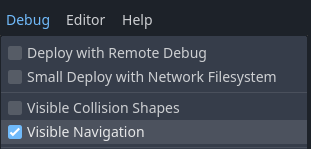
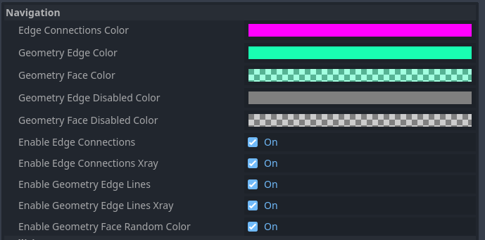
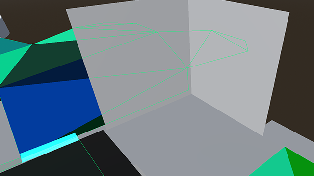
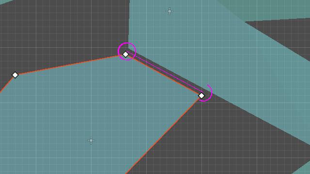
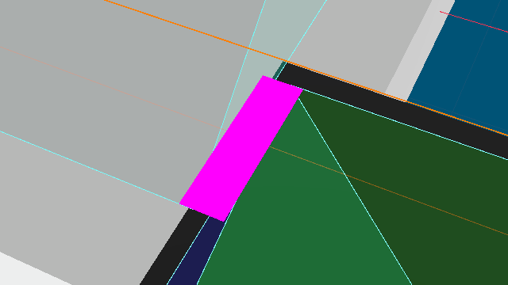
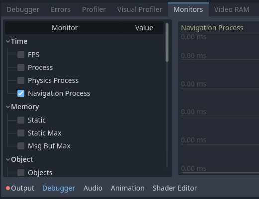

# Navigation Debug Tools

Note:

    The debug tools, properties and functions are only available in Pandemonium debug builds. 
    Do not use any of them in code that will be part of a release build.

## Enabling debug navigation

The navigation debug visualization is enabled by default inside the Editor.
To visualize navigation meshes and connections also at runtime 
enable the option `Visible Navigation` in the editor debug menu.



In Pandemonium debug builds the navigation debug can also be toggled on the NavigationServers from scripts.

GDScript

```
NavigationServer2D.set_debug_enabled(false)
NavigationServer3D.set_debug_enabled(true)
```

## Debug navigation settings

The appearance of navigation debug can be change in the ProjectSettings under `debug/shapes/navigation`. 
Certain debug features can also be enabled or disabled at will but may require a scene restart to apply.



## Debug navigation mesh polygons

If `enable_edge_lines` is enabled the edges of navigation mesh polygons will be highlighted.
If `enable_edge_lines_xray` is also enabled the edges of navigationmeshes will be visible through geometry.

if `enable_geometry_face_random_color` is enabled each navigation mesh face receives 
a random color that is mixed with the main color from `geometry_face_color`.




## Debug edge connections

Different navigation meshes connected within `edge_connection_margin` distance are overlaid.
The color of the overlay is controlled with the navigation debug `edge_connection_color`.
The connections can be made visible through geometry with the navigation debug `enable_edge_connections_xray` property.





Note:

    Edge connections are only visible when the NavigationServer is active.

## Debug Performance

To measure NavigationServer performance a dedicated monitor exists that can be found within the Editor Debugger under `Debugger->Monitors->NavigationProcess`.



NavigationProcess shows how long the NavigationServer spends updating its internals this update frame in milliseconds.
NavigationProcess works similar to Process for visual frame rendering and PhysicsProcess for collision and fixed updates.

NavigationProcess accounts for all updates to `navigation maps`, `navigation regions` and `navigation agents` as well as all the `avoidance calculations` for the update frame.

Note:

    NavigationProcess does NOT include pathfinding performance cause pathfinding operates on the navigation map data independently from the server process update.

NavigationProcess should be in general kept as low and as stable as possible for runtime performance to avoid frame rate issues.
Note that since the NavigationServer process update happens in the middle of the physics update an increase in NavigationProcess will automatically increase PhysicsProcess by the same amount.

Navigation also provides more detailed statistics about the current navigation related objects and navigation map composition on the NavigationServer.


Navigation statistics shown here can not be judged as good or bad for performance as it depends entirely on the project what can be considered as reasonable or horribly excessive.

Navigation statistics help with identifying performance bottlenecks that are less obvious because the source might not always have a visible representation.
E.g. pathfinding performance issues created by overly detailed navigation meshes with thousand of edges / polygons or problems caused by procedural navigation gone wrong.
