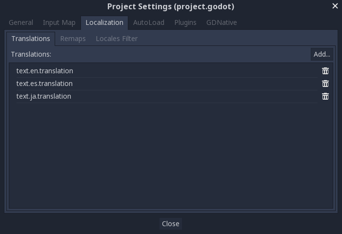
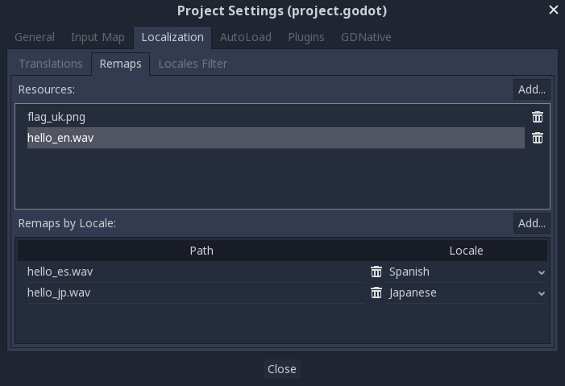
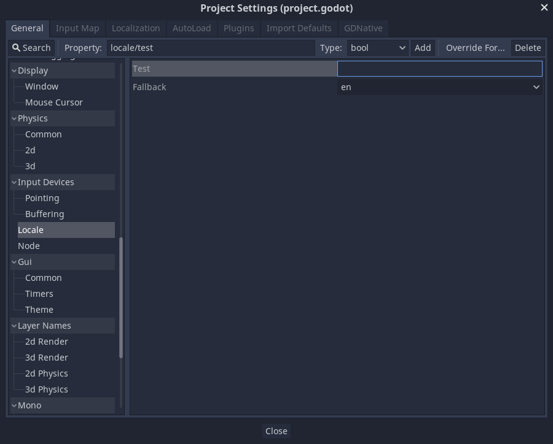
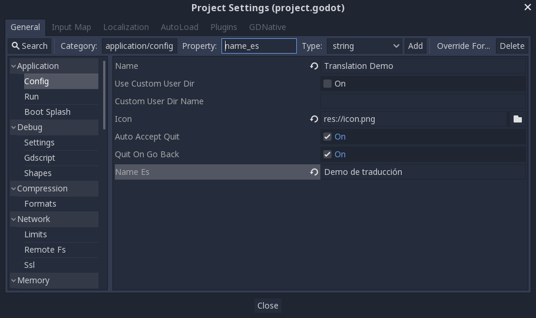

# Internationalizing games

## Introduction

Sería excelente que el mundo hablara solo un idioma (It would be great if the
world spoke only one language). Unfortunately for
us developers, that is not the case. While indie or niche games usually
do not need localization, games targeting a more massive market
often require localization. Pandemonium offers many tools to make this process
more straightforward, so this tutorial is more like a collection of
tips and tricks.

Localization is usually done by specific studios hired for the job and,
despite the huge amount of software and file formats available for this,
the most common way to do localization to this day is still with
spreadsheets. The process of creating the spreadsheets and importing
them is covered in the [importing translations](../21_assets_pipeline/04_importing_translations.md) tutorial,
so this one could be seen more like a follow-up to that one.


Note: We will be using the official demo as an example; you can download it [here](../../07_demo_projects/gui/translation/).

## Configuring the imported translation

Translations can get updated and re-imported when they change, but
they still have to be added to the project. This is done in
**Project → Project Settings → Localization**:



The above dialog is used to add or remove translations project-wide.

## Localizing resources

It is also possible to instruct Pandemonium to use alternate versions of
assets (resources) depending on the current language. The **Remaps** tab
can be used for this:



Select the resource to be remapped, then add some alternatives for each
locale.

## Converting keys to text

Some controls, such as `Button`,
will automatically fetch a translation if their text matches a translation key.
For example, if a label's text is "MAIN_SCREEN_GREETING1" and that key exists
in the current translation, then the text will automatically be translated.

This automatic translation behavior may be undesirable in certain cases. For
instance, when using a Label to display a player's name, you most likely don't
want the player's name to be translated if it matches a translation key. To
disable automatic translation on a specific node, use
`Object.set_message_translation()`
and send a `Object.notification()` to update the
translation:

```
func _ready():
    # This assumes you have a node called "Label" as a child of the node
    # that has the script attached.
    var label = get_node("Label")
    label.set_message_translation(false)
    label.notification(NOTIFICATION_TRANSLATION_CHANGED)
```

For more complex UI nodes such as OptionButtons, you may have to use this instead:

```
func _ready():
    var option_button = get_node("OptionButton")
    option_button.set_message_translation(false)
    option_button.notification(NOTIFICATION_TRANSLATION_CHANGED)
    option_button.get_popup().set_message_translation(false)
    option_button.get_popup().notification(NOTIFICATION_TRANSLATION_CHANGED)
```

In code, the `Object.tr()`
function can be used. This will just look up the text in the
translations and convert it if found:

```
level.set_text(tr("LEVEL_5_NAME"))
status.set_text(tr("GAME_STATUS_" + str(status_index)))
```

### Making controls resizable

The same text in different languages can vary greatly in length. For
this, make sure to read the tutorial on [size and anchors](../04_ui/01_size_and_anchors.md), as
dynamically adjusting control sizes may help.
`Container` can be useful, as well as the text wrapping
options available in `Label`.

## TranslationServer

Pandemonium has a server handling low-level translation management
called the `TranslationServer`.
Translations can be added or removed during run-time;
the current language can also be changed at run-time.

## Testing translations

You may want to test a project's translation before releasing it. Pandemonium provides two ways
to do this.

First, in the Project Settings, under **Input Devices &gt; Locale**, there is a **Test**
property. Set this property to the locale code of the language you want to test. Pandemonium will
run the project with that locale when the project is run (either from the editor or when
exported).



Keep in mind that since this is a project setting, it will show up in version control when
it is set to a non-empty value. Therefore, it should be set back to an empty value before
committing changes to version control.

Translations can also be tested when running Pandemonium from the command line.
For example, to test a game in French, the following argument can be
supplied:

```
pandemonium --language fr
```

## Translating the project name

The project name becomes the app name when exporting to different
operating systems and platforms. To specify the project name in more
than one language, create a new setting `application/name` in the **Project
Settings** and append the locale identifier to it.
For instance, for Spanish, this would be `application/name_es`:



