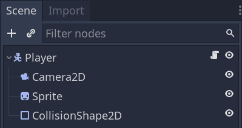
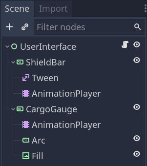
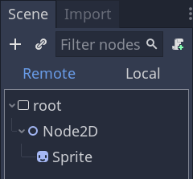

# Nodes and scene instances

This guide explains how to get nodes, create nodes, add them as a child, and
instantiate scenes from code.

## Getting nodes

You can get a reference to a node by calling the `Node.get_node()
( Node_method_get_node )` method. For this to work, the child node must be
present in the scene tree. Getting it in the parent node's `ready()` function
guarantees that.

If, for example,  you have a scene tree like this, and you want to get a reference to the
Sprite and Camera2D nodes to access them in your script.



To do so, you can use the following code.

gdscript GDScript

```
    var sprite
    var camera2d

    func _ready():
        sprite = get_node("Sprite")
        camera2d = get_node("Camera2D")
```

Note that you get nodes using their name, not their type. Above, "Sprite" and
"Camera2D" are the nodes' names in the scene.


If you rename the Sprite node as Skin in the Scene dock, you have to change the
line that gets the node to `get_node("Skin")` in the script.


## Node paths

When getting a reference to a node, you're not limited to getting a direct child. The `get_node()` function
supports paths, a bit like when working with a file browser. Add a slash to
separate nodes.

Take the following example scene, with the script attached to the UserInterface
node.



To get the Tween node, you would use the following code.

gdscript GDScript

```
    var tween

    func _ready():
        tween = get_node("ShieldBar/Tween")
```

Note:
 As with file paths, you can use ".." to get a parent node. The best
          practice is to avoid doing that though not to break encapsulation.
          You can also start the path with a forward
          slash to make it absolute, in which case your topmost node would be
          "/root", the application's predefined root viewport.

### Syntactic sugar

You can use two shorthands to shorten your code in GDScript. Firstly, putting the
`onready` keyword before a member variable makes it initialize right before
the `ready()` callback.

```
    onready var sprite = get_node("Sprite")
```

There is also a short notation for `get_node()`: the dollar sign, "$". You
place it before the name or path of the node you want to get.

```
    onready var sprite = $Sprite
    onready var tween = $ShieldBar/Tween
```

## Creating nodes

To create a node from code, call its `new()` method like for any other
class-based datatype.

You can store the newly created node's reference in a variable and call
`add_child()` to add it as a child of the node to which you attached the
script.

gdscript GDScript

```
    var sprite

    func _ready():
        var sprite = Sprite.new() # Create a new Sprite.
        add_child(sprite) # Add it as a child of this node.
```

To delete a node and free it from memory, you can call its `queue_free()`
method. Doing so queues the node for deletion at the end of the current frame
after it has finished processing. At that point, the engine removes the node from
the scene and frees the object in memory.

gdscript GDScript

```
    sprite.queue_free()
```

Before calling `sprite.queue_free()`, the remote scene tree looks like this.



After the engine freed the node, the remote scene tree doesn't display the
sprite anymore.


You can alternatively call `free()` to immediately destroy the node. You
should do this with care as any reference to it will instantly become `null`.
We recommend using `queue_free()` unless you know what you're doing.

When you free a node, it also frees all its children. Thanks to this, to delete
an entire branch of the scene tree, you only have to free the topmost parent
node.

## Instancing scenes

Scenes are templates from which you can create as many reproductions as you'd
like. This operation is called instancing, and doing it from code happens in two
steps:

1. Loading the scene from the hard drive.
2. Creating an instance of the loaded `PackedScene`
   resource.

gdscript GDScript

```
    var scene = load("res://MyScene.tscn")
```

Preloading the scene can improve the user's experience as the load operation
happens when the compiler reads the script and not at runtime. This feature is
only available with GDScript.

gdscript GDScript

```
    var scene = preload("res://MyScene.tscn")
```

At that point, `scene` is a packed scene resource, not a node. To create the
actual node, you need to call `PackedScene.instance()
( PackedScene_method_instance )`. It returns a tree of nodes that you can
as a child of your current node.

gdscript GDScript

```
    var instance = scene.instance()
    add_child(instance)
```

The advantage of this two-step process is you can keep a packed scene loaded and
create new instances on the fly. For example, to quickly instance several
enemies or bullets.
