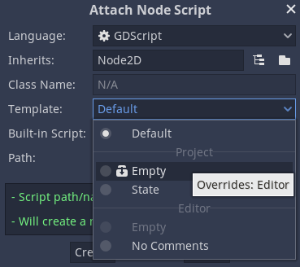

# Creating script templates

Pandemonium provides a way to use script templates as seen in the
`Script Create Dialog` while creating a new script:



A set of default script templates is provided by default, but it's also possible
to modify existing and create new ones, both per project and the editor.

## Locating the templates

There are two places where templates can be managed.

### Editor-defined templates

These are available globally throughout any project. The location of these
templates are determined per each OS:

-  Windows: `%APPDATA%\Pandemonium\script_templates\`
-  Linux: `$HOME/.config/pandemonium/script_templates/`
-  macOS: `$HOME/Library/Application Support/Pandemonium/script_templates/`

If no `script_templates` is detected, Pandemonium will create a default set of
built-in templates automatically, so this logic can be used to reset the default
templates in case you've accidentally overwritten them.

### Project-defined templates

The default path to search for templates is the
`res://script_templates/` directory. The path can be changed by configuring
the `editor/script_templates_search_path` setting in the
`ProjectSettings`, both via code and the editor.

If no `script_templates` directory is found within a project, it is simply
ignored.

## Language support and overriding behavior

Depending on whether a particular language implements a way to generate scripts
out of templates, it's possible to create a template which can be recognized by
that language according to template's file extension. For GDScript and C#, the
extensions must be `gd` and `cs` respectively.

Note: The script templates have the same extension as the regular script
files. This may lead to an issue of a script parser treating those templates as
actual scripts within a project. To avoid this, make sure to ignore the
directory containing them by creating an empty `.gdignore` file. The directory won't be
visible throughout the project's filesystem anymore, yet the templates can be
modified by an external text editor anytime.

The built-in editor templates are automatically shadowed by the project-specific
templates given both scripts have the same filename.

## Default template

The `Default` template is always generated dynamically per language and cannot
be configured nor overridden, but you can use these as the base for creating
other templates.


```
extends %BASE%


# Declare member variables here. Examples:
# var a%INT_TYPE% = 2
# var b%STRING_TYPE% = "text"


# Called when the node enters the scene tree for the first time.
func _ready()%VOID_RETURN%:
    pass # Replace with function body.


# Called every frame. 'delta' is the elapsed time since the previous frame.
#func _process(delta%FLOAT_TYPE%)%VOID_RETURN%:
#	pass
```

## List of template placeholders

The following describes the complete list of built-in template placeholders
which are currently implemented.

### Base placeholders


| Placeholder | Description                                                    |
|-------------|----------------------------------------------------------------|
| `%CLASS%`   | The name of the new class (used in C# only).                   |
| `%BASE%`    | The base type a new script inherits from.                      |
| `%TS%`      | Indentation placeholder. The exact type and number of          |
|             | whitespace characters used for indentation is determined by    |
|             | the `text_editor/indent/type` and `text_editor/indent/size`    |
|             | settings in the `EditorSettings`                               |
|             | respectively.                                                  |


### Type placeholders

These are only relevant for GDScript with static typing. Whether these
placeholders are actually replaced is determined by the
`text_editor/completion/add_type_hints` setting in the
`EditorSettings`.


| Placeholder       | Value        |
|-------------------|--------------|
| `%INT_TYPE%`      | `: int`      |
| `%STRING_TYPE%`   | `: String`   |
| `%FLOAT_TYPE%`    | `: float`    |
| `%VOID_RETURN%`   | `-> void`    |

