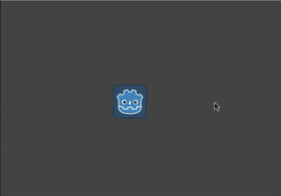
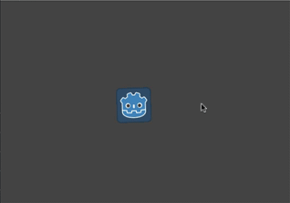

# Instancing with signals

Signals provide a way to decouple game objects, allowing you to avoid forcing a
fixed arrangement of nodes. One sign that a signal might be called for is when
you find yourself using `get_parent()`. Referring directly to a node's parent
means that you can't easily move that node to another location in the scene tree.
This can be especially problematic when you are instancing objects at runtime
and may want to place them in an arbitrary location in the running scene tree.

Below we'll consider an example of such a situation: firing bullets.

## Shooting example

Consider a player character that can rotate and shoot towards the mouse. Every
time the mouse button is clicked, we create an instance of the bullet at the
player's location. See `doc_instancing` for details.

We'll use an `Area2D` for the bullet, which moves in a straight line at a
given velocity:

gdscript GDScript

```
extends Area2D

var velocity = Vector2.ZERO

func _physics_process(delta):
    position += velocity * delta
```

However, if the bullets are added as children of the player, then they will
remain "attached" to the player as it rotates:



Instead, we need the bullets to be independent of the player's movement - once
fired, they should continue traveling in a straight line and the player can no
longer affect them. Instead of being added to the scene tree as a child of the
player, it makes more sense to add the bullet as a child of the "main" game
scene, which may be the player's parent or even further up the tree.

You could do this by adding the bullet to the main scene directly:

gdscript GDScript

```
var bullet_instance = Bullet.instance()
get_parent().add_child(bullet_instance)
```

However, this will lead to a different problem. Now if you try to test your
"Player" scene independently, it will crash on shooting, because there is no
parent node to access. This makes it a lot harder to test your player code
independently and also means that if you decide to change your main scene's
node structure, the player's parent may no longer be the appropriate node to
receive the bullets.

The solution to this is to use a signal to "emit" the bullets from the player.
The player then has no need to "know" what happens to the bullets after that -
whatever node is connected to the signal can "receive" the bullets and take the
appropriate action to spawn them.

Here is the code for the player using signals to emit the bullet:

gdscript GDScript

```
extends Sprite

signal shoot(bullet, direction, location)

var Bullet = preload("res://Bullet.tscn")

func _input(event):
    if event is InputEventMouseButton:
        if event.button_index == BUTTON_LEFT and event.pressed:
            emit_signal("shoot", Bullet, rotation, position)

func _process(delta):
    look_at(get_global_mouse_position())
```

In the main scene, we then connect the player's signal (it will appear in the
"Node" tab).

gdscript GDScript

```
func _on_Player_shoot(Bullet, direction, location):
    var b = Bullet.instance()
    add_child(b)
    b.rotation = direction
    b.position = location
    b.velocity = b.velocity.rotated(direction)
```

Now the bullets will maintain their own movement independent of the player's
rotation:


