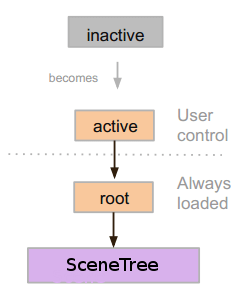
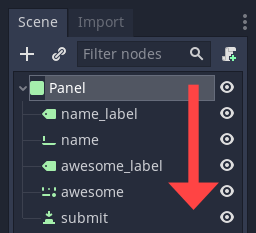

# Using SceneTree

## Introduction

In previous tutorials, everything revolved around the concept of
nodes. Scenes are collections of nodes. They become active once
they enter the *scene tree*.

## MainLoop

The way Pandemonium works internally is as follows. There is the
`OS` class,
which is the only instance that runs at the beginning. Afterwards, all
drivers, servers, scripting languages, scene system, etc are loaded.

When initialization is complete, `OS` needs to be
supplied a `MainLoop`
to run. Up to this point, all this is internals working (you can check
main/main.cpp file in the source code if you are ever interested to
see how this works internally).

The user program, or game, starts in the MainLoop. This class has a few
methods, for initialization, idle (frame-synchronized callback), fixed
(physics-synchronized callback), and input. Again, this is low
level and when making games in Pandemonium, writing your own MainLoop seldom makes sense.

## SceneTree

One of the ways to explain how Pandemonium works is that it's a high level
game engine over a low level middleware.

The scene system is the game engine, while the `OS`
and servers are the low level API.

The scene system provides its own main loop to OS,
`SceneTree`.
This is automatically instanced and set when running a scene, no need
to do any extra work.

It's important to know that this class exists because it has a few
important uses:

-  It contains the root `Viewport`, to which a
   scene is added as a child when it's first opened to become
   part of the *Scene Tree* (more on that next).
-  It contains information about the groups and has the means to call all
   nodes in a group or get a list of them.
-  It contains some global state functionality, such as setting pause
   mode or quitting the process.

When a node is part of the Scene Tree, the
`SceneTree`
singleton can be obtained by calling
`Node.get_tree()`.

## Root viewport

The root `Viewport`
is always at the top of the scene. From a node, it can be obtained in
two different ways:

gdscript GDScript

```
        get_tree().get_root() # Access via scene main loop.
        get_node("/root") # Access via absolute path.
```

This node contains the main viewport. Anything that is a child of a
`Viewport`
is drawn inside of it by default, so it makes sense that the top of all
nodes is always a node of this type otherwise nothing would be seen.

While other viewports can be created in the scene (for split-screen
effects and such), this one is the only one that is never created by the
user. It's created automatically inside SceneTree.

## Scene tree

When a node is connected, directly or indirectly, to the root
viewport, it becomes part of the *scene tree*.

This means that as explained in previous tutorials, it will get the
`enter_tree()` and `ready()` callbacks (as well as `exit_tree()`).



When nodes enter the *Scene Tree*, they become active. They get access
to everything they need to process, get input, display 2D and 3D visuals,
receive and send notifications, play sounds, etc. When they are removed from the
*scene tree*, they lose these abilities.

## Tree order

Most node operations in Pandemonium, such as drawing 2D, processing, or getting
notifications are done in tree order. This means that parents and
siblings with a lower rank in the tree order will get notified before
the current node.



## "Becoming active" by entering the *Scene Tree*

1. A scene is loaded from disk or created by scripting.
2. The root node of that scene (only one root, remember?) is added as
   either a child of the "root" Viewport (from SceneTree), or to any
   child or grandchild of it.
3. Every node of the newly added scene, will receive the "enter_tree"
   notification ( _enter_tree() callback in GDScript) in top-to-bottom
   order.
4. An extra notification, "ready" ( _ready() callback in GDScript) is
   provided for convenience, when a node and all its children are
   inside the active scene.
5. When a scene (or part of it) is removed, they receive the "exit
   scene" notification ( _exit_tree() callback in GDScript) in
   bottom-to-top order

## Changing current scene

After a scene is loaded, it is often desired to change this scene for
another one. The simple way to do this is to use the
`SceneTree.change_scene()`
function:

gdscript GDScript

```
    func _my_level_was_completed():
        get_tree().change_scene("res://levels/level2.tscn")
```

Rather than using file paths, one can also use ready-made
`PackedScene` resources using the equivalent
function
`SceneTree.change_scene_to(PackedScene scene)`:

gdscript GDScript

```
    var next_scene = preload("res://levels/level2.tscn")

    func _my_level_was_completed():
    	get_tree().change_scene_to(next_scene)
```

These are quick and useful ways to switch scenes but have the drawback
that the game will stall until the new scene is loaded and running. At
some point in the development of your game, it may be preferable to create proper loading
screens with progress bar, animated indicators or thread (background)
loading. This must be done manually using autoloads (see next chapter)
and `doc_background_loading`.
