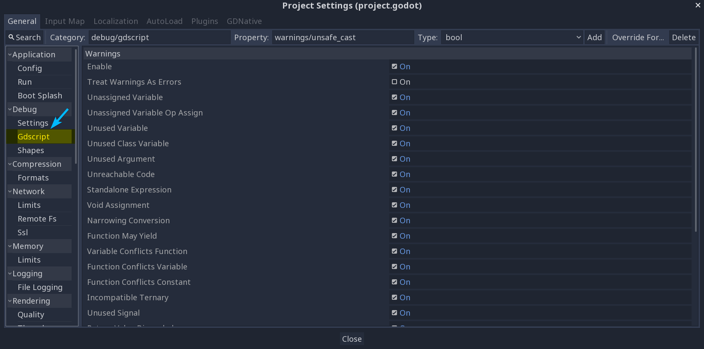
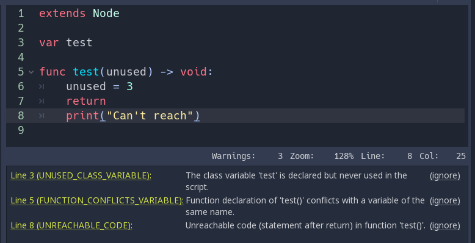
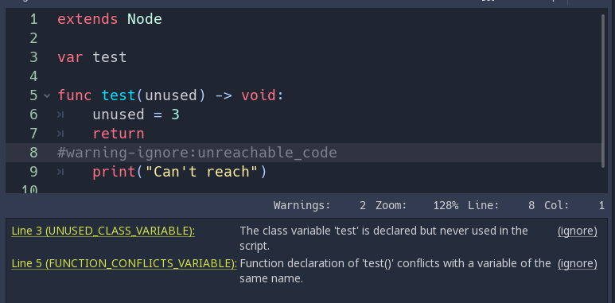
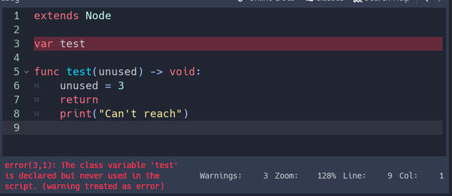

# GDScript warning system

The GDScript warning system complements `static typing ( doc_gdscript_static_typing )`
(but it can work without static typing too). It's here to help you avoid
mistakes that are hard to spot during development, and that may lead
to runtime errors.

You can configure warnings in the Project Settings under the section
called **Gdscript**:

Warning system project settings

You can find a list of warnings for the active GDScript file in the
script editor's status bar. The example below has 3 warnings:

Warning system example

To ignore specific warnings in one file, insert a special comment of the
form `# warning-ignore:warning-id`, or click on the ignore link to the
right of the warning's description. Pandemonium will add a comment above the
corresponding line and the code won't trigger the corresponding warning
anymore:

Warning system ignore example

You can also choose to ignore not just one but all warnings of a certain
type in this file with `# warning-ignore-all:warning-id`. To ignore all
warnings of all types in a file add the comment `# warnings-disable` to it.

Warnings won't prevent the game from running, but you can turn them into
errors if you'd like. This way your game won't compile unless you fix
all warnings. Head to the `GDScript` section of the Project Settings to
turn on this option. Here's the same file as the previous example with
warnings as errors turned on:

Warnings as errors
