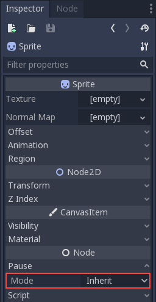

Pausing games and process mode
==============================

Introduction
------------

In most games it is desirable to, at some point, interrupt the
game to do something else, such as taking a break or changing options.
Implementing a fine-grained control for what can be paused (and what cannot)
is a lot of work, so a simple framework for pausing is provided in
Pandemonium.

How pausing works
-----------------

To pause the game the pause state must be set. This is done by assigning
`true` to the `SceneTree.paused` property:

gdscript GDScript

```
    get_tree().paused = true
```

Doing this will cause two things. First, 2D and 3D physics will be stopped
for all nodes. Second, the behavior of certain nodes will stop or start
depending on their process mode.

Note:
 The physics servers can be made active while the game is
          paused by using their `set_active` methods.

Process Modes
-------------

Each node in Pandemonium has a "Pause Mode" that defines when it processes. It can
be found and changed under a node's `Node` properties in the inspector.



You can also alter the property with code:

gdscript GDScript

```
    func _ready():
        pause_mode = Node.PAUSE_MODE_PROCESS
```

This is what each mode tells a node to do:  

-  **Inherit**: Process depending on the state of the parent,
   grandparent, etc. The first parent that has a non-Inherit state.
-  **Stop**: Stop the node no matter what (and children in Inherit
   mode). When paused this node will not process.
-  **Process**: Process the node no matter what (and children in Inherit
   mode). Paused or not this node will process.

By default, all nodes have this property in the "Inherit" state. If the
parent is set to "Inherit", then the grandparent will be checked and so
on. If a state can't be found in any of the grandparents, the pause state
in SceneTree is used. This means that, by default, when the game is paused
every node will be paused. Several things happen when a node stops processing.

The `process`, `physics_process`, `input`, and `input_event` functions
will not be called. However signals still work and cause their connected function to
run, even if that function's script is attached to a node that has its pause
mode set to "Stop".

Animation nodes will pause their current animation, audio nodes
will pause their current audio stream, and particles will pause. These resume
automatically when the game is no longer paused.

It is important to note that even if a node is processing while the game is
paused physics will **NOT** work for it by default. As stated earlier this is
because the physics servers are turned off. The physics servers can be made
active while the game is paused by using their `set_active` methods.

Pause Menu Example
------------------

Here is an example of a pause menu. Create a popup or panel with controls
inside, and set its pause mode to "Process" then hide it. By setting the
root of the pause popup to "Process", all children and grandchildren will
inherit that state. This way, this branch of the scene tree will continue
working when paused.

Finally, make it so when a pause button is pressed (any button will do),
enable the pause and show the pause screen.

gdscript GDScript

```
    func _on_pause_button_pressed():
        get_tree().paused = true
        $pause_popup.show()
```

To unpause, do the opposite when the pause screen is
closed:

gdscript GDScript

```
    func _on_pause_popup_close_pressed():
        $pause_popup.hide()
        get_tree().paused = false
```
