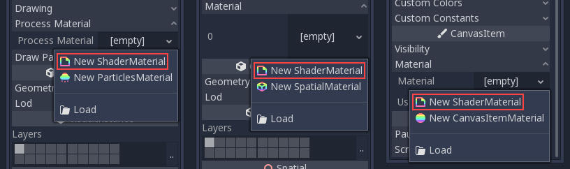
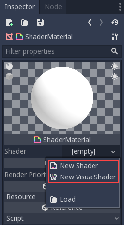
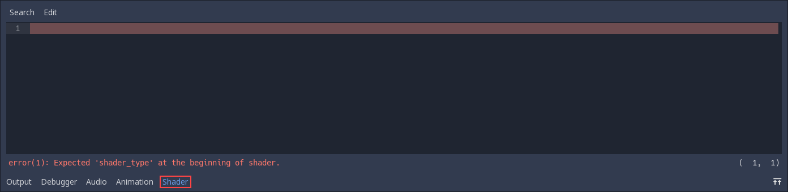
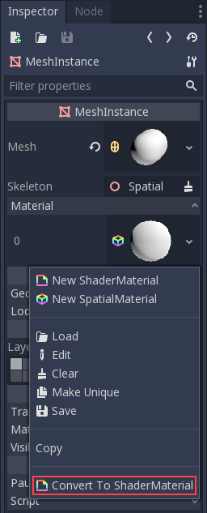

# Shader materials

## Introduction

For the most common cases, Pandemonium provides ready to use materials for
most types of shaders, such as `SpatialMaterial`,
`CanvasItemMaterial`.
They are flexible implementations that cover most use cases.

Shader materials allow writing a custom shader directly, for maximum flexibility.
Examples of this are:

-  Create procedural textures.
-  Create complex texture blending effects.
-  Create animated materials, or materials that change over time.
-  Create refractive effects or other advanced effects.
-  Create special lighting shaders for more exotic materials.
-  Animate vertices, like tree leaves or grass.
-  Create custom particle code.
-  And much more!

Pandemonium provides built in functionality to make frequent operations
easier. Additionally, Pandemonium's shader editor will detect errors as you
type, so you can see your edited shaders in real-time.

## Creating a ShaderMaterial

Create a new ShaderMaterial in some object of your choice. Go to the
"Material" property and create a ShaderMaterial.

Next, click on the shader material to see its properties. From here you
can create a shader. Regular shaders use code to set
their properties.

If you create a regular shader click on it and the shader editor will open.

## Converting to ShaderMaterial

It is possible to convert from SpatialMaterial, CanvasItemMaterial and
ParticlesMaterial to ShaderMaterial. To do so, go to the material properties
and select the convert option.

Note: Using the convert option will turn the SpatialMaterial into a ShaderMaterial
with a text shader, not a visual shader.

