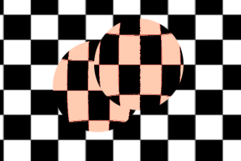
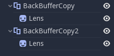
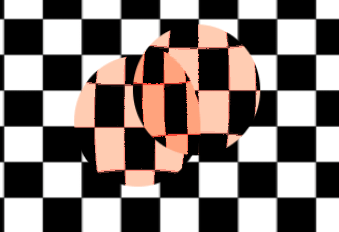

# Screen-reading shaders

### Introduction

It is often desired to make a shader that reads from the same
screen to which it's writing. 3D APIs, such as OpenGL or DirectX, make this very
difficult because of internal hardware limitations. GPUs are extremely
parallel, so reading and writing causes all sorts of cache and coherency
problems. As a result, not even the most modern hardware supports this
properly.

The workaround is to make a copy of the screen, or a part of the screen,
to a back-buffer and then read from it while drawing. Pandemonium provides a
few tools that make this process easy.

### SCREEN_TEXTURE built-in texture

Pandemonium's shading language has a special texture, `SCREEN_TEXTURE` (and `DEPTH_TEXTURE` for depth, in the case of 3D).
It takes as argument the UV of the screen and returns a vec3 RGB with the color. A
special built-in varying: SCREEN_UV can be used to obtain the UV for
the current fragment. As a result, this simple canvas_item fragment shader:

```
void fragment() {
    COLOR = textureLod(SCREEN_TEXTURE, SCREEN_UV, 0.0);
}
```

results in an invisible object, because it just shows what lies behind.

The reason why textureLod must be used is because, when Pandemonium copies back
a chunk of the screen, it also does an efficient separatable gaussian blur to its mipmaps.

This allows for not only reading from the screen, but reading from it with different amounts
of blur at no cost.

Note: Mipmaps are not generated in GLES2 due to poor performance and compatibility with older
devices.

### SCREEN_TEXTURE example

`SCREEN_TEXTURE` can be used for many things. There is a
special demo for *Screen Space Shaders*, that you can download to see
and learn. One example is a simple shader to adjust brightness, contrast
and saturation:

```
shader_type canvas_item;

uniform float brightness = 1.0;
uniform float contrast = 1.0;
uniform float saturation = 1.0;

void fragment() {
    vec3 c = textureLod(SCREEN_TEXTURE, SCREEN_UV, 0.0).rgb;

    c.rgb = mix(vec3(0.0), c.rgb, brightness);
    c.rgb = mix(vec3(0.5), c.rgb, contrast);
    c.rgb = mix(vec3(dot(vec3(1.0), c.rgb) * 0.33333), c.rgb, saturation);

    COLOR.rgb = c;
}
```

### Behind the scenes

While this seems magical, it's not. In 2D, the `SCREEN_TEXTURE` built-in, when
first found in a node that is about to be drawn, does a full-screen
copy to a back-buffer. Subsequent nodes that use it in
shaders will not have the screen copied for them, because this ends up
being inefficient. In 3D, the screen is copied after the opaque geometry pass,
but before the transparent geometry pass, so transparent objects will not be
captured in the `SCREEN_TEXTURE`.

As a result, in 2D, if shaders that use `SCREEN_TEXTURE` overlap, the second one
will not use the result of the first one, resulting in unexpected
visuals:



In the above image, the second sphere (top right) is using the same
source for `SCREEN_TEXTURE` as the first one below, so the first one
"disappears", or is not visible.

In 2D, this can be corrected via the `BackBufferCopy`
node, which can be instantiated between both spheres. BackBufferCopy can work by
either specifying a screen region or the whole screen:



With correct back-buffer copying, the two spheres blend correctly:



Warning: Materials that use `SCREEN_TEXTURE` are considered transparent themselves and
will not appear in the resulting `SCREEN_TEXTURE` of other materials.
If you plan to instance a scene that uses a material with `SCREEN_TEXTURE`,
you will need to use a BackBufferCopy node.

In 3D, there is less flexibility to solve this particular issue because the
`SCREEN_TEXTURE` is only captured once. Be careful when using
`SCREEN_TEXTURE` in 3D as it won't capture transparent objects and may capture
some opaque objects that are in front of the object.

You can reproduce the back-buffer logic in 3D by creating a `Viewport`
with a camera in the same position as your object, and then use the
`Viewport's` texture instead of `SCREEN_TEXTURE`.

### Back-buffer logic

So, to make it clearer, here's how the backbuffer copying logic works in
Pandemonium:

-  If a node uses the `SCREEN_TEXTURE`, the entire screen is copied to the
   back buffer before drawing that node. This only happens the first
   time; subsequent nodes do not trigger this.
-  If a BackBufferCopy node was processed before the situation in the
   point above (even if `SCREEN_TEXTURE` was not used), the behavior
   described in the point above does not happen. In other words,
   automatic copying of the entire screen only happens if `SCREEN_TEXTURE` is
   used in a node for the first time and no BackBufferCopy node (not
   disabled) was found before in tree-order.
-  BackBufferCopy can copy either the entire screen or a region. If set
   to only a region (not the whole screen) and your shader uses pixels
   not in the region copied, the result of that read is undefined
   (most likely garbage from previous frames). In other words, it's
   possible to use BackBufferCopy to copy back a region of the screen
   and then use `SCREEN_TEXTURE` on a different region. Avoid this behavior!


### DEPTH_TEXTURE

For 3D shaders, it's also possible to access the screen depth buffer. For this,
the `DEPTH_TEXTURE` built-in is used. This texture is not linear; it must be
converted via the inverse projection matrix.

The following code retrieves the 3D position below the pixel being drawn:

```
void fragment() {
    float depth = textureLod(DEPTH_TEXTURE, SCREEN_UV, 0.0).r;
    vec4 upos = INV_PROJECTION_MATRIX * vec4(SCREEN_UV * 2.0 - 1.0, depth * 2.0 - 1.0, 1.0);
    vec3 pixel_position = upos.xyz / upos.w;
}
```

