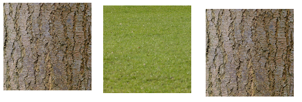
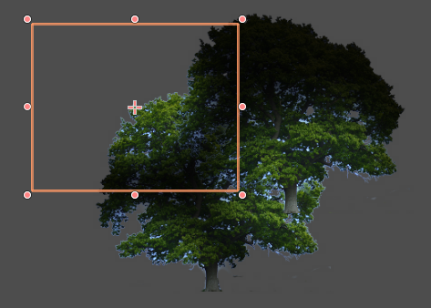
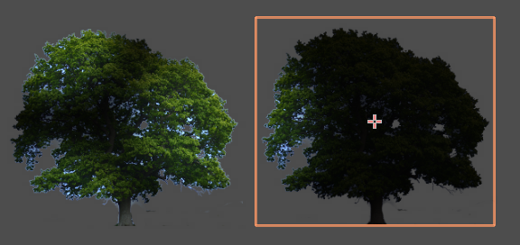
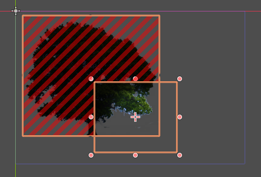

# Optimization using batching

### Introduction

Game engines have to send a set of instructions to the GPU to tell the GPU what
and where to draw. These instructions are sent using common instructions called
APIs (Application Programming Interfaces). Examples of graphics APIs are
OpenGL, OpenGL ES, and Vulkan.

Different APIs incur different costs when drawing objects. OpenGL handles a lot
of work for the user in the GPU driver at the cost of more expensive draw calls.
As a result, applications can often be sped up by reducing the number of draw
calls.

#### Draw calls

In 2D, we need to tell the GPU to render a series of primitives (rectangles,
lines, polygons etc). The most obvious technique is to tell the GPU to render
one primitive at a time, telling it some information such as the texture used,
the material, the position, size, etc. then saying "Draw!" (this is called a
draw call).

While this is conceptually simple from the engine side, GPUs operate very slowly
when used in this manner. GPUs work much more efficiently if you tell them to
draw a number of similar primitives all in one draw call, which we will call a
"batch".

It turns out that they don't just work a bit faster when used in this manner;
they work a *lot* faster.

As Pandemonium is designed to be a general-purpose engine, the primitives coming into
the Pandemonium renderer can be in any order, sometimes similar, and sometimes
dissimilar. To match Pandemonium's general-purpose nature with the batching
preferences of GPUs, Pandemonium features an intermediate layer which can
automatically group together primitives wherever possible and send these batches
on to the GPU. This can give an increase in rendering performance while
requiring few (if any) changes to your Pandemonium project.

### How it works

Instructions come into the renderer from your game in the form of a series of
items, each of which can contain one or more commands. The items correspond to
Nodes in the scene tree, and the commands correspond to primitives such as
rectangles or polygons. Some items such as TileMaps and text can contain a
large number of commands (tiles and glyphs respectively). Others, such as
sprites, may only contain a single command (a rectangle).

The batcher uses two main techniques to group together primitives:

- Consecutive items can be joined together.
- Consecutive commands within an item can be joined to form a batch.

#### Breaking batching

Batching can only take place if the items or commands are similar enough to be
rendered in one draw call. Certain changes (or techniques), by necessity, prevent
the formation of a contiguous batch, this is referred to as "breaking batching".

Batching will be broken by (amongst other things):

- Change of texture.
- Change of material.
- Change of primitive type (say, going from rectangles to lines).

Note: For example, if you draw a series of sprites each with a different texture,
there is no way they can be batched.

#### Determining the rendering order

The question arises, if only similar items can be drawn together in a batch, why
don't we look through all the items in a scene, group together all the similar
items, and draw them together?

In 3D, this is often exactly how engines work. However, in Pandemonium's 2D renderer,
items are drawn in "painter's order", from back to front. This ensures that
items at the front are drawn on top of earlier items when they overlap.

This also means that if we try and draw objects on a per-texture basis, then
this painter's order may break and objects will be drawn in the wrong order.

In Pandemonium, this back-to-front order is determined by:

- The order of objects in the scene tree.
- The Z index of objects.
- The canvas layer.
- `YSort` nodes.

Note: You can group similar objects together for easier batching. While doing so
is not a requirement on your part, think of it as an optional approach that
can improve performance in some cases.

#### A trick

And now, a sleight of hand. Even though the idea of painter's order is that
objects are rendered from back to front, consider 3 objects `A`, `B` and
`C`, that contain 2 different textures: grass and wood.


In painter's order they are ordered:

```
A - wood
B - grass
C - wood
```

Because of the texture changes, they can't be batched and will be rendered in 3
draw calls.

However, painter's order is only needed on the assumption that they will be
drawn *on top* of each other. If we relax that assumption, i.e. if none of these
3 objects are overlapping, there is *no need* to preserve painter's order. The
rendered result will be the same. What if we could take advantage of this?

#### Item reordering



It turns out that we can reorder items. However, we can only do this if the
items satisfy the conditions of an overlap test, to ensure that the end result
will be the same as if they were not reordered. The overlap test is very cheap
in performance terms, but not absolutely free, so there is a slight cost to
looking ahead to decide whether items can be reordered. The number of items to
lookahead for reordering can be set in project settings (see below), in order to
balance the costs and benefits in your project.

```

A - wood
C - wood
B - grass
```

Since the texture only changes once, we can render the above in only 2 draw
calls.

### Lights

Although the batching system's job is normally quite straightforward, it becomes
considerably more complex when 2D lights are used. This is because lights are
drawn using additional passes, one for each light affecting the primitive.
Consider 2 sprites `A` and `B`, with identical texture and material. Without
lights, they would be batched together and drawn in one draw call. But with 3
lights, they would be drawn as follows, each line being a draw call:



```

A
A - light 1
A - light 2
A - light 3
B
B - light 1
B - light 2
B - light 3
```

That is a lot of draw calls: 8 for only 2 sprites. Now, consider we are drawing
1,000 sprites. The number of draw calls quickly becomes astronomical and
performance suffers. This is partly why lights have the potential to drastically
slow down 2D rendering.

However, if you remember our magician's trick from item reordering, it turns out
we can use the same trick to get around painter's order for lights!

If `A` and `B` are not overlapping, we can render them together in a batch,
so the drawing process is as follows:



```

AB
AB - light 1
AB - light 2
AB - light 3
```


That is only 4 draw calls. Not bad, as that is a 2× reduction. However, consider
that in a real game, you might be drawing closer to 1,000 sprites.

- **Before:** 1000 × 4 = 4,000 draw calls.
- **After:** 1 × 4 = 4 draw calls.

That is a 1000× decrease in draw calls, and should give a huge increase in
performance.

#### Overlap test

However, as with the item reordering, things are not that simple. We must first
perform the overlap test to determine whether we can join these primitives. This
overlap test has a small cost. Again, you can choose the number of primitives to
lookahead in the overlap test to balance the benefits against the cost. With
lights, the benefits usually far outweigh the costs.

Also consider that depending on the arrangement of primitives in the viewport,
the overlap test will sometimes fail (because the primitives overlap and
therefore shouldn't be joined). In practice, the decrease in draw calls may be
less dramatic than in a perfect situation with no overlapping at all. However,
performance is usually far higher than without this lighting optimization.

### Light scissoring

Batching can make it more difficult to cull out objects that are not affected or
partially affected by a light. This can increase the fill rate requirements
quite a bit and slow down rendering. *Fill rate* is the rate at which pixels are
colored. It is another potential bottleneck unrelated to draw calls.

In order to counter this problem (and speed up lighting in general), batching
introduces light scissoring. This enables the use of the OpenGL command
`glScissor()`, which identifies an area outside of which the GPU won't render
any pixels. We can greatly optimize fill rate by identifying the intersection
area between a light and a primitive, and limit rendering the light to
*that area only*.

Light scissoring is controlled with the `rendering/batching/lights/scissor_area_threshold`
project setting. This value is between 1.0 and 0.0, with 1.0 being off (no
scissoring), and 0.0 being scissoring in every circumstance. The reason for the
setting is that there may be some small cost to scissoring on some hardware.
That said, scissoring should usually result in performance gains when you're
using 2D lighting.

The relationship between the threshold and whether a scissor operation takes
place is not always straightforward. Generally, it represents the pixel area
that is potentially "saved" by a scissor operation (i.e. the fill rate saved).
At 1.0, the entire screen's pixels would need to be saved, which rarely (if
ever) happens, so it is switched off. In practice, the useful values are close
to 0.0, as only a small percentage of pixels need to be saved for the operation
to be useful.



Bottom right is a light, the red area is the pixels saved by the scissoring
operation. Only the intersection needs to be rendered.

### Vertex baking

The GPU shader receives instructions on what to draw in 2 main ways:

- Shader uniforms (e.g. modulate color, item transform).
- Vertex attributes (vertex color, local transform).

However, within a single draw call (batch), we cannot change uniforms. This
means that naively, we would not be able to batch together items or commands
that change `final_modulate` or an item's transform. Unfortunately, that
happens in an awful lot of cases. For instance, sprites are typically
individual nodes with their own item transform, and they may have their own
color modulate as well.

To get around this problem, the batching can "bake" some of the uniforms into
the vertex attributes.

- The item transform can be combined with the local transform and sent in a
  vertex attribute.
- The final modulate color can be combined with the vertex colors, and sent in a
  vertex attribute.

In most cases, this works fine, but this shortcut breaks down if a shader expects
these values to be available individually rather than combined. This can happen
in custom shaders.

#### Custom shaders

As a result of the limitation described above, certain operations in custom
shaders will prevent vertex baking and therefore decrease the potential for
batching. While we are working to decrease these cases, the following caveats
currently apply:

- Reading or writing `COLOR` or `MODULATE` disables vertex color baking.
- Reading `VERTEX`  disables vertex position baking.

### Project Settings

To fine-tune batching, a number of project settings are available. You can
usually leave these at default during development, but it's a good idea to
experiment to ensure you are getting maximum performance. Spending a little time
tweaking parameters can often give considerable performance gains for very
little effort. See the on-hover tooltips in the Project Settings for more
information.

#### rendering/batching/options

- `use_batching:`
  - Turns batching on or off.
- `use_batching_in_editor`
  - Turns batching on or off in the Pandemonium editor.
  - This setting doesn't affect the running project in any way.
- `single_rect_fallback`
  - This is a faster way of drawing unbatchable rectangles. However, it may lead
    to flicker on some hardware so it's not recommended.

#### rendering/batching/parameters

- `max_join_item_commands`
  One of the most important ways of achieving batching is to join suitable
  adjacent items (nodes) together, however they can only be joined if the
  commands they contain are compatible. The system must therefore do a lookahead
  through the commands in an item to determine whether it can be joined. This
  has a small cost per command, and items with a large number of commands are
  not worth joining, so the best value may be project dependent.
- `colored_vertex_format_threshold`
  Baking colors into vertices results in a larger vertex format. This is not
  necessarily worth doing unless there are a lot of color changes going on
  within a joined item. This parameter represents the proportion of commands
  containing color changes / the total commands, above which it switches to
  baked colors.
- `batch_buffer_size`
  This determines the maximum size of a batch, it doesn't have a huge effect
  on performance but can be worth decreasing for mobile if RAM is at a premium.
- `item_reordering_lookahead`
  Item reordering can help especially with interleaved sprites using different
  textures. The lookahead for the overlap test has a small cost, so the best
  value may change per project.

#### rendering/batching/lights

- `scissor_area_threshold`
  See light scissoring.
- `max_join_items`
  Joining items before lighting can significantly increase
  performance. This requires an overlap test, which has a small cost, so the
  costs and benefits may be project dependent, and hence the best value to use
  here.

#### rendering/batching/debug

- `flash_batching`
  This is purely a debugging feature to identify regressions between the
  batching and legacy renderer. When it is switched on, the batching and legacy
  renderer are used alternately on each frame. This will decrease performance,
  and should not be used for your final export, only for testing.
- `diagnose_frame`
  This will periodically print a diagnostic batching log to
  the Pandemonium IDE / console.

#### rendering/batching/precision

- `uv_contract`
  On some hardware (notably some Android devices) there have been reports of
  tilemap tiles drawing slightly outside their UV range, leading to edge
  artifacts such as lines around tiles. If you see this problem, try enabling uv
  contract. This makes a small contraction in the UV coordinates to compensate
  for precision errors on devices.
- `uv_contract_amount`
  Hopefully, the default amount should cure artifacts on most devices,
  but this value remains adjustable just in case.

### Diagnostics

Although you can change parameters and examine the effect on frame rate, this
can feel like working blindly, with no idea of what is going on under the hood.
To help with this, batching offers a diagnostic mode, which will periodically
print out (to the IDE or console) a list of the batches that are being
processed. This can help pinpoint situations where batching isn't occurring
as intended, and help you fix these situations to get the best possible performance.

#### Reading a diagnostic

```
canvas_begin FRAME 2604
items
    joined_item 1 refs
            batch D 0-0
            batch D 0-2 n n
            batch R 0-1 [0 - 0] {255 255 255 255 }
    joined_item 1 refs
            batch D 0-0
            batch R 0-1 [0 - 146] {255 255 255 255 }
            batch D 0-0
            batch R 0-1 [0 - 146] {255 255 255 255 }
    joined_item 1 refs
            batch D 0-0
            batch R 0-2560 [0 - 144] {158 193 0 104 } MULTI
            batch D 0-0
            batch R 0-2560 [0 - 144] {158 193 0 104 } MULTI
            batch D 0-0
            batch R 0-2560 [0 - 144] {158 193 0 104 } MULTI
canvas_end
```


This is a typical diagnostic.

- **joined_item:** A joined item can contain 1 or
  more references to items (nodes). Generally, joined_items containing many
  references is preferable to many joined_items containing a single reference.
  Whether items can be joined will be determined by their contents and
  compatibility with the previous item.
- **batch R:** A batch containing rectangles. The second number is the number of
  rects. The second number in square brackets is the Pandemonium texture ID, and the
  numbers in curly braces is the color. If the batch contains more than one rect,
  `MULTI` is added to the line to make it easy to identify.
  Seeing `MULTI` is good as it indicates successful batching.
- **batch D:** A default batch, containing everything else that is not currently
  batched.

#### Default batches

The second number following default batches is the number of commands in the
batch, and it is followed by a brief summary of the contents:

```
l - line
PL - polyline
r - rect
n - ninepatch
PR - primitive
p - polygon
m - mesh
MM - multimesh
PA - particles
c - circle
t - transform
CI - clip_ignore
```

You may see "dummy" default batches containing no commands; you can ignore those.

### Frequently asked questions

#### I don't get a large performance increase when enabling batching.

- Try the diagnostics, see how much batching is occurring, and whether it can be
  improved
- Try changing batching parameters in the Project Settings.
- Consider that batching may not be your bottleneck (see bottlenecks).

#### I get a decrease in performance with batching.

- Try the steps described above to increase the number of batching opportunities.
- Try enabling `single_rect_fallback`.
- The single rect fallback method is the default used without batching, and it
  is approximately twice as fast. However, it can result in flickering on some
  hardware, so its use is discouraged.
- After trying the above, if your scene is still performing worse, consider
  turning off batching.

#### I use custom shaders and the items are not batching.

- Custom shaders can be problematic for batching, see the custom shaders section

#### I am seeing line artifacts appear on certain hardware.

- See the `uv_contract`
  project setting which can be used to solve this problem.

#### I use a large number of textures, so few items are being batched.

- Consider using texture atlases. As well as allowing batching, these
  reduce the need for state changes associated with changing textures.

### Appendix

#### Batched primitives

Not all primitives can be batched. Batching is not guaranteed either,
especially with primitives using an antialiased border. The following
primitive types are currently available:

- RECT
- NINEPATCH (depending on wrapping mode)
- POLY
- LINE

With non-batched primitives, you may be able to get better performance by
drawing them manually with polys in a `draw()` function.


#### Light scissoring threshold calculation

The actual proportion of screen pixel area used as the threshold is the
`ProjectSettings/rendering/batching/lights/scissor_area_threshold`
value to the power of 4.

For example, on a screen size of 1920×1080, there are 2,073,600 pixels.

At a threshold of 1,000 pixels, the proportion would be:

```
1000 / 2073600 = 0.00048225
0.00048225 ^ (1/4) = 0.14819
```

So a `ProjectSettings/rendering/batching/lights/scissor_area_threshold`
of `0.15` would be a reasonable value to try.

Going the other way, for instance with a `ProjectSettings/rendering/batching/lights/scissor_area_threshold`
of `0.5`:

```
0.5 ^ 4 = 0.0625
0.0625 * 2073600 = 129600 pixels
```

If the number of pixels saved is greater than this threshold, the scissor is
activated.

