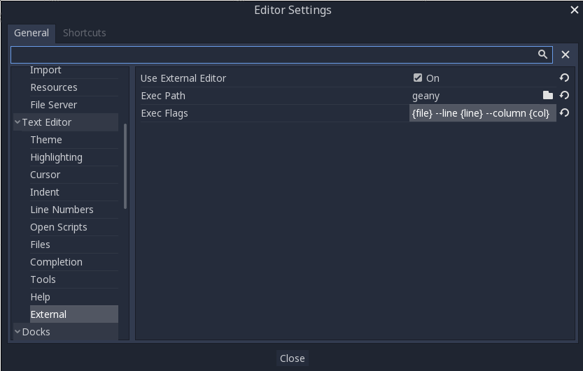

Using an external text editor
==============================

This page explains how to code using an external text editor.

Pandemonium can be used with an external text editor, such as Sublime Text or Visual
Studio Code. Browse to the relevant editor settings: `Editor -> Editor Settings
-> Text Editor -> External`

There are two fields: the executable path and command-line flags. The flags
allow you to integrate the editor with Pandemonium, passing it the file path to open
and other relevant arguments. Pandemonium will replace the following placeholders in
the flags string:

+---------------------+-----------------------------------------------------+
| Field in Exec Flags | Is replaced with                                    |
+=====================+=====================================================+
| `{project}`       | The absolute path to the project directory          |
+---------------------+-----------------------------------------------------+
| `{file}`          | The absolute path to the file                       |
+---------------------+-----------------------------------------------------+
| `{col}`           | The column number of the error                      |
+---------------------+-----------------------------------------------------+
| `{line}`          | The line number of the error                        |
+---------------------+-----------------------------------------------------+

Some example Exec Flags for various editors include:

+---------------------+-----------------------------------------------------+
| Editor              | Exec Flags                                          |
+=====================+=====================================================+
| Geany/Kate          | `{file} --line {line} --column {col}`             |
+---------------------+-----------------------------------------------------+
| Atom/Sublime Text   | `{file}:{line}`                                   |
+---------------------+-----------------------------------------------------+
| JetBrains Rider     | `{project} --line {line} {file}`                  |
+---------------------+-----------------------------------------------------+
| Visual Studio Code  | `{project} --goto {file}:{line}:{col}`            |
+---------------------+-----------------------------------------------------+
| Vim (gVim)          | `"+call cursor({line}, {col})" {file}`            |
+---------------------+-----------------------------------------------------+
| Emacs               | `emacs +{line}:{col} {file}`                      |
+---------------------+-----------------------------------------------------+

Note:
 For Visual Studio Code, you will have to point to the `code.cmd`
          file. For Emacs, you can call `emacsclient` instead of `emacs` if
          you use the server mode.

Official editor plugins
-----------------------

We have official plugins for the following code editors:

- `Visual Studio Code ( https://github.com/Relintai/pandemonium_engine-vscode-plugin )`
- `Emacs ( https://github.com/pandemoniumengine/emacs-gdscript-mode )`
