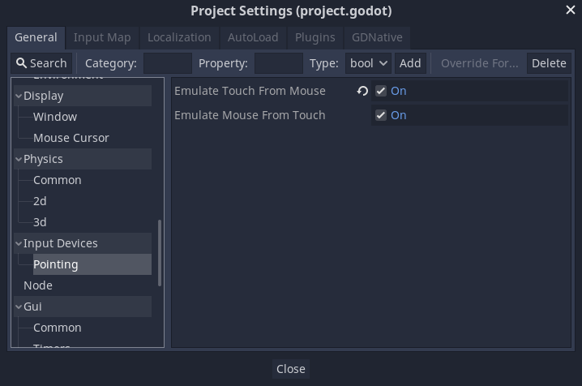
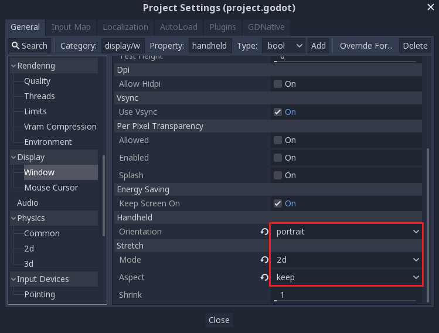
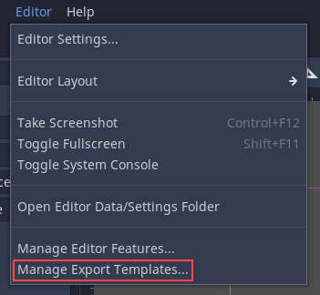
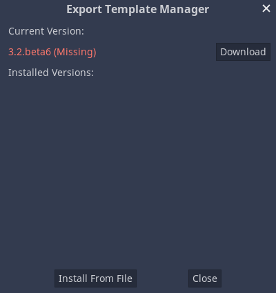
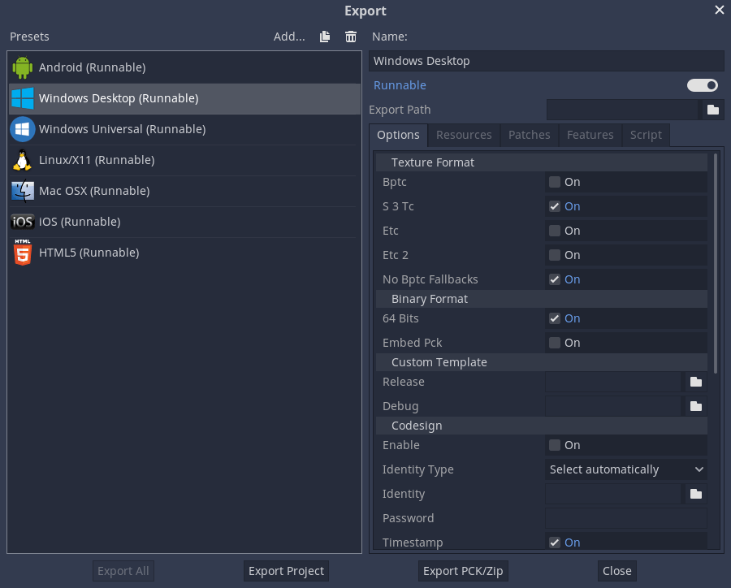
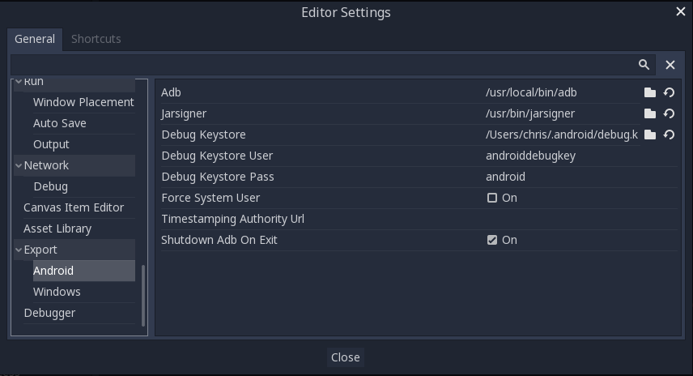
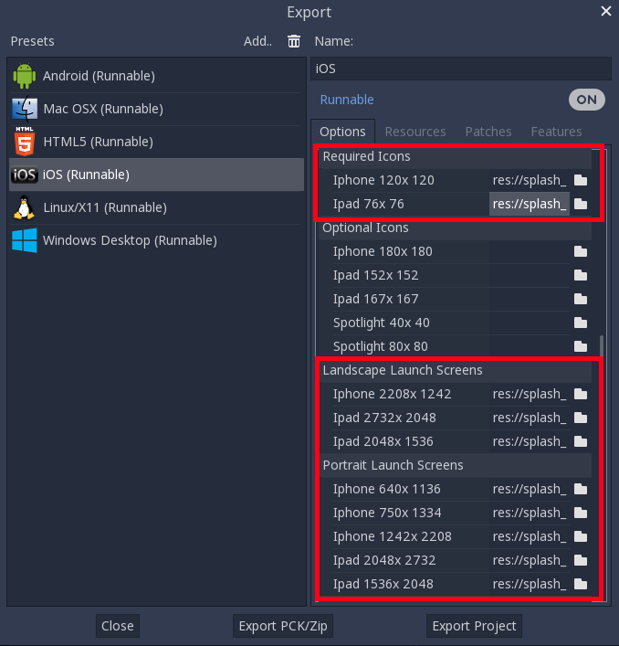
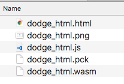
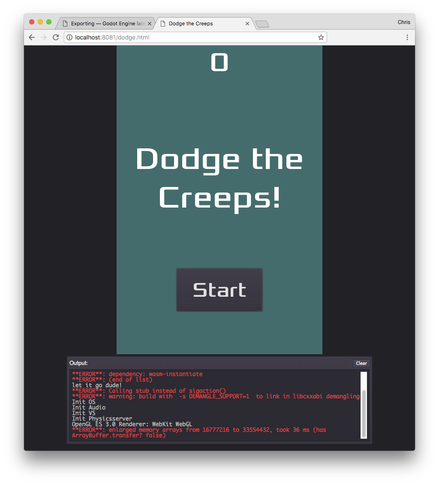
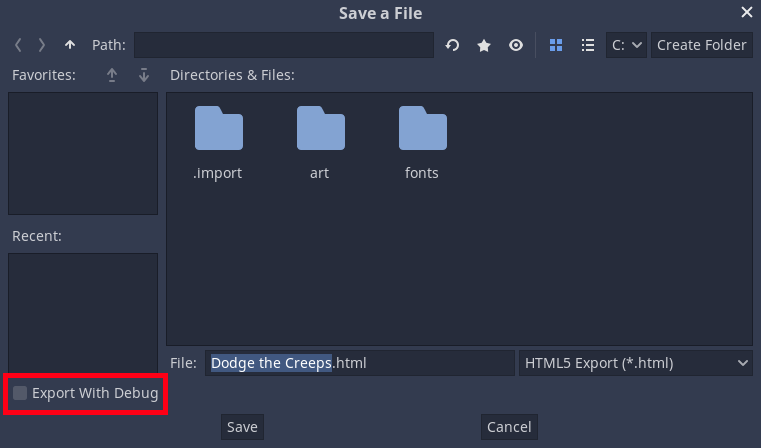

# Exporting

## Overview

Now that you have a working game, you probably want to share your success with
others. However, it's not practical to ask your friends to download Pandemonium
just so they can open your project. Instead, you can *export* your project,
converting it into a "package" that can be run by anyone.

The way you export your game depends on what platform you are targeting. In
this tutorial, you'll learn how to export the *Dodge the Creeps* game for a
variety of platforms. First, however, we need to make some changes to the
way the game works.

Note:
 If you haven't made "Dodge the Creeps" yourself yet, please read
          `doc_your_first_2d_game` before continuing with this tutorial.

## Preparing the project

In *Dodge the Creeps*, we used keyboard controls to move the player's character.
This is fine if your game is being played on a PC platform, but on a phone
or tablet, you need to support touchscreen input. Because a click event can
be treated the same as a touch event, we'll convert the game to a click-and-move
input style.

By default, Pandemonium emulates mouse input from touch input. That means that if
anything is coded to happen on a mouse event, touch will trigger it as well.
Pandemonium can also emulate touch input from mouse clicks, which we will need to be
able to keep playing our game on our computer after we switch to touch input.

In **Project > Project Settings**, under **Input Devices > Pointing**, enable
**Emulate Touch From Mouse**.



We also want to ensure that the game scales consistently on different-sized screens,
so in the project settings go to **Display**, then click on **Window**. In the **Stretch**
options, set **Mode** to `2d` and **Aspect** to `keep`.

Since we are already in the **Window** settings, we should also set under **Handheld**
the **Orientation** to `portrait`.



Next, we need to modify the `Player.gd` script to change the input method.
We'll remove the key inputs and make the player move towards a "target" that's
set by the touch (or click) event.

Here is the full script for the player, with comments noting what we've
changed:

gdscript GDScript

```
    extends Area2D

    signal hit

    export var speed = 400
    var screen_size
    # Add this variable to hold the clicked position.
    var target = Vector2()

    func _ready():
        hide()
        screen_size = get_viewport_rect().size

    func start(pos):
        position = pos
        # Initial target is the start position.
        target = pos
        show()
        $CollisionShape2D.disabled = false

    # Change the target whenever a touch event happens.
    func _input(event):
        if event is InputEventScreenTouch and event.pressed:
            target = event.position

    func _process(delta):
        var velocity = Vector2()
        # Move towards the target and stop when close.
        if position.distance_to(target) > 10:
            velocity = target - position

    # Remove keyboard controls.
    #    if Input.is_action_pressed("ui_right"):
    #       velocity.x += 1
    #    if Input.is_action_pressed("ui_left"):
    #        velocity.x -= 1
    #    if Input.is_action_pressed("ui_down"):
    #        velocity.y += 1
    #    if Input.is_action_pressed("ui_up"):
    #        velocity.y -= 1

        if velocity.length() > 0:
            velocity = velocity.normalized() * speed
            $AnimatedSprite.play()
        else:
            $AnimatedSprite.stop()

        position += velocity * delta
        # We still need to clamp the player's position here because on devices that don't
        # match your game's aspect ratio, Pandemonium will try to maintain it as much as possible
        # by creating black borders, if necessary.
        # Without clamp(), the player would be able to move under those borders.
        position.x = clamp(position.x, 0, screen_size.x)
        position.y = clamp(position.y, 0, screen_size.y)

        if velocity.x != 0:
            $AnimatedSprite.animation = "walk"
            $AnimatedSprite.flip_v = false
            $AnimatedSprite.flip_h = velocity.x < 0
        elif velocity.y != 0:
            $AnimatedSprite.animation = "up"
            $AnimatedSprite.flip_v = velocity.y > 0

    func _on_Player_body_entered( body ):
        hide()
        emit_signal("hit")
        $CollisionShape2D.set_deferred("disabled", true)
```

## Setting a main scene

The main scene is the one that your game will start in. For this
*Dodge the Creeps* example, in
**Project -> Project Settings -> Application -> Run**, set **Main Scene**
to `Main.tscn` by clicking the folder icon and selecting it.

## Export templates

To export the project, you need to download the *export templates* from the
http://pandemoniumengine.org/download. These templates are optimized versions of the engine
without the editor pre-compiled for each platform. You can also
download them in Pandemonium by clicking on **Editor -> Manage Export Templates**:



Note:


    If you've downloaded Pandemonium from
    `Steam ( https://store.steampowered.com/app/404790/Pandemonium_Engine/ )`,
    export templates are already included. Therefore, you don't need to download
    them using the **Manage Export Templates** dialog.

In the window that appears, you can click **Download** to get the template
version that matches your version of Pandemonium.



Note:


    Export templates are bound to a specific Pandemonium version. If you upgrade
    Pandemonium, you must download templates that match the new version.

## Export presets

Next, you can configure the export settings by clicking on **Project -> Export**.

Create a new export preset by clicking **Add...** and selecting a platform. You
can make as many presets as you like with different settings.



At the bottom of the window are two buttons. **Export PCK/ZIP** only creates
a packed version of your project's data. This doesn't include an executable
so the project can't be run on its own.

The second button, **Export Project**, creates a complete executable version
of your game, such as an `.apk` for Android or an `.exe` for Windows.

In the **Resources** and **Features** tabs, you can customize how the game is
exported for each platform. We can leave those settings alone for now.

## Exporting by platform

In this section, we'll walk through the process for each platform,
including any additional software or requirements you'll need.

### PC (Linux/macOS/Windows)

Exporting PC platforms works the same across the three supported operating
systems. Open the export window and click **Add...** to create the preset(s) you
want to make. Then click **Export Project** and choose a name and destination
folder. Choose a location *outside* of your project folder.

Click **Save** and the engine will build the export files.

Note:


    When exporting for macOS, if you export from a macOS computer, you'll end up
    with a `.dmg` file, while using Linux or Windows produces a `.zip`. In
    either case, the compressed file contains a macOS `.app` that you can
    double-click and run.

Note:


    On Windows, if you want your exported executable to have a different icon
    than the default one, you need to change it manually. See
    `doc_changing_application_icon_for_windows`.

### Android

Tip:


    Mobile devices come with a wide variety of capabilities. In most cases,
    Pandemonium's default settings will work, but mobile development is sometimes more
    art than science, and you may need to do some experimenting and searching
    for help in order to get everything working.

Before you can export your project for Android, you must download the following
software:

* Android SDK: https://developer.android.com/studio/
* Open JDK (**version 8 is required**, more recent versions won't work): https://adoptopenjdk.net/index.html

When you run Android Studio for the first time, click on **Configure -> SDK Manager**
and install **Android SDK Platform Tools**. This installs the `adb`
command-line tool that Pandemonium uses to communicate with your device.

Next, create a debug keystore by running the following command on your
system's command line:

```
    keytool -keyalg RSA -genkeypair -alias androiddebugkey -keypass android -keystore debug.keystore -storepass android -dname "CN=Android Debug,O=Android,C=US" -validity 9999
```

Click on *Editor -> Editor Settings* in Pandemonium and select the *Export/Android*
section. Here, you need to set the paths to the Android SDK applications on
your system and the location of the keystore you just created.



Now you're ready to export. Click on **Project -> Export** and add a preset
for Android (see above). Select the newly added Android preset. Under **Options**,
go to **Screen** and set **Orientation** to **Portrait**. If your game is in
landscape mode (i.e. the window width in pixels is greater than the window height),
leave this on **Landscape**.

Click the **Export Project** button and Pandemonium will build an APK you can download
on your device. To do this on the command line, use the following:

```
    adb install dodge.apk
```

Note:
 Your device may need to be in *developer mode*. Consult your
          device's documentation for details.

If your system supports it, connecting a compatible Android device will cause
a **One-click Deploy** button to appear in Pandemonium's playtest button area:


Clicking this button builds the APK and copies it onto your device in one step.

### iOS

Note:


    To build your game for iOS, you must have a computer running macOS with
    Xcode installed.

Before exporting, there are some settings that you *must* complete for the project
to export successfully. First, the **App Store Team Id**, which you can find by
logging in to your Apple developer account and looking in the **Membership** section.

You must also provide icons and splash screen images as shown below:



Click **Export Project** and select a destination folder.

Once you have successfully exported the project, you'll find the following
folders and files have been created in your selected location:


You can now open the project in Xcode and build the project for iOS.
The Xcode build procedure is beyond the scope of this tutorial.
See https://help.apple.com/xcode/mac/current/#/devc8c2a6be1
for more information.

### HTML5 (web)

Click **Export Project** on the HTML5 preset. We don't need to change any
of the default settings.

When the export is complete, you'll have a folder containing the following
files:



Viewing the `.html` file in your browser lets you play the game. However, you
can't open the file directly. Instead, it needs to be served by a web server. If
you don't have one set up on your computer, you can search online to find
suggestions for your specific OS.

Point your browser at the URL where you've placed the HTML file. You may have
to wait a few moments while the game loads before you see the start screen.



The console window beneath the game tells you if anything goes wrong. You can
disable it by disabling **Export With Debug** in the final file dialog that appears
when you export the project.



Note:


    While WebAssembly is supported in all major browsers, it is still an
    emerging technology and you may find some things that don't work. Make sure
    you have updated your browser to the most recent version, and report any
    bugs you find on the
    `Pandemonium GitHub repository ( https://github.com/Relintai/pandemonium_engine/issues )`.
