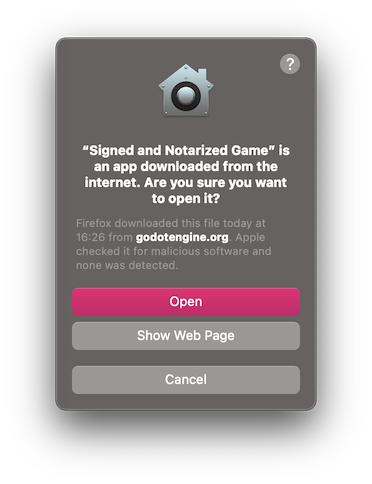
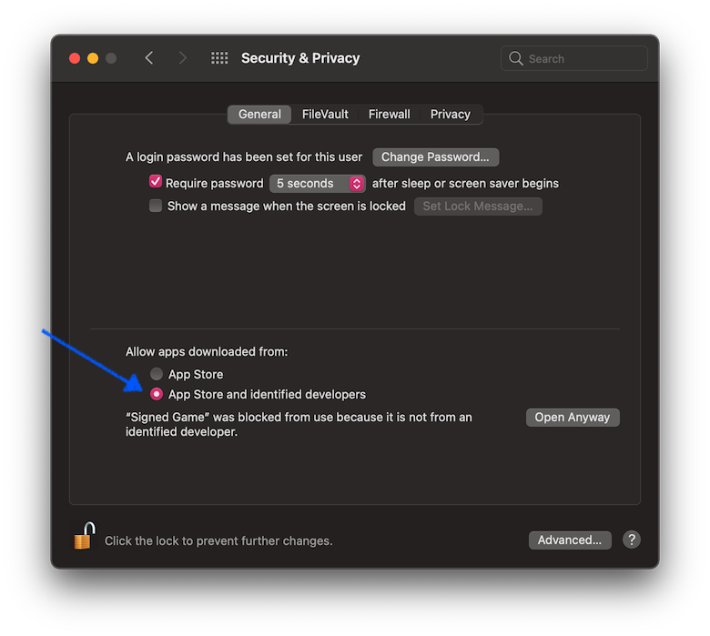
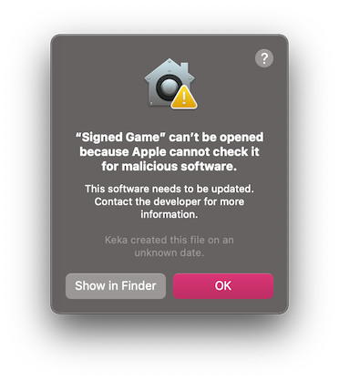
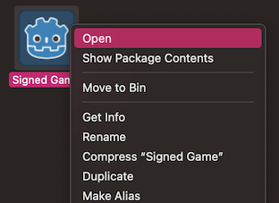
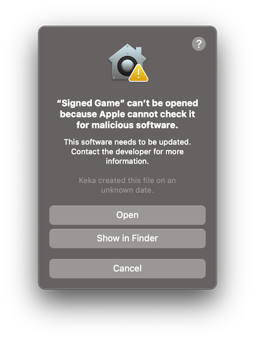
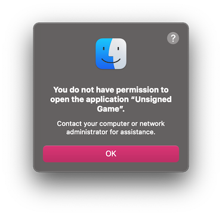

# Running Pandemonium apps on macOS

See also:

    This page covers running Pandemonium projects on macOS.
    If you haven't exported your project yet, read `doc_exporting_for_macos` first.

By default, macOS will run only applications that are signed and notarized.

Depending on the way a macOS app is signed and distributed, the following scenarios are possible:

## App is signed, notarized and distributed via App Store

Note:

    App developers need to join the Apple Developer Program, and configure signing and notarization options during export, then upload the app to the App Store.

The app should run out of the box, without extra user interaction required.

## App is signed, notarized and distributed outside App Store

Note:

    App developers need to join the Apple Developer Program, and configure signing and notarization options during export, then distribute the app as ".DMG" or ".ZIP" archive.

When you run the app for the first time, the following dialog is displayed:

Click `Open` to start the app.

If you see the following warning dialog, your Mac is set up to allow apps only from the App Store.

To allow third-party apps, open `System Preferences`, click `Security & Privacy`, then click `General`, unlock settings, and select `App Store and identified developers`.

## App is signed (including ad-hoc signatures) but not notarized

Note:

    App developer used self-signed certificate or ad-hoc signing (default Pandemonium behavior for exported project).

When you run the app for the first time, the following dialog is displayed:

To run this app, you can temporarily override Gatekeeper:

* Either open `System Preferences`, click `Security & Privacy`, then click `General`, and click `Open Anyway`.

  

* Or, right-click (Control-click) on the app icon in the Finder window and select `Open` from the menu.

  

* Then click `Open` in the confirmation dialog.

  

* Enter your password if you're prompted.

## App is not-signed, executable is linker-signed

Note:

    App is built using official export templates, but it is not signed.

When you run the app for the first time, the following dialog is displayed:

To run this app, you should remove the quarantine extended file attribute manually:

* Open `Terminal.app` (press `Cmd + Space`, and enter `Terminal`).

* Navigate to the folder containing the target application.

  Use the `cd path_to_the_app_folder` command, e.g. `cd ~/Downloads/` if it's in the `Downloads` folder.

* Run the command `xattr -dr com.apple.quarantine "Unsigned Game.app"` (including quotation marks and `.app` extension).

## Neither app nor executable is signed (relevant for Apple Silicon macs only)

Note:

    App is built using custom export templates, compiled using OSXCross, and it is not signed at all.

When you run the app for the first time, the following dialog is displayed:

To run this app, you can ad-hoc sign it yourself:

* Install `Xcode` for the App Store, start it and confirm command line tools installation.

* Open `Terminal.app` (press `Cmd + Space`, and enter `Terminal`).

* Navigate to the folder containing the target application.

  Use the `cd path_to_the_app_folder` command, e.g. `cd ~/Downloads/` if it's in the `Downloads` folder.

* Run the following commands:

  `xattr -dr com.apple.quarantine "Unsigned Game.app"` (including quotation marks and ".app" extension).

  `codesign -s - --force --deep "Unsigned Game.app"` (including quotation marks and ".app" extension).
