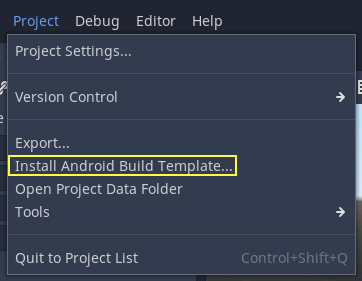
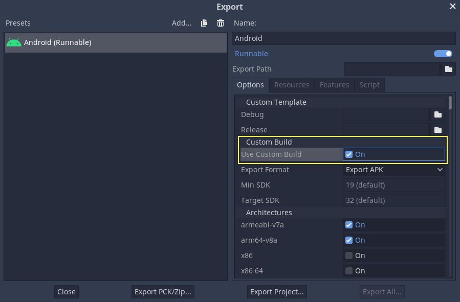
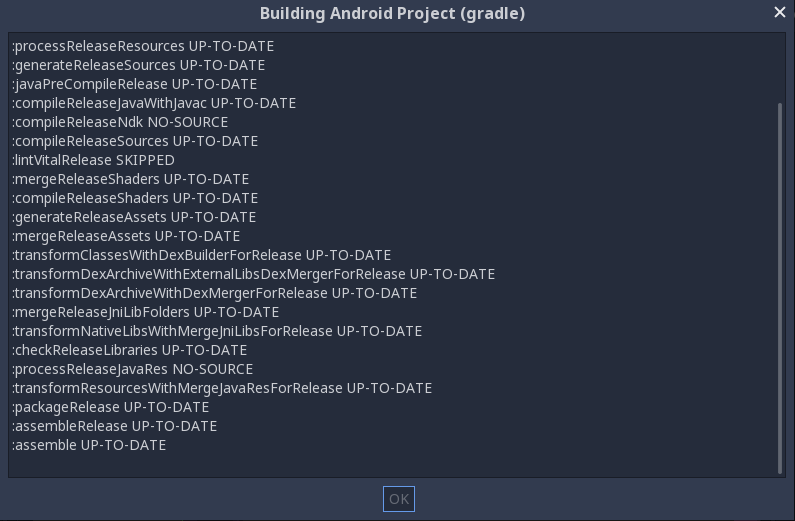

# Custom builds for Android

Pandemonium provides the option to use custom build Android templates. Instead of
using the already pre-built template that ships with Pandemonium, an actual Android
Java project gets installed into your project folder. Pandemonium will then build it
and use it as an export template every time you export the project.

There are some reasons why you may want to do this:

* Modify the project before it's built.
* Add external SDKs that build with your project.

Configuring the custom build is a fairly straightforward process. But first
you need to follow the steps in `exporting for android( doc_exporting_for_android )`
up to **Setting it up in Pandemonium**. After doing that, follow the steps below.

## Set up the custom build environment

Go to the Project menu, and install the *Custom Build* template:

Make sure export templates are downloaded. If not, this menu will help you
download them.

A Gradle-based Android project will be created under `res://android/build`.
Editing these files is not needed unless you want to `create
your own add-ons( doc_android_plugin )`, or you really need to modify the project.

## Enabling the custom build and exporting

When setting up the Android project in the **Project > Export** dialog,
**Custom Build** needs to be enabled:

From now on, attempting to export the project or one-click deploy will call the
`Gradle ( https://gradle.org/ )` build system to generate fresh templates (this
window will appear every time):

The templates built will be used automatically afterwards, so no further
configuration is needed.
