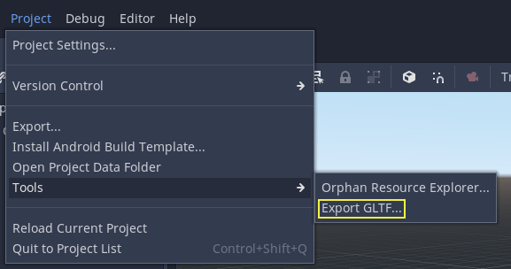

# Exporting 3D scenes

## Overview

In Pandemonium it is possible to export 3D scenes as a glTF 2.0 file. You can
export as a glTF binary (`.glb` file) or glTF embedded with textures
(`gltf` + `.bin` + textures). This allows you to create scenes in Pandemonium,
such as a CSG mesh blockout for a level, export it to clean it up in a
program such as Blender, and then bring it back into Pandemonium.

Note: Only Blender 2.83 and newer can import glTF files exported by Pandemonium.

To export a scene in the editor go to **Project &gt; Tools &gt; Export GLTF...**

## Limitations

There are several limitations with glTF export.

* No support for exporting particles since their implementation varies across engines.
* ShaderMaterials cannot be exported.
* No support for exporting 2D scenes.
* Only supported in editor builds (`tools=yes`).

