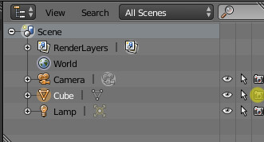

# Blender ESCN exporter

Note:
 This chapter relates to the Blender plugin called "Pandemonium Blender Exporter",
          which can be downloaded here: https://github.com/Relintai/pandemonium_engine-blender-exporter

This plugin can be used to export Blender scenes in a Pandemonium-specific scene format
called ESCN, which is similar to TSCN (text format) but will be imported as binary
SCN for performance.

## Disabling specific objects

Sometimes you don't want some objects exported (e.g. high-res models used for
baking). An object will not be exported if it is not rendered in the scene.
This can be set in the outliner:

Objects hidden in the viewport will be exported, but will be hidden in the
Pandemonium scene.

## Build pipeline integration

If you have hundreds of model files, you don't want your artists to waste time
manually exporting their blend files. To combat this, the exporter provides a
python function `io_scene_pandemonium.export(out_file_path)` that can be called to
export a file. This allows easy integration with other build systems. An
example Makefile and python script that exports all the blends in a directory
are present in the Pandemonium-Blender-exporter repository.
