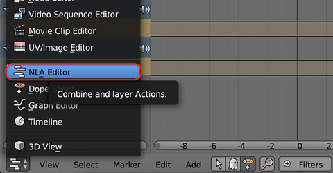
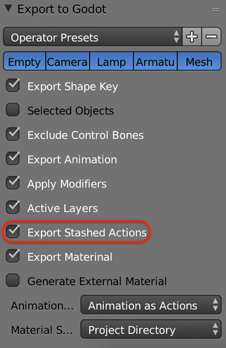
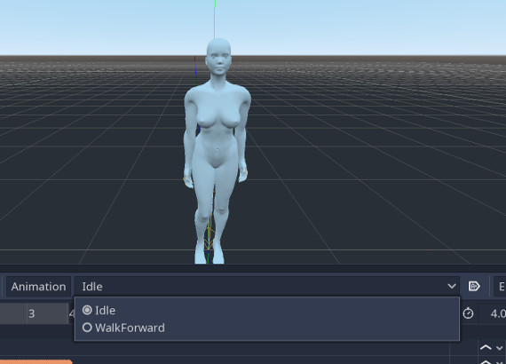

# Animation

Animation supported:
 - transform animation of all types of objects
 - transform animation of pose bones
 - shape key animation
 - light animation
 - camera animation

## Multiple Actions For Single Object

In most games, one object would have several animations to switch between.
This add-on has support for exporting multiple actions all at once into
a single AnimationPlayer and makes it easy to switch actions.

This workflow makes use of blender nla_tracks. Here is a brief guide on how
to use this feature:

**1. Stash active action**

New created action is always an active action bound to object. There are
several ways to place an active action into NLA track,
one is of course doing it in `NLA Editor`

Or it can be done stashing the action in `Dope Sheet`

**2. Check mute status of NLA tracks**

An NLA track can be `mute` or `unmute`, the exporter will export all
the `mute` NLA track as a separate action, while blends all the `unmute`
NLA tracks into every action (including the action action) being exported.

**3. Export the scene**

Make sure the `Export Stashed Actions` option has been turned on.

Then all the stashed actions, as well as the active action, are exported
to an AnimationPlayer.

## Constraints

Sometimes complicated animation is built with object constraint; a usual
example is inverse kinematics. The add-on would automatically check if an
object has some constraint; if it does, all the constraints are baked into
actions and then exported along with the object.

## Animation Mode

Pandemonium and Blender have different structure to store animation data.
In Pandemonium animation data is stored in an AnimationPlayer node, instead
of in each animated node. In order to fix this inconsistence and still
make the animation play versatile, this add-on has three animation exporting
modes.

**Mode 'Animation as Actions'**

Treat all the animations as object actions, so in the exported scene, every
object would have its own AnimationPlayer and hold its actions.

**Mode 'Scene Animation'**

If you want your animation to generate the same result as playing at Blender's
timeline, this is what you want. In this mode, all the animations in the scene
are placed in just one AnimationPlayer in the scene root.

**Mode 'Animation as Action with Squash'**

This mode has very similar behavior of mode 'Animation as Action', but it
can generate fewer AnimationPlayers; objects in parent-children relationship would
share their AnimationPlayer. It is useful when you have several rigs, and each
Skeleton and Mesh has actions; then one rig would have just one AnimationPlayer.
