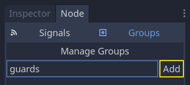
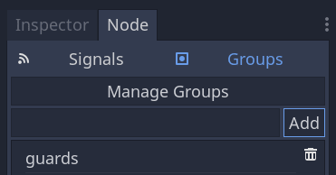
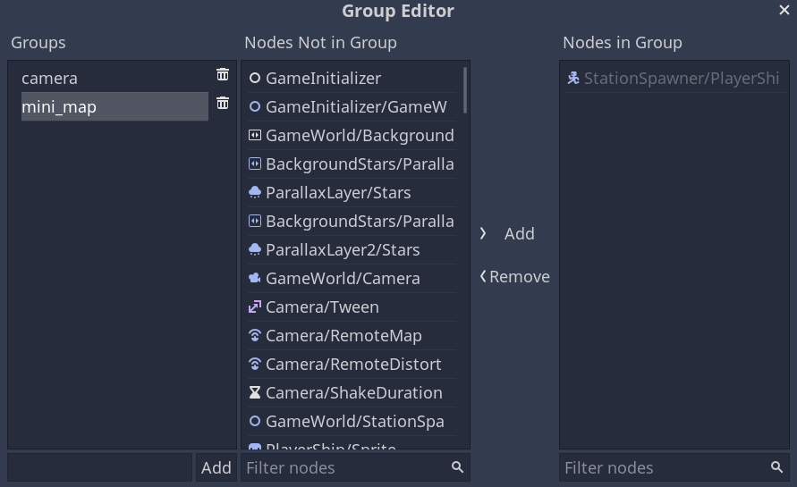

Groups
======

Groups in Pandemonium work like tags in other software. You can add a node to as many
groups as you want. Then, in code, you can use the SceneTree to:

- Get a list of nodes in a group.
- Call a method on all nodes in a group.
- Send a notification to all nodes in a group.

This is a useful feature to organize large scenes and decouple code.


Managing groups
---------------

Groups are created by adding a node to a new group name, and likewise they are
removed by removing all nodes from a given group.

There are two ways to add/remove nodes to groups:

- During design, by using the Node dock in the editor.
- During execution, by calling `Node.add_to_group()`
  or `Node.remove_from_group()`.


Using the Node dock
~~~~~~~~~~~~~~~~~~~

You can add nodes in the current scene to groups using the Groups tab in the
Node dock.


Select one or more nodes in the Scene dock and write the group name in the
field, then click Add.



You should now see the group appear.



In a complex project, you may end up with many groups or large scenes with many
nodes. You can add or remove any node to groups using the Group Editor window.
To access it, click the Manage Groups button.


The Group Editor window appears. Here's a screenshot from a complex project to
illustrate the tool's purpose.



It has three columns:

1. A list of groups used by nodes in the current scene.
2. A list of nodes that are not part of the selected group.
3. A list of nodes in the group.

The fields at the bottom allow you to add new groups or filter nodes in the
second and third columns.

Note:
 Any node name that's greyed out means the node was added to the group
          in a different scene and you cannot edit it here. This happens on
          scene instances in particular.

Using code
~~~~~~~~~~

You can also manage groups from scripts. The following code adds the node to
which you attach the script to the `guards` group as soon as it enters the
scene tree.

gdscript GDScript

```
    func _ready():
        add_to_group("guards")
```

Imagine you're creating an infiltration game. When an
enemy spots the player, you want all guards and robots to be on alert.

In the fictional example below, we use `SceneTree.call_group()` to alert all
enemies that the player was spotted.

gdscript GDScript

```
    func _on_Player_spotted():
        get_tree().call_group("guards", "enter_alert_mode")
```

The above code calls the function `enter_alert_mode` on every member of the
group `guards`.

To get the full list of nodes in the `guards` group as an array, you can call
`SceneTree.get_nodes_in_group()
( SceneTree_method_get_nodes_in_group )`:

gdscript GDScript

```
    var guards = get_tree().get_nodes_in_group("guards")
```

The `SceneTree` class provides many more useful methods
to interact with scenes, their node hierarchy, and groups. It allows you to
switch scenes easily or reload them, quit the game or pause and unpause it. It
also provides useful signals.
