# Using LayeredTileMaps

This page assumes you have created or downloaded a LayeredTileSet already. If not,
please read [using_tilesets.md](using_tilesets.md) first as you will need a LayeredTileSet
to create a LayeredTileMap.

## Introduction

A tilemap is a grid of tiles used to create a game's layout. There are several
benefits to using LayeredTileMap nodes to design your levels.
First, they make it possible to draw the layout by "painting" the tiles onto a
grid, which is much faster than placing individual Sprite
nodes one by one. Second, they allow for much larger levels because they are
optimized for drawing large numbers of tiles. Finally, you can add collision,
occlusion, and navigation shapes to tiles, adding greater functionality to
the LayeredTileMap.

## Specifying the LayeredTileSet in the LayeredTileMap

If you've followed the previous page on [using_tilesets.md](using_tilesets.md), you should
have a LayeredTileSet resource that is built-in to the LayeredTileMap node. This is good for
prototyping, but in a real world project, you will generally have multiple
levels reusing the same tileset.

The recommended way to reuse the same LayeredTileSet in several LayeredTileMap nodes is to save
the LayeredTileSet to an external resource. To do so, click the dropdown next to the LayeredTileSet
resource and choose **Save**:

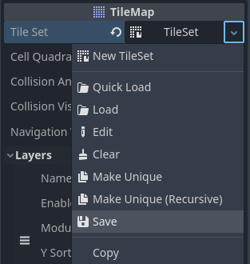

Saving the built-in LayeredTileSet resource to an external resource file

## Creating LayeredTileMap layers

As of Pandemonium 4.0, you can place several *layers* in a single LayeredTileMap node. For
example, this allows you to distinguish foreground tiles from background tiles
for better organization. You can place one tile per layer at a given location,
which allows you to overlap several tiles together if you have more than one layer.

By default, a LayeredTileMap node automatically has one premade layer. You do not have
to create additional layers if you only need a single layer, but if you wish to
do so now, select the LayeredTileMap node and unfold the **Layers** section in the
inspector:

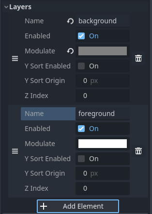

Creating layers in a LayeredTileMap node (example with "background" and "foreground")

Each layer has several properties you can adjust:

- **Name:** A human-readable name to display in the LayeredTileMap editor. This can be
  something like "background", "buildings", "vegetation", etc.
- **Enabled:** If ``true``, the layer is visible in the editor and when running
  the project.
- **Modulate:** The color to use as a multiplier for all tiles on the layer.
  This is also multiplied with the per-tile **Modulate** property and the
  LayeredTileMap node's **Modulate** property. For example, you can use this to darken
  background tiles to make foreground tiles stand out more.
- **Y Sort Enabled:** If ``true``, sorts tiles based on their Y position on the
  LayeredTileMap. This can be used to prevent sorting issues with certain tile setups,
  especially with isometric tiles.
- **Y Sort Origin:** The vertical offset to use for Y-sorting on each tile (in pixels).
  Only effective if **Y Sort Enabled** is ``true``.
- **Z Index:** Controls whether this layer is drawn in front of or behind other
  LayeredTileMap layers. This value can be positive or negative; the layer with the highest Z
  Index is drawn on top of other layers. If several layers have an equal Z Index
  property, the layer that is *last* in the list of layers (the one which
  appears at the bottom in the list) is drawn on top.

You can reorder layers by drag-and-dropping the "three horizontal bars" icon on
the left of the entries in the **Layers** section.

Note:

You can create, rename or reorder layers in the future without affecting
existing tiles. Be careful though, as *removing* a layer will also remove
all tiles that were placed on the layer.

## Opening the LayeredTileMap editor

Select the LayeredTileMap node, then open the LayeredTileMap panel at the bottom
of the editor:

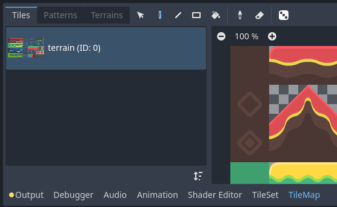

Opening the LayeredTileMap panel at the bottom of the editor. The LayeredTileMap node must be selected first.

## Selecting tiles to use for painting

First, if you've created additional layers above, make sure you've selected the
layer you wish to paint on:

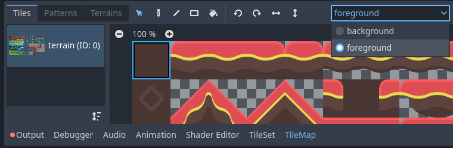

Selecting a layer to paint on in the LayeredTileMap editor

Tip:

In the 2D editor, the layers you aren't currently editing from the same
LayeredTileMap node will appear grayed out while in the LayeredTileMap editor. You can
disable this behavior by clicking the icon next to the layer selection menu
(**Highlight Selected LayeredTileMap Layer** tooltip).

You can skip the above step if you haven't created additional layers, as the
first layer is automatically selected when entering the LayeredTileMap editor.

Before you can place tiles in the 2D editor, you must select one or more tiles
in the LayeredTileMap panel located at the bottom of the editor. To do so, click a tile
in the LayeredTileMap panel, or hold down the mouse button to select multiple tiles:

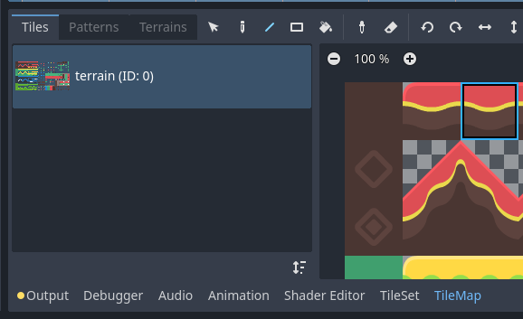

Selecting a tile in the LayeredTileMap editor by clicking it

Tip:

Like in the 2D and LayeredTileSet editors, you can pan across the LayeredTileMap panel using
the middle or right mouse buttons, and zoom using the mouse wheel or buttons in
the top-left corner.

You can also hold down `Shift` to append to the current selection. When
selecting more than one tile, multiple tiles will be placed every time you
perform a painting operation. This can be used to paint structures composed of
multiple tiles in a single click (such as large platforms or trees).

The final selection does not have to be contiguous: if there is empty space
between selected tiles, it will be left empty in the pattern that will be
painted in the 2D editor.

Selecting multiple tiles in the LayeredTileMap editor by holding down the left mouse button

If you've created alternative tiles in your LayeredTileSet, you can select them for
painting on the right of the base tiles:

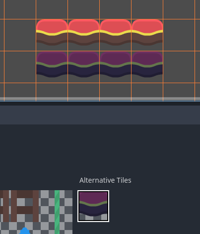

Selecting an alternative tile in the LayeredTileMap editor

Lastly, if you've created a *scenes collection* in the LayeredTileSet, you can place scene tiles in the LayeredTileMap:

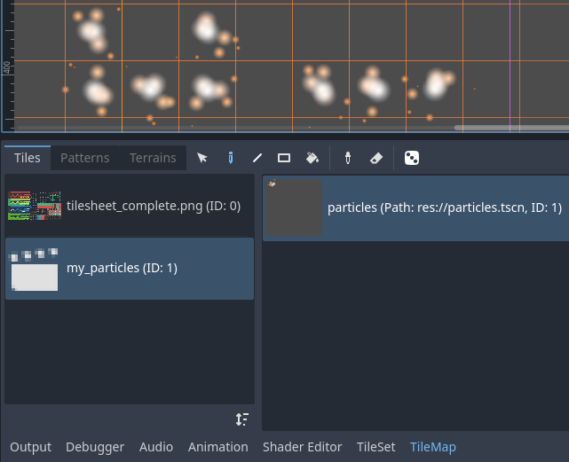

Placing a scene tile containing particles using the LayeredTileMap editor

## Painting modes and tools

Using the toolbar at the top of the LayeredTileMap editor, you can choose between
several painting modes and tools. These modes affect operation when clicking in
the 2D editor, **not** the LayeredTileMap panel itself.

From left to right, the painting modes and tools you can choose are:

### Selection

Select tiles by clicking a single tile, or by holding down the left mouse button to
select multiple with a rectangle in the 2D editor. Note that empty space cannot be
selected: if you create a rectangle selection, only non-empty tiles will be selected.

To append to the current selection, hold `Shift` then select a tile.
To remove from the current selection, hold `Ctrl` then select a tile.

The selection can then be used in any other painting mode to quickly create copies
of an already-placed pattern.

You can remove the selected tiles from the LayeredTileMap by pressing `Del`.

You can toggle this mode temporarily while in Paint mode by holding `Ctrl`
then performing a selection.

Tip:

You can copy and paste tiles that were already placed by performing a
selection, pressing `Ctrl + C` then pressing `Ctrl + V`.
The selection will be pasted after left-clicking. You can press
`Ctrl + V` another time to perform more copies this way.
Right-click or press `Escape` to cancel pasting.

### Paint

The standard Paint mode allows you to place tiles by clicking or holding
down the left mouse button.

If you right-click, the currently selected tile will be erased from the tilemap.
In other words, it will be replaced by empty space.

If you have selected multiple tiles in the LayeredTileMap or using the Selection tool,
they will be placed every time you click or drag the mouse while holding down
the left mouse button.

Tip:

While in Paint mode, you can draw a line by holding `Shift` *before*
holding down the left mouse button, then dragging the mouse to the line's end
point. This is identical to using the Line tool described below.

You can also draw a rectangle by holding `Ctrl` and `Shift`
*before* holding down the left mouse button, then dragging the mouse to the
rectangle's end point. This is identical to using the Rectangle tool
described below.

Lastly, you can pick existing tiles in the 2D editor by holding `Ctrl`
then clicking on a tile (or holding and dragging the mouse).
This will switch the currently painted tile(s) to the tile(s) you've just clicked.
This is identical to using the Picker tool described below.

### Line

After selecting Line Paint mode, you can draw in a line that is
always 1 tile thick (no matter its orientation).

If you right-click while in Line Paint mode, you will erase in a line.

If you have selected multiple tiles in the LayeredTileMap or using the Selection tool,
you can place them in a repeating pattern across the line.

You can toggle this mode temporarily while in Paint or Eraser mode by holding
`Shift` then drawing.

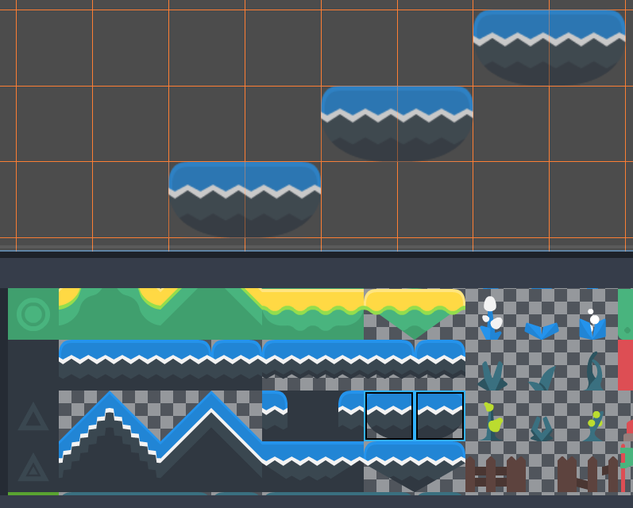

Using the line tool after selecting two tiles to draw platforms diagonally

### Rectangle

After selecting Rectangle Paint mode, you can draw in an axis-aligned
rectangle.

If you right-click while in Rectangle Paint mode, you will erase in
an axis-aligned rectangle.

If you have selected multiple tiles in the LayeredTileMap or using the Selection tool,
you can place them in a repeating pattern within the rectangle.

You can toggle this mode temporarily while in Paint or Eraser mode by holding
`Ctrl` and `Shift` then drawing.

### Bucket Fill

After selecting Bucket Fill mode, you can choose whether painting should be
limited to contiguous areas only by toggling the **Contiguous** checkbox that
appears on the right of the toolbar.

If you enable **Contiguous** (the default), only matching tiles that touch the
current selection will be replaced. This contiguous check is performed
horizontally and vertically, but *not* diagonally.

If you disable **Contiguous**, all tiles with the same ID in the entire LayeredTileMap will
be replaced by the currently selected tile. If selecting an empty tile with
**Contiguous** unchecked, all tiles in the rectangle that encompasses the
LayeredTileMap's effective area will be replaced instead.

If you right-click while in Bucket Fill mode, you will replace matching tiles
with empty tiles.

If you have selected multiple tiles in the LayeredTileMap or using the Selection tool,
you can place them in a repeating pattern within the filled area.

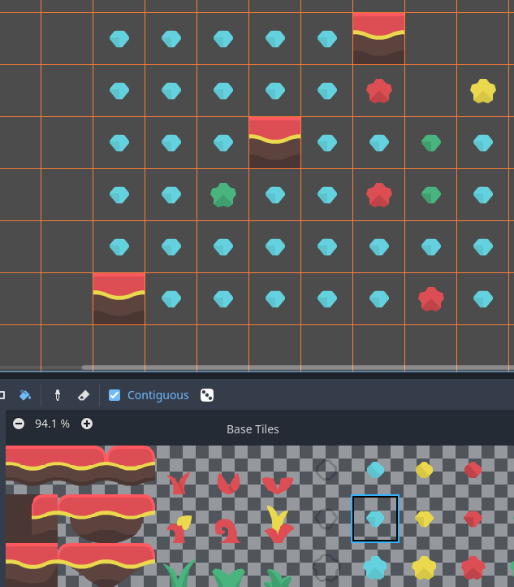

Using the Bucket Fill tool

### Picker

After selecting Picker mode, you can pick existing tiles in the 2D editor by
holding `Ctrl` then clicking on a tile. This will switch the currently
painted tile to the tile you've just clicked. You can also pick multiple tiles
at once by holding down the left mouse button and forming a rectangle selection.
Only non-empty tiles can be picked.

You can toggle this mode temporarily while in Paint mode by holding `Ctrl`
then clicking or dragging the mouse.

### Eraser

This mode is combined with any other painting mode (Paint, Line, Rectangle,
Bucket Fill). When eraser mode is enabled, tiles will be replaced by empty tiles
instead of drawing new lines when left-clicking.

You can toggle this mode temporarily while in any other mode by right-clicking
instead of left-clicking.

## Painting randomly using scattering

While painting, you can optionally enable *randomization*. When enabled,
a random tile will be chosen between all the currently selected tiles when
painting. This is supported with the Paint, Line, Rectangle and Bucket Fill
tools. For effective paint randomization, you must select multiple tiles
in the LayeredTileMap editor or use scattering (both approaches can be combined).

If **Scattering** is set to a value greater than 0, there is a chance that no tile
will be placed when painting. This can be used to add occasional, non-repeating
detail to large areas (such as adding grass or crumbs on a large top-down
LayeredTileMap).

Example when using Paint mode:

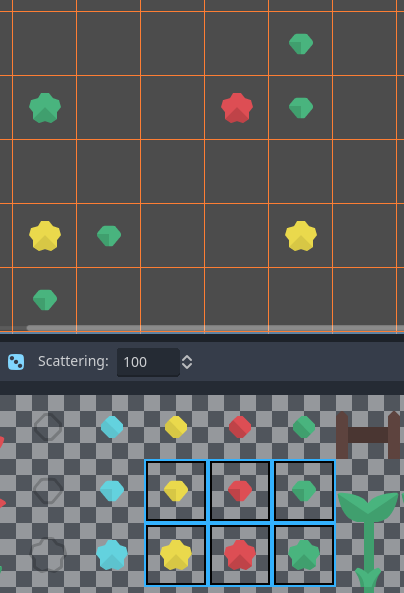

Selecting from several times to randomly choose, then painting by holding down the left mouse button

Example when using Bucket Fill mode:

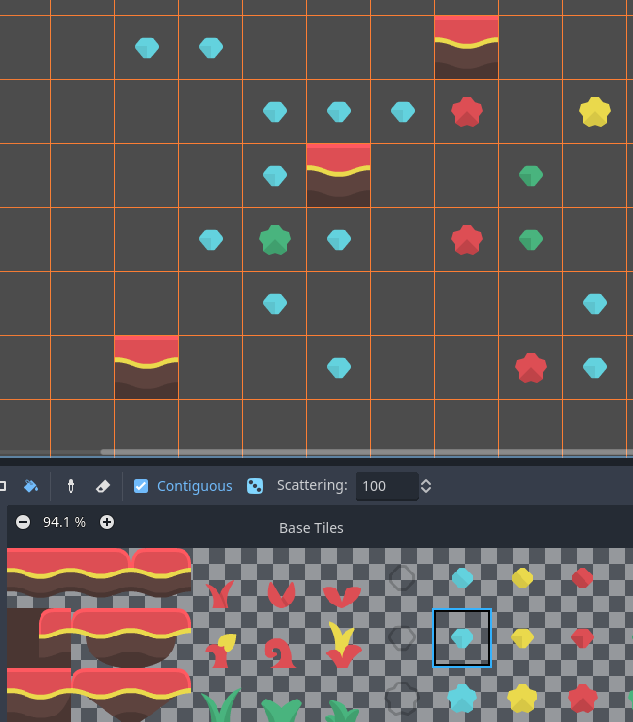

Using Bucket Fill tool with a single tile, but with randomization and scattering enabled

Note:

Eraser mode does not take randomization and scattering into account.
All tiles within the selection are always removed.

## Saving and loading premade tile placements using patterns

While you can copy and paste tiles while in Select mode, you may wish to save
premade *patterns* of tiles to place together in a go. This can be done on a
per-LayeredTileMap basis by choosing the **Patterns** tab of the LayeredTileMap editor.

To create a new pattern, switch to Select mode, perform a selection and press
`Ctrl + C`. Click on empty space within the Patterns tab (a blue focus
rectangle should appear around the empty space), then press `Ctrl + V`:

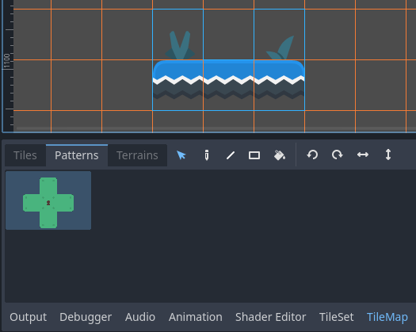

Creating a new pattern from a selection in the LayeredTileMap editor

To use an existing pattern, click its image in the **Patterns** tab, switch to
any painting mode, then left-click somewhere in the 2D editor:

Placing an existing pattern using the LayeredTileMap editor

Like multi-tile selections, patterns will be repeated if used with the Line,
Rectangle or Bucket Fill painting modes.

Note:

Despite being edited in the LayeredTileMap editor, patterns are stored in the
LayeredTileSet resource. This allows reusing patterns in different LayeredTileMap nodes
after loading a LayeredTileSet resource saved to an external file.

## Handling tile connections automatically using terrains

To use terrains, the LayeredTileMap node must feature at least one terrain set and a
terrain within this terrain set. See
`doc_using_tilesets_creating_terrain_sets` if you haven't created a terrain
set for the LayeredTileSet yet.

There are 3 kinds of painting modes available for terrain connections:

- **Connect**, where tiles are connected to surrounding tiles on the same
  LayeredTileMap layer.
- **Path**, where tiles are connected to tiles painted in the same stroke (until
  the mouse button is released).
- Tile-specific overrides to resolve conflicts or handle situations not covered
  by the terrain system.

The Connect mode is easier to use, but Path is more flexible as it allows for
more artist control during painting. For instance, Path can allow roads to be
directly adjacent to each other without being connected to each other, while
Connect will force both roads to be connected.

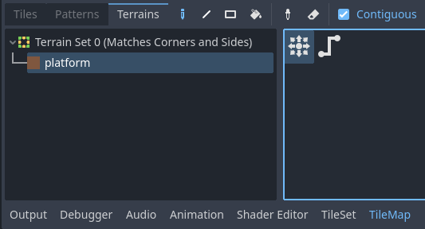

Selecting Connect mode in the LayeredTileMap editor's Terrains tab

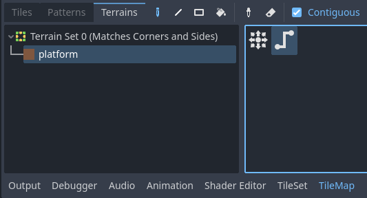

Selecting Path mode in the LayeredTileMap editor's Terrains tab

Lastly, you can select specific tiles from the terrain to resolve conflicts in
certain situations:

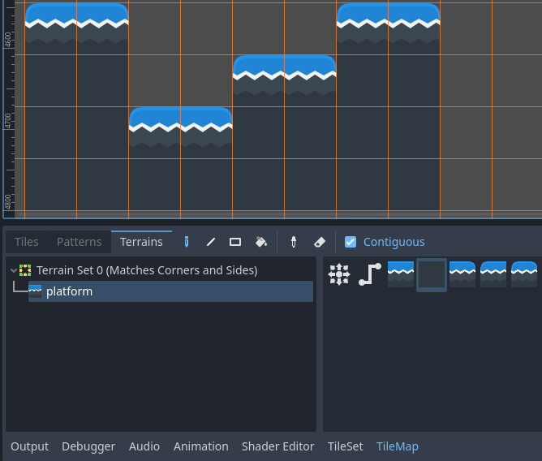

Painting with specific tiles in the LayeredTileMap editor's Terrains tab

Any tile that has at least one of its bits set to a value set to the
corresponding terrain ID will appear in the list of tiles to choose from.

## Handling missing tiles

If you remove tiles in the LayeredTileSet that are referenced in a LayeredTileMap, the LayeredTileMap
will display a placeholder to indicate that an invalid tile ID is placed:

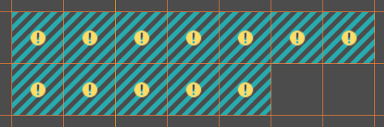

Missing tiles in the LayeredTileMap editor due to the LayeredTileSet reference being broken

These placeholders are **not** visible in the running project, but the tile data
is still persisted to disk. This allows you to safely close and reopen such
scenes. Once you re-add a tile with the matching ID, the tiles will appear with
the new tile's appearance.

Note:

Missing tile placeholders may not be visible until you select the LayeredTileMap
node and open the LayeredTileMap editor.
