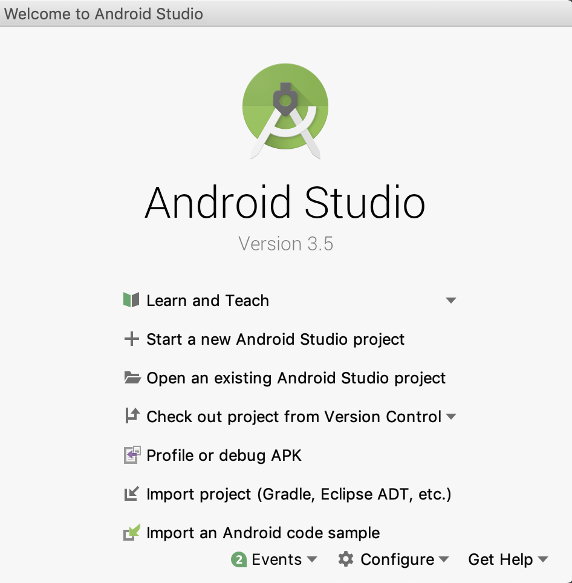

# Android Studio

[Android Studio](https://developer.android.com/studio) is a free
[JetBrains](https://www.jetbrains.com/) IDE for Android development.
It has a feature-rich editor which supports Java and C/C++. It can be used to
work on Pandemonium's core engine as well as the Android platform codebase.

## Importing the project

- From the Android Studio's welcome window select **Open an existing
  Android Studio project**.

Android Studio's welcome window.

- Navigate to `<Pandemonium root directory>/platform/android/java` and select the `settings.gradle` file.
- Android Studio will import and index the project.
- To build the project, follow the compiling instructions.

