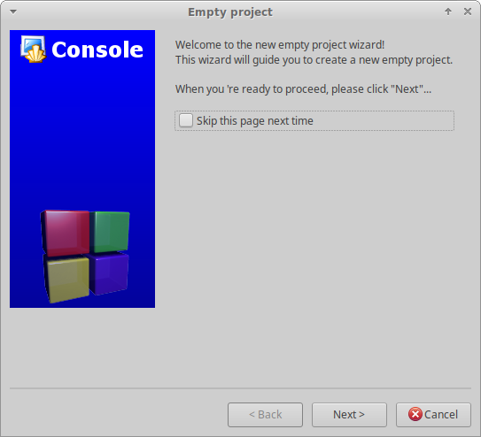

# Code::Blocks

`Code::Blocks ( https://codeblocks.org/ )` is a free, open source, cross platform IDE.

## Creating a new project

From Code::Blocks' main screen, click **Create a new project** or select **File > New > Project...**.

In the **New from template** window, from **Projects**, select **Empty project**, and click **Go**.

Click Next, to pass the welcome to the new empty project wizard.

The project file should be created in the root of the cloned project folder. To achieve this, first, ensure that the **Project title** is the same as the folder name that Pandemonium was cloned into. Unless you cloned the project into a folder with a different name, this will be `pandemonium`.

Second, ensure that the **Folder to create project in** is the folder you ran the Git clone command from, not the `pandemonium` project folder. Confirm that the **Resulting filename** field will create the project file in the root of the cloned project folder.

The compiler and configuration settings are managed through **SCons** and will be configured later. However, it's worth deselecting the **Create "Release" configuration** option; so only a single build target is created before clicking **Finish**.

## Configuring the build

The first step is to change the project properties. Right-click on the new project and select **Properties...**.

Check the **This is a custom Makefile** property. Click OK to save the changes.

The next step is to change the build options. Right-click on the new project and select **Build Options...**.

Select the **"Make" commands** tab and remove all the existing commands for all the build targets. For each build target enter the **SCons** command for creating the desired build in the **Build project/target** field. The minimum is `scons`. For details on the **SCons** build options, see `doc_introduction_to_the_buildsystem`. It's also useful to add the `scons --clean` command in the **Clean project/target** field to the project's default commmands.

If you're using Windows, all the commands need to be preceded with `cmd /c` to iniitalize the command interpreter.

Windows example:

!{}(img/code_blocks_scons_windows.png)

Code::Blocks should now be configured to build Pandemonium; so either select **Build > Build**, click the gear button, or press :kbd:`Ctrl + F9`.

## Configuring the run

Once **SCons** has successfully built the desired target, reopen the project **Properties...** and select the **Build targets** tab. In the **Output filename** field, browse to the `bin` folder and select the compiled file.

Deselect the **Auto-generate filename prefix** and **Auto-generate filename extension** options.

Code::Blocks should now be configured to run your compiled Pandemonium executable; so either select **Build > Run**, click the green arrow button, or press :kbd:`Ctrl + F10`.

There are two additional points worth noting. First, if required, the **Execution working dir** field can be used to test specific projects, by setting it to the folder containing the `project.pandemonium` file. Second, the **Build targets** tab can be used to add and remove build targets for working with and creating different builds.

## Adding files to the project

To add all the Pandemonium code files to the project, right-click on the new project and select **Add files recursively...**.

It should automatically select the project folder; so simply click **Open**. By default, all code files are included, so simply click **OK**.

## Code style configuration

Before editing any files, remember that all code needs to comply with the `doc_code_style_guidelines`. One important difference with Pandemonium is the use of tabs for indents. Therefore, the key default editor setting that needs to be changed in Code::Blocks is to enable tabs for indents. This setting can be found by selecting **Settings > Editor**.

Under **General Settings**, on the **Editor Settings** tab, under **Tab Options** check **Use TAB character**.

That's it. You're ready to start contributing to Pandemonium using the Code::Blocks IDE. Remember to save the project file and the **Workspace**. If you run into any issues, ask for help in one of `Pandemonium's community channels ( https://pandemoniumengine.org/community )`.
