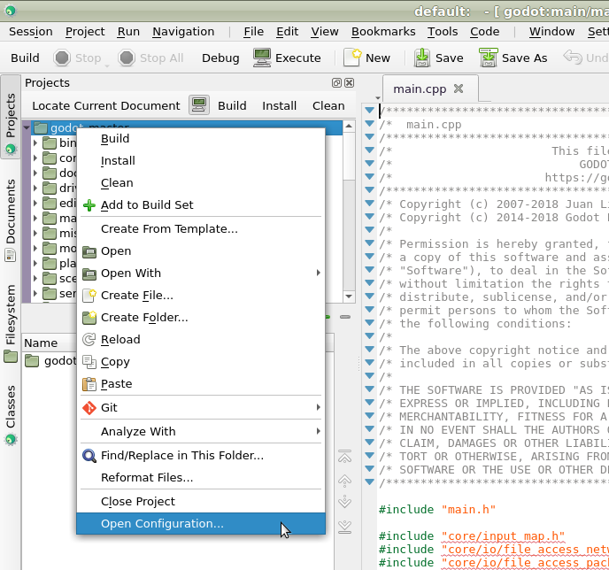
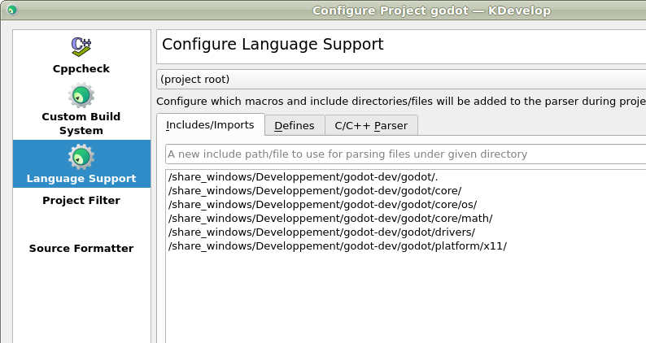
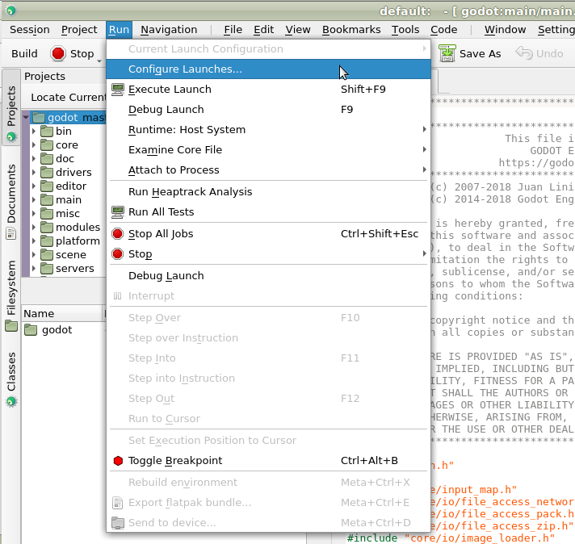

# KDevelop

`KDevelop ( https://www.kdevelop.org )` is a free, open source IDE for all desktop platforms.

## Importing the project

- From the KDevelop's main screen select **Open Project**.


KDevelop's main screen.

- Navigate to the Pandemonium root folder and select it.
- On the next screen, choose **Custom Build System** for the **Project Manager**.


- After the project has been imported, open the project configuration by right-clicking 
  on it in the **Projects** panel and selecting **Open Configuration..** option.



- Under **Language Support** open the **Includes/Imports** tab and add the following paths:

```
     .  // A dot, to indicate the root of the Pandemonium project
     core/
     core/os/
     core/math/
     drivers/
     platform/<your_platform>/  // Replace <your_platform> with a folder 
                                   corresponding to your current platform
```



- Apply the changes.
- Under **Custom Build System** add a new build configuration with the following settings:

|                 |                                                                              |
|-----------------|------------------------------------------------------------------------------|
| Build Directory | *blank*                                                                      |
| Enable          | **True**                                                                     |
| Executable      | **scons**                                                                    |
| Arguments       | See `doc_introduction_to_the_buildsystem` for a full list of arguments. |


- Apply the changes and close the configuration window.

## Debugging the project

- Select **Run > Configure Launches...** from the top menu.



- Click **Add** to create a new launch configuration.
- Select **Executable** option and specify the path to your executable located in 
  the `<Pandemonium root directory>/bin` folder. The name depends on your build configuration,
  e.g. `pandemonium.x11.tools.64` for 64-bit X11 platform with `tools` enabled.


If you run into any issues, ask for help in one of
`Pandemonium's community channels ( https://pandemoniumengine.org/community )`.
