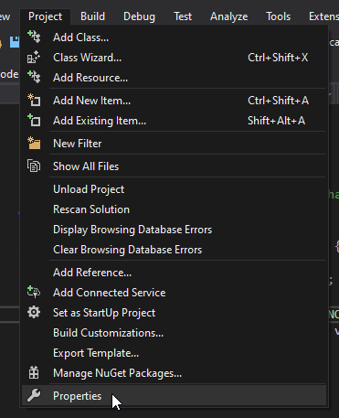

# Visual Studio

`Visual Studio Community ( https://visualstudio.microsoft.com )` is a Windows-only IDE 
by `Microsoft ( https://microsoft.com )` that's free for non-commercial use.
It has many useful features, such as memory view, performance view, source
control and more.

## Importing the project

Visual Studio requires a solution file to work on a project. While Pandemonium does not come
with the solution file, it can be generated using SCons.

- Navigate to the Pandemonium root folder and open a Command Prompt or PowerShell window.
- Run `scons platform=windows vsproj=yes` to generate the solution.
- You can now open the project by double-clicking on the `pandemonium.sln` in the project root
  or by using the **Open a project or solution** option inside of the Visual Studio.
- Use the **Build** top menu to build the project.

Warning:

 Visual Studio must be configured with the C++ package. It can be selected
             in the intaller:

## Debugging the project

Visual Studio features a powerful debugger. This allows the user to examine Pandemonium's
source code, stop at specific points in the code, inspect the current execution context,
and make live changes to the codebase.

You can launch the project with the debugger attached using the **Debug > Start Debugging**
option from the top menu. However, unless you want to debug the project manager specifically,
you'd need to configure debugging options first. This is due to the fact that when the Pandemonium 
project manager opens a project, the initial process is terminated and the debugger gets detached.

- To configure the launch options to use with the debugger use **Project > Properties**
  from the top menu:

- Open the **Debugging** section and under **Command Arguments** add two new arguments: 
  the `-e` flag opens the editor instead of the project manager, and the `--path` argument
  tells the executable to open the specified project (must be provided as an *absolute* path 
  to the project root, not the `project.pandemonium` file).

To learn more about command line arguments, refer to the
`command line tutorial ( doc_command_line_tutorial )`.

Even if you start the project without a debugger attached it can still be connected to the running
process using **Debug > Attach to Process...** menu.

To check that everything is working, put a breakpoint in `main.cpp` and press :kbd:`F5` to
start debugging.

If you run into any issues, ask for help in one of
`Pandemonium's community channels ( https://pandemoniumengine.org/community )`.
