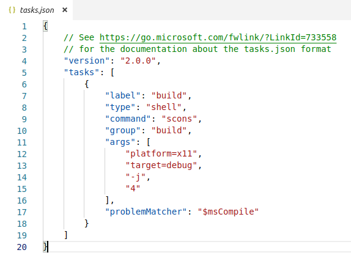
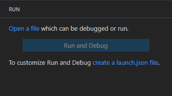
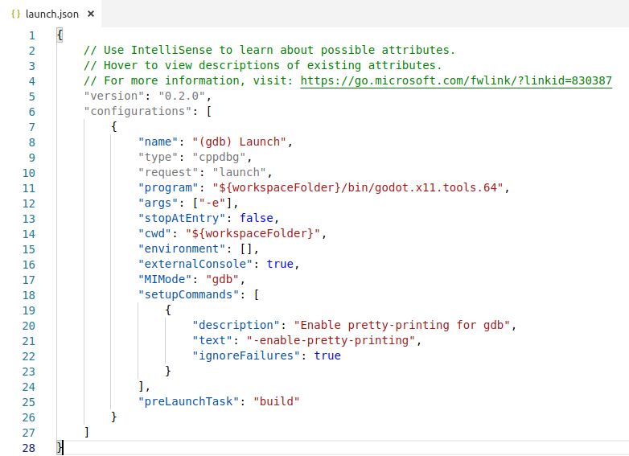

# Visual Studio Code

`Visual Studio Code ( https://code.visualstudio.com )` is a free cross-platform code editor
by `Microsoft ( https://microsoft.com )` (not to be confused with `doc_configuring_an_ide_vs`).

## Importing the project

- Make sure the C/C++ extension is installed. You can find instructions in
  the `official documentation ( https://code.visualstudio.com/docs/languages/cpp )`.
  Alternatively, `clangd ( https://open-vsx.org/extension/llvm-vs-code-extensions/vscode-clangd )`
  can be used instead.
- When using the clangd extension, run `scons compiledb=yes`.
- From the Visual Studio Code's main screen open the Pandemonium root folder with
  **File > Open Folder...**.
- Press :kbd:`Ctrl + Shift + P` to open the command prompt window and enter *Configure Task*.


- Select the **Create tasks.json file from template** option.


- Then select **Others**.


- Within the `tasks.json` file find the `"tasks"` array and add a new section to it:

js Linux/X11

```
    {
      "label": "build",
      "group": "build",
      "type": "shell",
      "command": "scons",
      "args": [
        "-j $(nproc)"
      ],
      "problemMatcher": "$msCompile"
    }
```

js Windows

```
    {
      "label": "build",
      "group": "build",
      "type": "shell",
      "command": "scons",
      "args": [
        // Use this when your default shell is Command Prompt (cmd.exe).
        "-j %NUMBER_OF_PROCESSORS%",
        // Use this when your default shell is PowerShell.
        "-j $env:NUMBER_OF_PROCESSORS"
      ],
      "problemMatcher": "$msCompile"
    }
```



An example of a filled out `tasks.json`.

Arguments can be different based on your own setup and needs. See
`doc_introduction_to_the_buildsystem` for a full list of arguments.

## Debugging the project

To run and debug the project you need to create a new configuration in the `launch.json` file.

- Press :kbd:`Ctrl + Shift + D` to open the Run panel.
- If `launch.json` file is missing you will be prompted to create a new one.



- Select **C++ (GDB/LLDB)**. There may be another platform specific option here. If selected,
  adjust the configuration example provided accordingly.
- Within the `launch.json` file find the `"configurations"` array and add a new section to it:

js X11

```
    {
      "name": "Launch Project",
      "type": "lldb",
      "request": "launch",
      // Change to pandemonium.x11.tools.64.llvm for llvm-based builds.
      "program": "${workspaceFolder}/bin/pandemonium.x11.tools.64",
      // Change the arguments below for the project you want to test with.
      // To run the project instead of editing it, remove the "--editor" argument.
      "args": [ "--editor", "--path", "path-to-your-pandemonium-project-folder" ],
      "stopAtEntry": false,
      "cwd": "${workspaceFolder}",
      "environment": [],
      "externalConsole": false,
      "preLaunchTask": "build"
    }

```

js X11_gdb

```
    {
      "name": "Launch Project",
      "type": "cppdbg",
      "request": "launch",
      // Change to pandemonium.x11.tools.64.llvm for llvm-based builds.
      "program": "${workspaceFolder}/bin/pandemonium.x11.tools.64",
      // Change the arguments below for the project you want to test with.
      // To run the project instead of editing it, remove the "--editor" argument.
      "args": [ "--editor", "--path", "path-to-your-pandemonium-project-folder" ],
      "stopAtEntry": false,
      "cwd": "${workspaceFolder}",
      "environment": [],
      "externalConsole": false,
      "setupCommands":
      [
        {
          "description": "Enable pretty-printing for gdb",
          "text": "-enable-pretty-printing",
          "ignoreFailures": true
        }
      ],
      "preLaunchTask": "build"
    }
```

js Windows

```
    {
      "name": "Launch Project",
      "type": "cppvsdbg",
      "request": "launch",
      "program": "${workspaceFolder}/bin/pandemonium.windows.tools.64.exe",
      // Change the arguments below for the project you want to test with.
      // To run the project instead of editing it, remove the "--editor" argument.
      "args": [ "--editor", "--path", "path-to-your-pandemonium-project-folder" ],
      "stopAtEntry": false,
      "cwd": "${workspaceFolder}",
      "environment": [],
      "console": "internalConsole",
      "visualizerFile": "${workspaceFolder}/platform/windows/pandemonium.natvis",
      "preLaunchTask": "build"
    }
```



   An example of a filled out `launch.json`.


Note:


    Due to sporadic performance issues, it is recommended to use LLDB over GDB on Unix-based systems.
    Make sure that the `CodeLLDB extension ( https://marketplace.visualstudio.com/items?itemName=vadimcn.vscode-lldb )`
    is installed.

    If you encounter issues with lldb, you may consider using gdb (see the X11_gdb configuration).

    Do note that lldb may work better with llvm-based builds. See `doc_compiling_for_x11` for further information.

The name under `program` depends on your build configuration,
e.g. `pandemonium.x11.tools.64` for 64-bit X11 platform with `tools` enabled.

If you run into any issues, ask for help in one of
`Pandemonium's community channels ( https://pandemoniumengine.org/community )`.
