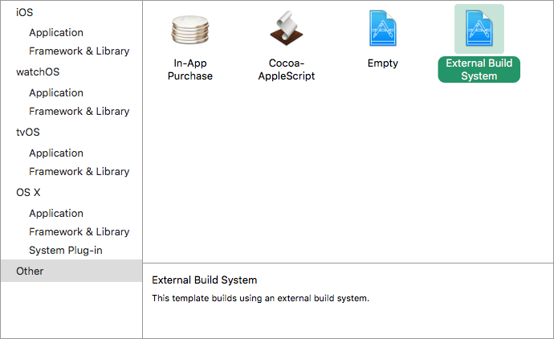
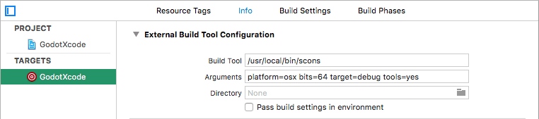
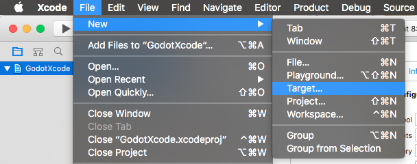
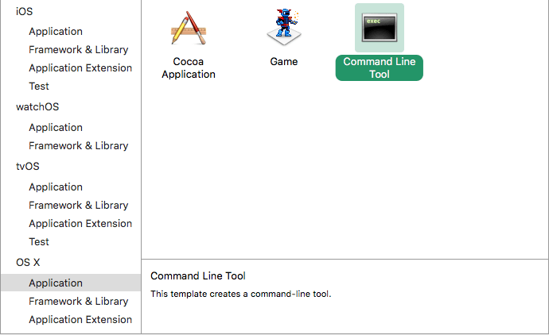
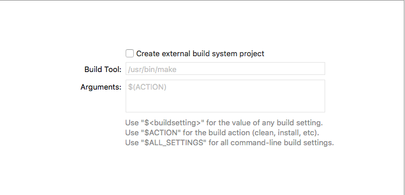
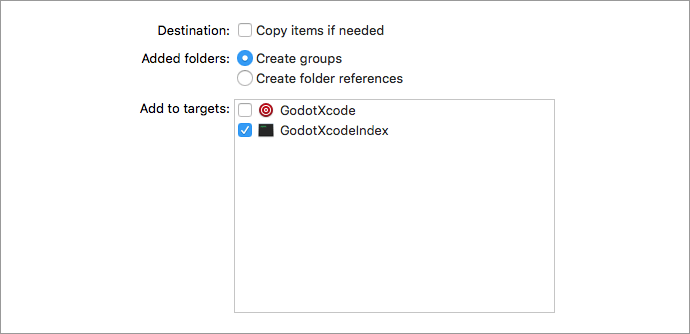
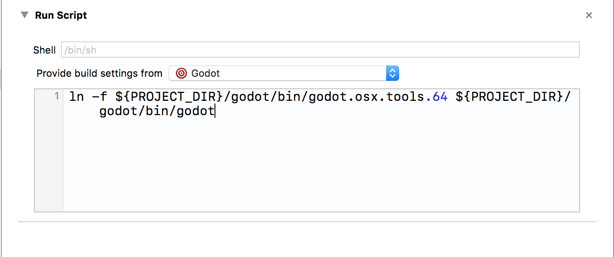
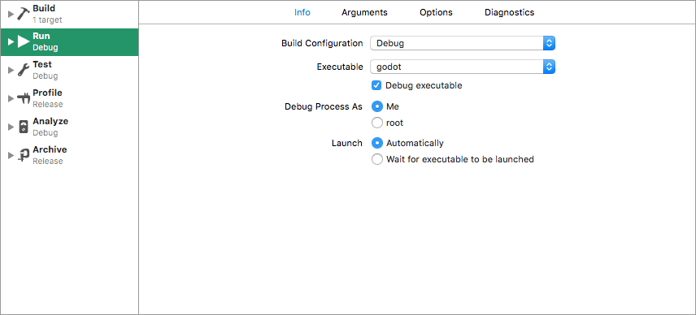

# Xcode

`Xcode ( https://developer.apple.com/xcode )` is a free macOS-only IDE. You can 
download it from the Mac App Store.

## Importing the project

- From Xcode's main screen create a new project using the **Other > External Build System** template.



- Open your build targets from the **Targets** section and select the **Info** tab.
- Fill out the form with the following settings:

|            |                                                                              |
|------------|------------------------------------------------------------------------------|
| Build Tool | A full path to the **scons** executable, e.g. **/usr/local/bin/scons**       |
| Arguments  | See `doc_introduction_to_the_buildsystem` for a full list of arguments.      |
| Directory  | A full path to the Pandemonium root folder                                   |




- Add a Command Line Tool target which will be used for indexing the project by
  choosing **File > New > Target...**.



- Select **OS X > Application > Command Line Tool**.



Note:
 Name it something so you know not to compile with this target (e.g. `PandemoniumXcodeIndex`).

- For this target open the **Build Settings** tab and look for **Header Search Paths**.
- Set **Header Search Paths** to the absolute path to the Pandemonium root folder. You need to
  include subdirectories as well. To achieve that, add two two asterisks (`**`) to the 
  end of the path, e.g. `/Users/me/repos/pandemonium-source/**`.

- Add the Pandemonium source to the project by dragging and dropping it into the project file browser.
- Uncheck **Create external build system project**.



- Next select **Create groups** for the **Added folders** option and check *only* 
  your command line indexing target in the **Add to targets** section.



- Xcode will now index the files. This may take a few minutes.
- Once Xcode is done indexing, you should have jump-to-definition,
  autocompletion, and full syntax highlighting.

## Debugging the project

To enable debugging support you need to edit the external build target's build and run schemes.

- Open the scheme editor of the external build target.
- Locate the **Build > Post Actions** section.
- Add a new script run action
- Under **Provide build settings from** select your project. This allows to reference 
  the project directory within the script.
- Create a script that will give the binary a name that Xcode can recognize, e.g.:

```
  ln -f ${PROJECT_DIR}/pandemonium/bin/pandemonium.osx.tools.64 ${PROJECT_DIR}/pandemonium/bin/pandemonium
```



- Build the external build target.

- Open the scheme editor again and select **Run**.



- Set the **Executable** to the file you linked in your post-build action script.
- Check **Debug executable**.
- You can add two arguments on the **Arguments** tab:
  the `-e` flag opens the editor instead of the project manager, and the `--path` argument
  tells the executable to open the specified project (must be provided as an *absolute* path 
  to the project root, not the `project.pandemonium` file).

To check that everything is working, put a breakpoint in `platform/osx/pandemonium_main_osx.mm` and
run the project.

If you run into any issues, ask for help in one of
`Pandemonium's community channels ( https://pandemoniumengine.org/community )`.
