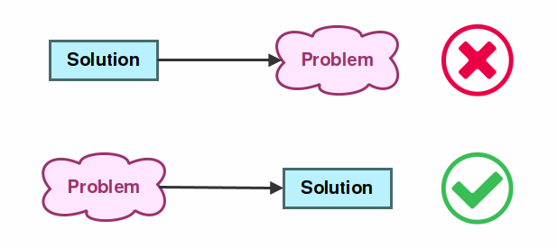
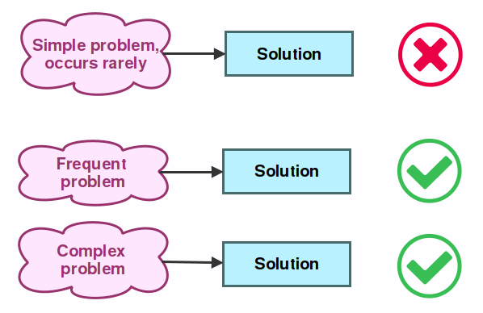
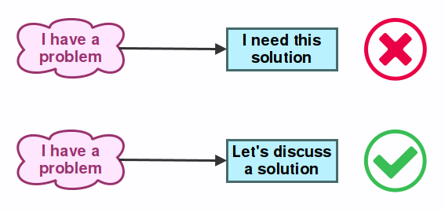
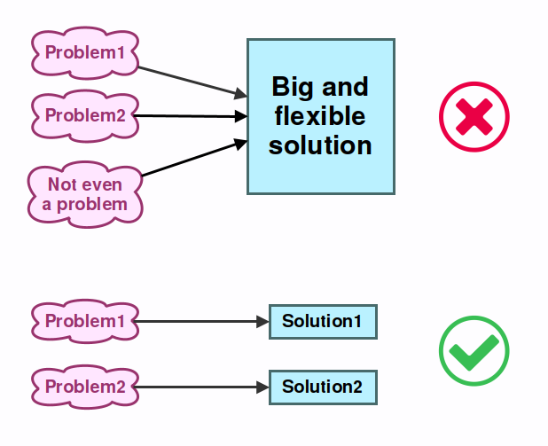
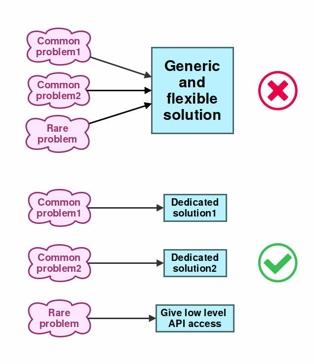
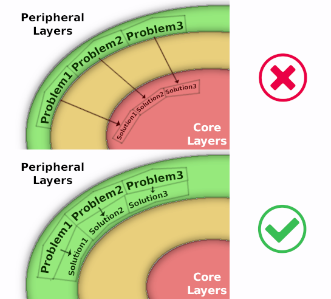

.. _doc_best_practices_for_engine_contributors:

Best practices for engine contributors
======================================

Introduction
------------

Godot has a large amount of users who have the ability to contribute, given the
project itself is aimed mainly at users with the ability to do programming.
Despite this, not all of them have the same level of experience working in large
projects or in software engineering, which can lead to common misunderstandings
and bad practices during the process of contributing code to the project.

Language
--------

The scope of this document is to be a list of best practices for contributors to
follow, as well as to create a language they can use to refer to common
situations that arise in the process of submitting their contributions.

While some may find it useful to extend this to general software development,
our intention is to just restrict to situations that are most common in our
project.

Contributions are most of the time categorized as bug fixes, enhancements or new
features. To abstract this idea, we will call them *Solutions*, because they
always seek to solve something that can be described as a *Problem*.

Best Practices
--------------

#1: The problem always comes first
~~~~~~~~~~~~~~~~~~~~~~~~~~~~~~~~~~

Many contributors are extremely creative and just enjoy the process of designing
abstract data structures, creating nice user interfaces, or simply love
programming. Whatever the case may be, they come up with cool ideas, which may
or may not be solving any real problems.

These are usually called *Solutions in search of a problem*. In an ideal world,
they would not be harmful but, in reality, code takes time to write, takes space
as source and binary and requires maintenance once it exists. Avoiding the
addition of anything unnecessary is always considered a good practice in
software development.

#2: To solve the problem, it has to exist in the first place
~~~~~~~~~~~~~~~~~~~~~~~~~~~~~~~~~~~~~~~~~~~~~~~~~~~~~~~~~~~~

This is a variation of the previous practice. Adding anything unnecessary is not
a good idea, but what constitutes what is necessary and what isn't?

The answer to this question is that the problem needs to *exist* before it can
be actually solved. It must not be speculation or a belief. The user must be
using the software as intended to create something they *need*. In this process,
the user may stumble into a problem that requires a solution to proceed, or in
order to achieve greater productivity. In this case, *a solution is needed*.

Believing that problems may arise in the future and that the software needs to
be ready to solve them by the time they appear is called *"Future proofing"* and
its characterized by lines of thought such as:

- I think it would be useful for users to...
- I think users will eventually need to...

This is generally considered a bad habit because trying to solve problems that
*don't actually exist* in the present will often lead to code that will be
written but never used, or that is considerably more complex to use and maintain
than it needs to be.

#3: The problem has to be complex or frequent
~~~~~~~~~~~~~~~~~~~~~~~~~~~~~~~~~~~~~~~~~~~~~

Software is designed to solve problems, but we can't expect it to solve *every
problem that exists under the sun*. As a game engine, Godot will solve problems
for you, so it helps you to make games better and faster, but it won't make the
*entire game* for you. A line must be drawn somewhere.

Whether a problem is worth solving is determined by the difficulty the user has
to work around it. This difficulty can be expressed as:

- The complexity of the problem
- The frequency the problem

If the problem is *too complex* for most users to solve, the software must offer
a ready-made solution for it. Likewise, if the problem is easy for the user to
work around, offering such a solution is unnecessary and it's up to the user to
do it.

The exception, however, is when the user stumbles into this problem *frequently
enough* that having to do the simple solution every time becomes an annoyance.
In this case, the software must offer a solution to simplify this use case.

In our experience, in most cases it's usually obvious to tell when a problem is
complex or frequent, but cases may arise where drawing this line is difficult.
This is why discussing with other developers (next point) is always advised.

#4: The solution must be discussed with others
~~~~~~~~~~~~~~~~~~~~~~~~~~~~~~~~~~~~~~~~~~~~~~

It is often the case that when users stumble upon problems, they are only
immersed in their project, so they will naturally try to solve the problem
from their perspective, thinking only about their use case.

Because of this, user proposed solutions don't always contemplate other use
cases that developers are often aware of, so they are often biased towards their
own requirements.

For developers, the perspective is different. They may find the user's problem
too unique to justify a solution (instead of a user workaround), or maybe they
will suggest a partial (usually simpler or lower level) solution that applies to
a wider range of known problems, and leave the rest of the solution up to the
user.

In any case, before attempting a contribution, it is important to discuss the
actual problems with the other developers or contributors, so a better agreement
on implementation can be reached.

The only exception, in this case, is when an area of code has a clear owner
(agreed by the other contributors), who talks to users directly and has the most
knowledge to implement a solution directly.

Also, Godot's philosophy is to favor ease of use and maintenance over absolute
performance. Performance optimizations will be considered, but they may not
be accepted if they make something too difficult to use or if they add too much
complexity to the codebase.

#5: To each problem, its own solution
~~~~~~~~~~~~~~~~~~~~~~~~~~~~~~~~~~~~~

For programmers, it is always a most enjoyable challenge to find the most
optimal solutions to problems. Things, however, may go overboard sometimes and
programmers will try to come up with solutions that solve as many problems as
possible.

The situation will often take a turn for the worse when, in order to make this
solution appear even more fantastic and flexible, the pure speculation-based
problems (as described in #2) also make their appearance on stage.

The main problem is that, in reality, it rarely works this way. Most of the
time, writing an individual solution to each problem results in code that
is simpler and more maintainable.

Additionally, solutions that target individual problems are better for the
users, as they find something that does exactly what they need, without having
to learn and remember a more complex system they will only need for simple
tasks.

Big and flexible solutions also have an additional drawback which is that, over
time, they are rarely flexible enough for all users, who keep requesting more
functions added (and making the API and codebase more and more complex).

#6: Cater to common use cases, leave the door open for the rare ones
~~~~~~~~~~~~~~~~~~~~~~~~~~~~~~~~~~~~~~~~~~~~~~~~~~~~~~~~~~~~~~~~~~~~

This is a continuation of the previous point, which further explains why this
way of thinking and designing software is preferred.

As mentioned before (in point #2), it is very difficult for us (as human beings
who design software) to actually understand all future user needs. Trying to
write very flexible structures that cater to many use cases at once is often a
mistake.

We may come up with something we believe is brilliant, but when it's actually
used, we will find that users will never even use half of it, or that they will
require features that don't quite accommodate our original design, forcing us to
either throw it away or make it even more complex.

The question is then, how to design software that gives users what *we know they
need*, but that is flexible enough to allow them to do *what we don't know they
might need* in the future?

The answer to this question is that, to ensure users still can do what they want
to do, we need to give them access to a *low level API* that they can use to
achieve what they want, even if it's more work for them because it means
reimplementing some logic that already exists.

In real-life scenarios, these use cases will be at most rare and uncommon
anyway, so it makes sense a custom solution needs to be written. This is why
it's important to still provide users the basic building blocks to do it.

#7: Prefer local solutions
~~~~~~~~~~~~~~~~~~~~~~~~~~

When looking for a solution to a problem, be it implementing a new feature or
fixing a bug, sometimes the easiest path is to add data or a new function in the
core layers of code.

The main problem here is, adding something to the core layers that will only be
used from a single location far away will not only make the code more difficult
to follow (split in two), but also make the core API larger, more complex, more
difficult to understand in general.

This is bad, because readability and cleanness of core APIs is always of extreme
importance given how much code relies on it, and because it's key for new
contributors as a starting point to learning the codebase.

The common reasoning for wanting to do this is that it's usually less code to
simply add a hack in the core layers.

Despite this, this practice is not advised. Generally, the code for a solution
should be closer to where the problem originates, even if it involves more code,
duplicated, more complex or is less efficient. More creativity might be needed,
but this path is always the advised one.

#8: Don't use complex canned solutions for simple problems
~~~~~~~~~~~~~~~~~~~~~~~~~~~~~~~~~~~~~~~~~~~~~~~~~~~~~~~~~~

Not every problem has a simple solution and, many times, the right choice is to
use a third party library to solve the problem.

As Godot requires to be shipped in a large amount of platforms, we can't
link libraries dynamically. Instead, we bundle them in our source tree.

As a result, we are very picky with what goes in, and we tend to prefer smaller
libraries (in fact, single header ones are our favorite). Only in cases where
there is no other choice we end up bundling something larger.

Also, libraries must use a permissive enough license to be included into Godot.
Some examples of acceptable licenses are Apache 2.0, BSD, MIT, ISC, and MPL 2.0.
In particular, we cannot accept libraries licensed under the GPL or LGPL since
these licenses effectively disallow static linking in proprietary software
(which Godot is distributed as in most exported projects). This requirement also
applies to the editor, since we may want to run it on iOS in the long term.
Since iOS doesn't support dynamic linking, static linking the only option on
that platform.
