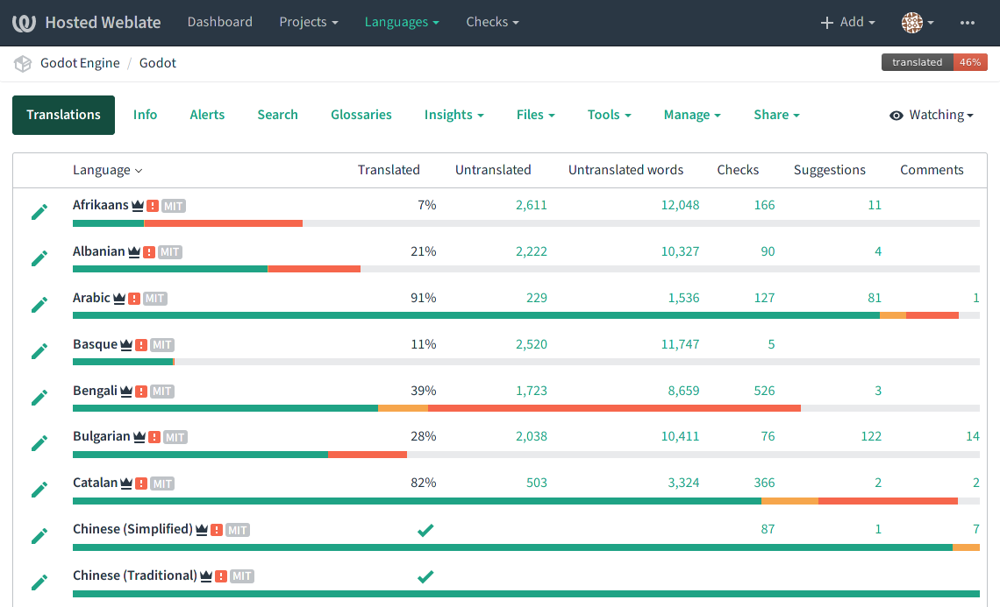
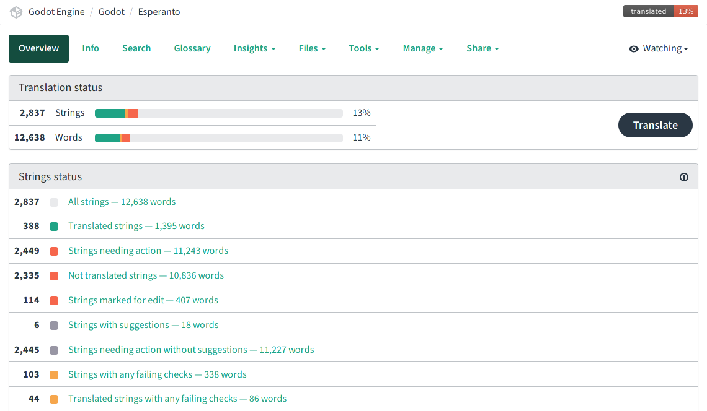
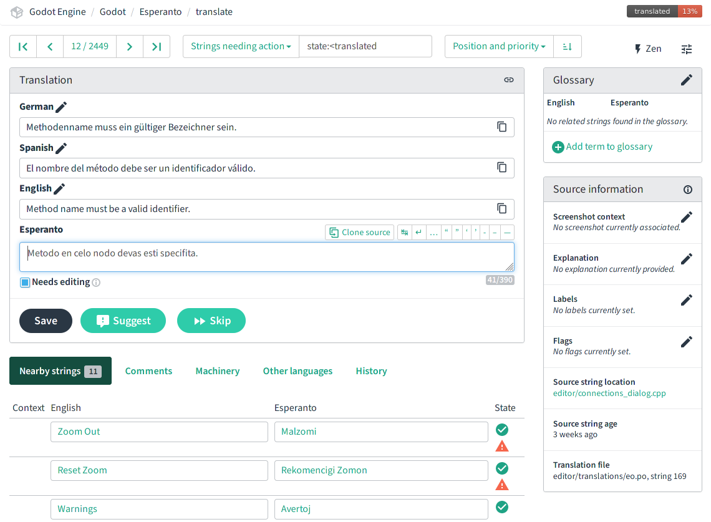
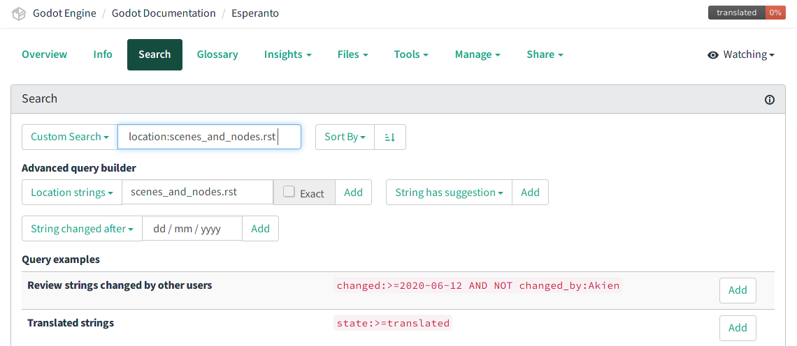

Editor and docs localization
============================

.. highlight:: none

Godot aims to make game development available to everyone, including people who
may not know or be comfortable with English. Therefore, we do our best to make
the most important resources available in many languages, thanks to the
translation effort of the community.

These resources include:

1. The `Godot editor's interface ( https://hosted.weblate.org/projects/godot-engine/godot/ )`
   (ca. 15,000 words).
2. The `online documentation ( https://hosted.weblate.org/projects/godot-engine/godot-docs/ )`
   (editor manual and tutorials, ca. 300,000 words).
3. The `class reference ( https://hosted.weblate.org/projects/godot-engine/godot-class-reference/ )`,
   available both online and in the editor (ca. 200,000 words).

To manage translations, we use the GNU gettext file format (`PO` files), and
the open source `Weblate ( https://weblate.org )` web-based localization
platform, which allows easy collaboration of many contributors to complete the
translation for the various components, and keep them up to date. Click the bold
links above to access each resource on Weblate.

This page gives an overview of the general translation workflow on Weblate, and
some resource-specific instructions on e.g. how to handle some keywords or the
localization of images.

.. tip::

    Translating all the official Godot content is a massive undertaking, so we
    advise prioritizing the resources as they are listed above: first the editor
    interface, then the online documentation, and eventually the class reference
    if there are enough translators to keep up with updates.

Using Weblate for translations
------------------------------

While our translations eventually reside in the Git repositories of the Godot
engine and its documentation, all translation updates are handled through
Weblate, and thus direct pull requests to the Git repositories are not accepted.
Translations are synced manually between Weblate and the Godot repositories by
maintainers.

You should therefore `register on Weblate ( https://hosted.weblate.org/accounts/register/ )`
to contribute to Godot's translations.

Once signed in, browse to the Godot resource which you want to contribute to (in
this page we will use the `editor translation ( https://hosted.weblate.org/projects/godot-engine/godot/ )`
as an example) to find the list of all languages:

See also:

    Feel free to consult Weblate's own documentation on the `translation
    workflow ( https://docs.weblate.org/en/latest/user/translating.html )` for
    more details.

Adding a new language
^^^^^^^^^^^^^^^^^^^^^

If your language is already listed, click on its name to access the overview,
and skip the rest of this section.

If your language is not listed, scroll to the bottom of the list of languages
and click the "Start new translation" button, and select the language you want
to translate to:

.. important::

    If your language is spoken in several countries with only limited regional
    variations, please consider adding it with its generic variant (e.g. `fr`
    for French) instead of a regional variant (e.g. `fr_FR` for French
    (France), `fr_CA` for French (Canada), or `fr_DZ` for French (Algeria)).

    Godot has a huge amount of content to translate, so duplicating the work for
    regional variants should only be done if the language variations are
    significant enough. Additionally, if a translation is done with for a
    regional variant, it will only be available automatically for users located
    in this region (or having their system language configured for this region).

    When regional variations are significant enough to warrant separate
    translations, we advise to focus on completing a generic variant first if
    possible, then duplicate the fully completed translation for regional
    variants and do the relevant edits. This is typically a good strategy for
    e.g. Spanish (work on `es` first, then duplicate it to `es_AR`,
    `es_ES`, `es_MX`, etc. if necessary) or Portuguese (`pt_BR` vs
    `pt_PT`).

Translation interface
^^^^^^^^^^^^^^^^^^^^^

Once a language has been selected, you will see an overview of the translation
status, including how many strings are left to translate or review. Each item
can be clicked and used to browse through the corresponding list. You can also
click the "Translate" button to get started on the list of strings needing
action.

After selecting a list of clicking "Translate", you will see the main
translation interface where all the work happens:

On that page, you have:

 - A toolbar which lets you cycle through strings of the current list, change
   to another predefined list or do a custom search, etc. There is also a "Zen"
   editing mode with a simplified interface.
 - The actual string you are working on in the "Translation" panel. By default,
   there should be the English source string and an edit box for your language.
   If you are familiar with other languages, you can add them in your user
   settings to give you more context for translation.
   Once you are done editing the current string, press "Save" to confirm changes
   and move to the next entry. Alternatively, use the "Skip" button to skip it.
   The "Needs editing" checkbox means that the original string was updated, and
   the translation therefore needs review to take those changes into account (in
   PO jargon, these are so-called "fuzzy" strings). Such strings won't be used
   in the translation until fixed.
 - The bottom panel has various tools which can help with the translation
   effort, such as context from nearby strings (usually from the same editor
   tool or documentation page, so they might use similar terms), comments from
   other translators, machine translations, and a list of all other existing
   translations for that string.
 - On the top right, the glossary shows terms for which an entry has been added
   previously, and which are included in the current string. For example, if
   you decided with fellow translators to use a specific translation for the
   "node" term in Godot, you can add it to the glossary to ensure that other
   translators use the same convention.
 - The bottom right panel includes information on the source string. The most
   relevant item is the "source string location", which links you to the
   original string on GitHub. You may need to search for the string in the page
   to locate it and its surrounding context.

Locating original content
-------------------------

PO files are an ordered list of source strings (`msgid`) and their translation
(`msgstr`), and by default, Weblate will present the strings in that order. It
can therefore be useful to understand how the content is organized in the PO
files to help you locate the original content and use it as a reference when
translating.

.. important::

    It is primordial to use the original context as reference when translating,
    as many words have several possible translations depending on the context.
    Using the wrong translation can actually be detrimental to the user and make
    things harder to understand than if they stayed in English.
    Using the context also makes the translation effort much easier and more
    enjoyable, as you can see directly if the translation you wrote will make
    sense in context.

- The editor interface's translation template is generated by parsing all the
  C++ source code in **alphabetical order**, so all the strings defined in a
  given file will be grouped together. For example, if the "source string
  location" indicates `editor/code_editor.cpp`, the current string (and the
  nearby ones) is defined in the `editor/code_editor.cpp` code file, and is
  thereby related to the code editors in Godot (GDScript, shaders).
- The online documentation's translation template is generated from the source
  RST files in the same order as seen in the **table of contents**, so for
  example the first strings are from the front page of the documentation.
  The recommended workflow is therefore to find a unique string corresponding to
  a page that you want to translate, and then translate all the strings with the
  same source string location while comparing with the online version of that
  page in English. An example of source string location could be
  `getting_started/step_by_step/nodes_and_scenes.rst` for the
  page `doc_nodes_and_scenes`.
- The class reference's translation template is generated from the source XML
  files in **alphabetical order**, which is also the same as the order of the
  table of contents for the online version. You can therefore locate the source
  string corresponding to the brief description of a given class to find the
  first string to translate and all other descriptions from that class should be
  in the subsequent strings on Weblate. For example, the descriptions for the
  `Node2D` class would have the source string location
  `doc/classes/Node2D.xml`.

A handy tool to locate specific pages/classes is to use Weblate's advanced
search feature, and especially the "Location strings" query (which can also be
used with the `location:` token, e.g. `location:nodes_and_scenes.rst`):

Note:

    When a given source string is used in multiple source locations, they will
    all be concatenated into one. For example, the above
    `location:nodes_and_scenes.rst` query would land first on the
    "Introduction" source string which is used in dozens of pages, including
    some that come before `nodes_and_scenes.rst` in the template. Clicking the
    "Next" button then brings us to the "Scene and nodes" title string displayed
    above.
    So it may happen that a given paragraph or section title is not at the
    location you'd expect it when reading the online version of a page.

Respecting the markup syntax
----------------------------

Each translation resource originates from a different source code format, and
having some notions on the markup language used for each resource is important
to avoid creating syntax errors in your translations.

Editor interface (C++)
^^^^^^^^^^^^^^^^^^^^^^

The editor translations originate from C++ strings, and may use:

- **C format specifiers** such as `%s` (a string) or `%d` (a number). These
  specifiers are replaced by content at runtime, and should be preserved and
  placed in your translation where necessary for it to be meaningful after
  substitution. You may need to refer to the source string location to
  understand what kind of content will be substituted if it's not clear from the
  sentence. Example (`%s`  will be substituted with a file name or path)::

    # PO file:
    "There is no '%s' file."

    # Weblate:
    There is no '%s' file.

- **C escape characters** such as `\n` (line break) or `\t` (tabulation). In
  the Weblate editor, the `\n` characters are replaced by `↵` (return) and
  `\t` by `↹`. Tabs are not used much, but you should make sure to use line
  breaks in the same way as the original English string (Weblate will issue a
  warning if you don't). Line breaks might sometimes be used for vertical
  spacing, or manual wrapping of long lines which would otherwise be too long
  especially in the editor translation). Example::

    # PO file:
    "Scene '%s' is currently being edited.\n"
    "Changes will only take effect when reloaded."

    # Weblate:
    Scene '%s' is currently being edited.↵
    Changes will only take effect when reloaded.

Note:

  Only logical order of the characters matters, in the right-to-left text, format
  specifiers may be displayed as `s%`.

Online documentation (RST)
^^^^^^^^^^^^^^^^^^^^^^^^^^

The documentation translations originate from reStructuredText (RST) files,
which also use their own markup syntax to style text, create internal and
external links, etc. Here are some examples::

    # "development" is styled bold.
    # "Have a look here" is a link pointing to https://docs.godotengine.org/en/latest.
    # You should translate "Have a look here", but not the URL, unless there is
    # a matching URL for the same content in your language.
    # Note: The `, ( , >, and _ characters all have a meaning in the hyperlink
    # syntax and should be preserved.

    Looking for the documentation of the current **development** branch?
    `Have a look here ( https://docs.godotengine.org/en/latest )`.

    # "|supported|" is an inline reference to an image and should stay unchanged.
    # "master" uses the markup for inline code, and will be styled as such.
    # Note: Inline code in RST uses 2 backticks on each side, unlike Markdown.
    # Single backticks are used for hyperlinks.

    |supported| Backwards-compatible new features (backported from the `master`
    branch) as well as bug, security, and platform support fixes.

    # The  Sphinx "role" is used for internal references to other pages of
    # the documentation.
    # It can be used with only the reference name of a page (which should not be
    # changed), in which case the title of that page will be displayed:

    See `doc_ways_to_contribute`.

    # Or it can be used with an optional custom title, which should thus be translated:

    See `how to contribute ( doc_ways_to_contribute )`.

    # You may encounter other Sphinx roles, such as :kbd: used for shortcut keys.
    # You can translate the content between backticks to match the usual key names,
    # if it's different from the English one.

    Save the scene. Click Scene -> Save, or press :kbd:`Ctrl + S` on Windows/Linux
    or :kbd:`Cmd + S` on macOS.

See also:

    See Sphinx's `reStructured Text primer ( https://www.sphinx-doc.org/en/master/usage/restructuredtext/basics.html )`
    for a quick overview of the markup language you may find in source strings.
    You may encounter especially the inline markup (bold, italics, inline code)
    and the internal and external hyperlink markup.

Class reference (BBCode)
^^^^^^^^^^^^^^^^^^^^^^^^

The class reference is documented in the main Godot repository using XML files,
and with BBCode-like markup for styling and internal references.

Some of the tags used are from the original BBCode (e.g. `[b]Bold[/b]` and
`[i]Italics[/i]`), while others are Godot-specific and used for advanced
features such as inline code (e.g. `[code]true[/code]`), linking to another
class (e.g. `[Node2D]`) or to a property in a given class (e.g.
`[member Node2D.position]`), or for multiline code blocks. Example::

    Returns a color according to the standardized [code]name[/code] with [code]alpha[/code] ranging from 0 to 1.
    [codeblock]
    red = ColorN("red", 1)
    [/codeblock]
    Supported color names are the same as the constants defined in [Color].

In the above example, `[code]name[/code]`, `[code]alpha[/code]`, and
`[Color]` should *not* be translated, as they refer respectively to argument
names and a class of the Godot API. Similarly, the contents of the
`[codeblock]` should not be translated, as `ColorN` is a function of the
Godot API and `"red"` is one of the named colors it supports. At most, you can
translate the name of the variable which holds the result (`red = ...`).

Note also that in the XML, each line is a paragraph, so you should not add line
breaks if they are not part of the original translation.

See also:

    See our documentation for class reference writers for the `list of
    BBCode-like tags ( doc_class_reference_writing_guidelines_bbcode )` which are used
    throughout the class reference.

Offline translation and testing
-------------------------------

While we advise using the Weblate interface to write translations, you also have
the possibility to download the PO file locally to translate it with your
preferred PO editing application, such as `Poedit ( https://poedit.net/ )` or
`Lokalize ( https://userbase.kde.org/Lokalize )`.

To download the PO file locally, browse to the translation overview for your
language, and select the first item in the "Files" menu:

Once you are done with a series of edits, use the "Upload translation" item in
that same menu and select your file. Choose "Add as translation" for the file
upload mode.

Note:

    If a significant amount of time has passed between your download of the PO
    file and the upload of the edited version, there is a risk to overwrite the
    translations authored by other contributors in the meantime. This is why we
    advise to use the online interface so that you always work on the latest
    version.

If you want to test changes locally (especially for the editor translation), you
can use the downloaded PO file and `compile Godot from source ( toc-devel-compiling )`.

Rename the editor translation PO file to `( lang>.po` (e.g. `eo.po` for
Esperanto) and place it in the `editor/translations/` folder
(`GitHub ( https://github.com/godotengine/godot/tree/master/editor/translations )`).

You can also test class reference changes the same way by renaming the PO file
similarly and placing it in the `doc/translations/` folder
(`GitHub ( https://github.com/godotengine/godot/tree/master/doc/translations )`).

Localizing documentation images
-------------------------------

The online documentation includes many images, which can be screenshots of the
Godot editor, custom-made graphs, of any other kind of visual content. Some of
it includes text and might thus be relevant to localize in your language.

This part is not handled via Weblate, but directly on the `godot-docs-l10n
( https://github.com/godotengine/godot-docs-l10n )` Git repository where the
documentation translations are synced from Weblate.

Note:

   The workflow is not the most straightforward and requires some knowledge of
   Git. We plan to work on a simplified Web tool which could be used to manage
   image localization in a convenient way, abstracting away these steps.

To translate an image, you should first locate it in the original English
documentation. To do so, browse the relevant page in the docs, e.g.
`doc_intro_to_the_editor_interface`. Click the "Edit on GitHub" link in the
top right corner:

On GitHub, click on the image you want to translate. If relevant, click on
"Download" to download it locally and edit it with an image edition tool.
Note the full path to the image as it will be needed further down (here
`getting_started/step_by_step/img/project_manager_first_open.png)`).

Create your localized version of the image, either by editing the English one,
or by taking a screenshot of the editor with your language, if it's an editor
screenshot. Some images may also have source files available in SVG format, so
you can browse the `img/` folder which contains them to check for that.

Name your localized image like the original one, but with the language code
added before the extension, e.g. `project_manager_first_open.png)` would become
`project_manager_first_open.fr.png)` for the French localization.

Finally, on godot-docs-l10n_, recreate the same folder structure as for the
original image in the `images` subfolder
(`GitHub ( https://github.com/godotengine/godot-docs-l10n/tree/master/images )`),
and place your translated image there. In our example, the end result should be
`images/getting_started/step_by_step/img/project_manager_first_open.fr.png)`.

Repeat this for other images and `make a Pull Request ( doc_pr_workflow )`.
